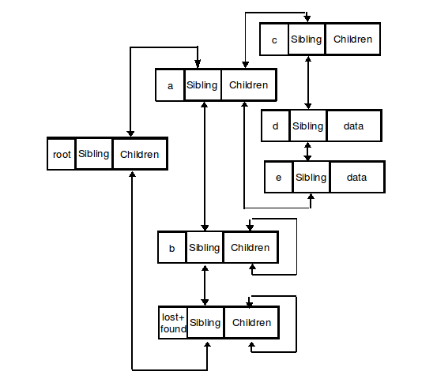
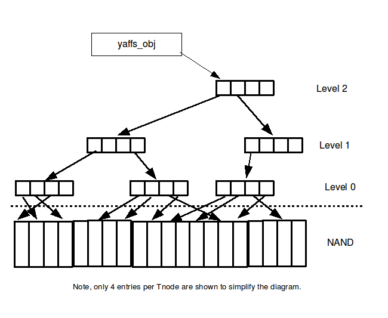
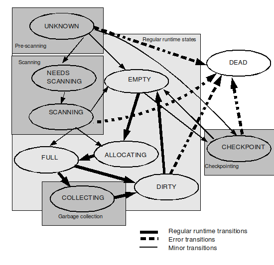

[TOC]

---

# 什么是yaffs
yaffs是用于征地闪存的特性设计的用于NAND闪存的文件系统。Yaffs1是yaffs的初始版本。支持512字节的NAND设备。Yaffs2是Yaffs1的后续产品，在原来基础上扩展支持更大的设备。

---

# 对象 (Objects)
对象object是存储在文件系统的一切，包括了：
* 通常的数据文件
* 目录
* 硬链接
* 软链接
* 特殊对象 (管道，设备等等)

所有的对象有一个唯一的整数对象标识(obj_id)
在标准的POSIX中包括了 inodes 和 directory entries(dentries)。inode一般是常规文件，目录或者特殊文件。dentry提供了一种定位inodes的机制。在POSIX下，每个inode可能有0个，1个，或者多个dentries。一对一最好理解。允许多个dentries访问同一个inode，这是通过硬链接实现的。inode也会拥有0个dentries，当inode打开时取消链接，这是inode依然存在但是没有dentries。

---

# Yaffs1 存储文件
Yaffs1 拥有一个修改过的日志结构，Yaffs2 拥有真正的日志结构。真正的日志结构文件系统只能按照顺序写入。Yaffs中使用的删除标记，打破了这一规则。
文件系统不是在特定的位置写入数据，而是按照顺序以日志的形式写入，每个日志都占一个chunk大小，有两种类型的chunk：
* Data chunk: 保存通常的文件内容
* Object Header: 对象的描述符，包含详细信息，例如父目录的标识符，对象名称等等。
每一个chunk都有一个关联的tags，包含以下重要字段：
* Object Id(obj_id)：表示这个chunk属于哪一个对象
* Chunk Id(chunk_id)：表示该块在文件中的位置。如果是Object Header的 chunk_id == 0，文件的第一个数据chunk_id == 1，往后以此类推。
* Deletion Marker(is_deleted)：yaffs1独占。表示这一个chunk不再使用。
* Byte Count(n_bytes)：一个数据chunk中字节的数量
* Serial Number(serial_number)：yaffs1独占。用来区别chunk，当拥有相同的obj_id和chunk_id。
## 举个例子
1. 有一个每个block只有4个chunk的nand类型，创建一个文件
   Block|Chunk|obj_id|chunk_id|Deletion|Comment
   ----|----|----|----|----|----
   1|0|500|0|Live|Object Header
2. 往这个文件中写入一些数据
   Block|Chunk|obj_id|chunk_id|Deletion|Comment
   ----|----|----|----|----|----
   1|0|500|0|Live|Object Header
   1|1|500|1|Live|数据的第一个chunk
   1|2|500|2|Live|数据的第二个chunk
   1|3|500|3|Live|数据的第三个chunk
3. 接下来关闭这个文件，这时会为这个object创建一个新的header。这就意味着要删除之前的对象标题。
   Block|Chunk|obj_id|chunk_id|Deletion|Comment
   ----|----|----|----|----|----
   1|0|500|0|**Deleted**|旧的 Object Header(长度为0)
   1|1|500|1|Live|数据的第一个chunk
   1|2|500|2|Live|数据的第二个chunk
   1|3|500|3|Live|数据的第三个chunk
   2|0|500|0|Live|新的 Object Header(长度为n)
4. 接着打开这个文件进行读写，覆盖文件的第一个chunk的内容
   Block|Chunk|obj_id|chunk_id|Deletion|Comment
   ----|----|----|----|----|----
   1|0|500|0|Deleted|旧的 Object Header
   1|1|500|1|**Deleted**|旧的数据的第一个chunk(长度为0)
   1|2|500|2|Live|数据的第二个chunk
   1|3|500|3|Live|数据的第三个chunk
   2|0|500|0|**Deleted**|旧的 Object Header(长度为n)
   2|1|500|1|Live|新的第一个数据 chunk
   2|2|500|0|Live|有一个新的 Object Header(长度为n)
5. 这时通过 O_TRUNC 打开文件并关闭文件使文件大小为0，那么就会写入一个长度为0的新Object Header，并且删除之前的数据块。
    Block|Chunk|obj_id|chunk_id|Deletion|Comment
   ----|----|----|----|----|----
   1|0|500|0|Deleted|旧的 Object Header
   1|1|500|1|Deleted|旧的数据的第一个chunk(长度为0)
   1|2|500|2|**Deleted**|数据的第二个chunk
   1|3|500|3|**Deleted**|数据的第三个chunk
   2|0|500|0|Deleted|旧的 Object Header(长度为n)
   2|1|500|1|**Deleted**|新的第一个数据 chunk
   2|2|500|0|**Deleted**|有一个新的 Object Header(长度为n)
   2|3|500|0|Live|新的 Object Header(长度为0)
6. 当block1中的所有chunk都标记为删除的时候，我们可以擦除块1并且重新利用这一块空间。
   Block|Chunk|obj_id|chunk_id|Deletion|Comment
   ----|----|----|----|----|----
   1|0|500| | | 已删除
   1|1|500| | | 已删除
   1|2|500| | | 已删除
   1|3|500| | | 已删除
   2|0|500|0|Deleted|旧的 Object Header(长度为n)
   2|1|500|1|Deleted|旧的第一个数据 chunk
   2|2|500|0|Deleted|旧的 Object Header(长度为n)
   2|3|500|0|Live|新的 Object Header(长度为0)
7. 重命名该文件，会产生一个新的对象头
   Block|Chunk|obj_id|chunk_id|Deletion|Comment
   ----|----|----|----|----|----
   1|0|500| | | 已删除
   1|1|500| | | 已删除
   1|2|500| | | 已删除
   1|3|500| | | 已删除
   2|0|500|0|Deleted|旧的 Object Header(长度为n)
   2|1|500|1|Deleted|旧的第一个数据 chunk
   2|2|500|0|Deleted|旧的 Object Header(长度为n)
   2|3|500|0|**Deleted**|旧的 Object Header(长度为0)
   3|0|500|0|Live|包含新名称的Object Header
   此时的block也是可以擦除的状态了
   这些tags起到的作用：
   * obj_id:当前的chunk属于哪一个obj
   * chunk_id:这个chunk在文件中的哪一个位置
   * Deletion：哪一个chunk才是当前正在使用的

在闪存中没有文件分配表或者类似的结构，这样减少写入和擦除的次数，增加了稳定性。

---

# 垃圾收集
从block中去复制那些有用的chunk，这样原来的chunk就可以擦除，使得整个block可以被擦除重用，这一过程就是垃圾收集。

工作的流程如下：
1. 找到一个值得收集的block
2. 遍历这个block中的chunks。将正在使用的chunk创建一个新的副本，删除原来的。修改RAM的数据结构反映更改。

确定一个区块是否值得收集的启发式如下：
1. 如果有很多可以擦除的块，yaffs只会尝试对使用很少的block进行收集，这种称为被动垃圾收集。一次只收集几个chunk，将block的收集工作放到多个收集周期来完成，提高系统的响应能力
2. 如果被擦除的块很少，yaffs努力恢复更多的空间，称为激进垃圾收集。空间紧迫，在一个来收集周期中收集整个块。

---

# Yaffs1序列号(serial numbers)
Yaffs1 中的每一个chunk都会有一个2bit的序列号，当一个相同tags的chunk被拷贝或者替换时，这个序列号就会增加。为了提高系统的稳定性，在删除一个旧的chunk前，换先去创建新的chunk。如果系统出现故障，会出现两个相同的tags的chunk，就需要通过检查序列号来确定哪一个chunk是当前的。

---

# Yaffs2 NAND模型
Yaffs2是在原来功能上的扩展来实现新的目标包括：
1. 零复写。Yaffs1上需要复写备用区域中的一个bit位来标志删除标记。更现在的NAND对复写的容忍度更低，Yaffs2实现了零复写。
2. block内的顺序写入。现代的NAND更倾向顺序的写入。由于Yaffs2不需要使用删除标记，采用更加严格的顺序写入。
3. 新的闪存技术(MLC)只有在顺序写入才能工作。
   
Yaffs2不使用删除标记，通过以下机制确定那一块chunk是当前的：
* 序列号(seq_number)：随着block的分配，文件系统的seq_number随之增加，并给每一个chunk标记。组织成为时间顺序的log结构。
* 收缩头标记(shrink_header)：收缩头标记用于收缩文件数据大小是而写入的文件头。

注意：在Yaffs2仍然有chunk的删除。chunk会在RAM的数据结构中被标记用于垃圾回收等等，没有把标记写入flash

## 序列号(sequence number)
序列号可以让Yaffs确定事件的序列和恢复文件的状态。通过向后扫描的时间顺序（扫描从最高的序列号到最低的序列号）。因此:
* 由于是向后扫描，首先遇到的与 obj_id:chunk_id 匹配的chunk是当前使用的，后续扫描到的都是过去的需要被删除。
* Object Header中的文件长度用于修建文件的大小。超出文件长度的块会被视为要删除。当前的和弃置的对象头都需要对大小进行精确地重建。

## 收缩头(shrink header)
收缩标头标记的目的是显示该对象标头指示文件的大小已缩小，并防止垃圾收集删除这些对象标头。

考虑下列操作:
``` C
#define MB (1024 * 1024)

h = open(“foo”,O_CREAT| O_RDWR, S_IREAD|S_IWRITE); /* create file */
write(h,data,5*MB); /* write 5 MB of data */
truncate(h,1*MB); /* truncate to 1MB */
lseek(h,2*MB, SEEK_SET); /* set the file access position to 2MB */
write(h,data,1*MB); /* write 1MB of data */
close(h);
```
该文件现在将是 3MB 的长度，但在 1MB 和 2MB 之间会有一个“漏洞”。根据 POSIX（以及帮助安全等），“漏洞”应该始终读回为零。
在Yaffs2中会通过以下的序列chunk来表示：
1. 创建时的Object Header(file length == 0)
2. 5MB 的数据块（0 到 5MB）
3. 收缩的 Object Header(file length == 1)
4. 1MB 的数据块（2MB 到 3MB）
5. 关闭时的 Object Header(file length == 3)
   
当前的数据chunk有：
* 步骤2中创建的 1MB 数据
* 步骤4中创建的 1MB 数据
* 步骤5中的Object Header

Yaffs2需要记住其中发生的截断，否则就会忘记文件中间有一个洞。Yaffs2会创建一个shrink header标记洞的开始，用一个常规Object Header表示洞的结束。

---

# 坏块处理
任何没有有效坏块处理策略的闪存文件系统都不适合 NAND 闪存。Yaffs1 使用 Smart-Media 风格的坏块标记。这将检查备用区域的第六个字节（字节 5）。在一个好的块中，这应该是 0xFF。工厂标记的坏块应该是 0x00。如果 Yaffs1 确定一个块坏了，它会用 0x59 ('Y') 标记为坏。使用独特的标记可以将 Yaffs 标记的坏块与工厂标记的坏块区分开来。Yaffs2 模式旨在支持更广泛的设备和备用区域布局。因此，Yaffs2 不会决定标记哪些字节，而是调用驱动程序函数来确定块是坏的，还是将其标记为坏的。如果读取或写入操作失败或检测到三个 ECC 错误，Yaffs 将标记一个块为坏块。标记为坏的块将不再使用，从而提高文件系统的健壮性。NAND 闪存单元有时会受到 NAND 活动和电荷损失的干扰（损坏）。这些错误由纠错码 (ECC) 纠正，纠错码可以在硬件、软件驱动程序或 Yaffs 本身中实现。同样，任何缺乏有效 ECC 处理的闪存文件系统都不适合 NAND 闪存。Yaffs1 模式既可以使用内置的 ECC，也可以使用驱动程序或硬件提供的 ECC。由于 Yaffs2 模式是为更广泛的设备设计的，它内部不提供 ECC，而是要求驱动程序提供 ECC。Yaffs 提供的 ECC 代码 (yaffs_ecc.c) 是我们所知的智能媒体兼容 ECC 算法的最快 C 代码实现。此代码将纠正 256 字节数据块内的任何单个位错误，并检测每个 256 字节数据块中的 2 个错误。这足以在大多数 SLC 型 NAND 闪存上提供非常高的可靠性的纠错。

---

# RAM结构
RAM的结构定义在 yaffs_guts.h 中，它们的主要用途是：
* 设备/分区：这被命名为yaffs_dev 。这是保存与 Yaffs“分区”或“挂载点”相关的信息所必需的。使用这些而不是全局变量，允许 Yaffs 同时支持多个分区和不同类型的分区。事实上，这里提到的几乎其他数据结构都是该结构的一部分或通过该结构访问。
* NAND Block信息：它被命名为yaffs_block_info并保存 NAND 块的当前状态。每个 yaffs_dev 都有一个这些数组。
* NAND Chunk信息：附加到 yaffs_dev 的位域，用于保存系统中每个块的当前使用状态。分区中的每个块有一位。
* Object：它被命名为yaffs_obj并保存对象的状态。文件系统中的每个对象都有一个，其中一个对象是常规文件、目录、硬链接、符号链接或特殊链接之一。yaffs_Objects 有不同的变体来反映这些不同对象类型所需的不同数据。每个对象都由 obj_id 唯一标识。
* 文件结构：对于每个文件对象，Yaffs 持有一个树，它提供了在文件中查找数据块的机制。树由称为yaffs_tnode（树节点）的节点组成。
* 目录结构：目录结构允许按名称查找对象。目录结构是从以目录为根的双向链表构建的，并将目录中的同级对象绑定在一起。
* 对象编号哈希表：对象编号哈希表提供了一种从对象的 obj_id 中查找对象的机制。obj_id 被散列以选择一个散列桶。每个哈希桶都有一个属于这个哈希桶的对象的双向链接列表，以及桶中对象的计数。
* 缓存：Yaffs 提供读/写缓存，可显着提高短操作的性能。缓存的大小可以在运行时设置。

## Yaffs 对象(struck yaffs_obj)
每一个文件系统中的对象都有一个 yaffs_obj 结构表示。yaffs_obj主要功能存储大部分对象元数据和特定类型的信息。元数据包括：
* obj_id：表示对象的编号
* parent：指向父目录的指针，并非所有对象都有父对象。未链接和已删除文件的根目录和特殊目录没有父目录，因此为 NULL。
* short_name：如果名称足够短以适合固定大小的小数组（默认为 16 个字符），则将其存储在此处，否则每次请求时都必须从闪存中获取。
* type：对象的类型。
* 权限(Permission)、时间(Time)、所有权(ownership)和其他属性

根据不同的对象类型，yaffs_obj还会存储：
* 数据文件：tnode树，文件范围
* 目录：目录链
* 硬链接：等效对象
* 软链接：字符串

## 通过 obj_id 查找
这个机制的目的是通过 obj_id 快速访问对应的设备。每一个 yaffs_dev 都使用一个哈希表，哈希表有256个桶，每一个桶包含一个双向链表存放 yaffs_objs。yaffs的哈希函数只是屏蔽了obj_ids最低有效位。yaffs分配使得每个桶中的对象的数量维持在相当低的水平。

## 目录结构
目录结构的目的是通过名称快速访问对象。这是执行文件操作（例如打开、重命名等）所必需的。Yaffs的目录结构是由YAFFS_OBJECT_TYPE_DIRECTORY 类型的对象树组成。这些对象有一个双向连接的子节点。yaffs_obj也有一个双向链表节点，称为兄弟节点，将目录中的兄弟节点链接在一起。每个yaffs分区还会有一些假目录，这些目录不存在NAND中，但会在挂载的时候创建：
* lost+found：此目录用作存储任何无法放置在正常目录树中的丢失文件部分的地方。
* Unlinked and deleted：将对象放置在这些目录中会使它们处于未链接或已删除的状态。

名称解析通过两种机制加速：
* short_name 直接存储在 yaffs_obj 中，因此不必从内存中加载
* 每一个对象都有一个**名称总和**，通过一个简单的名称散列加快了匹配过程


上图包含了以下的目录树
/|根目录
----|----
/a|目录包含 c,d,e
/b|空目录
/lost+found|空目录
/a/c|目录
/a/d|数据文件
/a/e|数据文件
如果yaffs分区损害，在扫描器件创建对象时，找不到对象头(包含对象名称)。则该对象没有名称，yaffs会为这个对象创建一个假名，以便放在目录结构中。

## 硬链接
在 POSIX 文件系统中，Object（Linux 术语中的 inode，BSD 中的 vnode）和Object Names（Linux 术语中的 dentry）是独立的，因为一个对象可以有零个、一个或多个名称。
具有零链接的文件是由以下结构引起的：
``` C
h = open(“foo”,O_CREAT | O_RDWR, S_IREAD | S_IWRITE); /* create file “foo” */
unlink(“foo”); /* unlink it to removedirectory entry */
/* we still have a handle to the file so can still access it via the handle */
read(h,buffer,100);
write(h,buffer,100);
close(h); /* as soon as the handle is closed the file is deleted */
```
Yaffs不单独存储 object 和 name，这样会导致额外的读写。Yaffs为大多数典型情况，一个name对应一个Object做了优化。通过“作弊”来实现其他的功能：
* 拥有零名字的对象（比如取消链接的对象）被重命名为一个指代取消链接对象的一个假名
* 多个名称的对象，将一个对象作为主对象，多个硬链接为伪对象指代它
* node 编号（BSD 中的 vnid）是每个文件系统的唯一编号，用于标识对象。主对象的 Yaffs obj_id 呈现给用户。也就是说，如果从硬链接对象查询 inode 编号，则返回等效对象的 obj_id。

硬链接与伪对象之间的链接是通过两个字段：
* 每个对象有一个 hard_links 双向链表，硬链接通过链表链接到该对象
* 每个硬链接有一个指向等效对象的  equiv_obj 指针。

一个对象如果被删除且它有硬链接，会有以下操作：
* 选择这个对象的一个硬链接
* 把这个对象重命名为这个硬链接的名称
* 删除这个硬链接

## 符号链接和特殊对象
仅仅储存满足POSIX文件系统所需要的值。软链接对象保存了一个软链接字符串用于提供POSIX符号字符串机制。特殊对象是同来存储设备编号、管道和其他类似特殊对象入口

## 文件对象
yaffs_Objects 有一个类型和一个变量，它是保存不同对象类型状态所需的不同数据的联合。
文件对象具有 YAFFS_OBJECT_TYPE_FILE 类型和关联的文件变量。这存储以下主要值：
* file_size：文件大小
* top_level：Tnode 树的深度
* top：指向 Tnode 树顶部的指针

### Tnode tree
每一个 tnode tree 提供了一个从文件的位置到NAND chunk地址的映射。

tnode tree由层级结构组成，每个都包含：
* 在大于0的层级，一个tnode拥有8个指针来指向下一层的tnode
* 在0层，一个tnode拥有16个chunk id，标识在RAM中chunk的位置。

这些组织形式都是2的幂，可以通过位的掩码进行查找。遍历这棵树的代码在 yaffs_find_tnode_0() 中。随着文件大小的增长，会添加更多的 tnode，并且随着级别填充，会添加更多级别。如果文件被截断或向下调整大小，则树被修剪。如果文件中的块被替换（例如，数据被垃圾收集覆盖或复制），则必须更新 tnode 树以反映更改。Tnodes 通常占 Yaffs 的 RAM 使用量的大部分。

# 各种机制
## block和chunk管理
### block状态
yaffs会跟踪每个block和chunk在分区中的状态。这些信息在扫描的时候建立后者从检查点恢复。一个block会是下面状态其中之一（查看枚举变量定义yaffs_block_state ）：
状态|描述
----|----
UNKNOWN|块状态未知
NEEDS_SCANNING|在预扫描期间，已经确定该块上有东西并且需要扫描。
SCANNING|当前正在扫描此块。
EMPTY|该块中没有任何内容（已擦除）并可用于分配。块可以通过被擦除来达到这个状态。
ALLOCATING|这是块分配器当前用于分配的块。
FULL|此块中的所有块都已分配，并且至少有一个块包含尚未删除的有用信息。
DIRTY|该块中的所有块都已分配并全部删除。在此之前，该块可能一直处于 FULL 或 COLLECTING 状态。现在可以擦除该块并返回到 EMPTY 状态。
CHECKPOINT|该块中有检查点数据。当检查点无效时，该块将被擦除并返回到 EMPTY 状态。
COLLECTING|块正在被垃圾收集。一旦检查了所有实时数据，该块就会变为 DIRTY。
DEAD|此块已被淘汰或被标记为坏。这是一个终结状态。

通常的状态就是：EMPTY -> ALLOCATING -> FULL -> COLLECTING -> DIRTY.
### block 和 chunk 分配
一个chunk在写入之前首先要分配。chunk的分配机制可以通过yaffs_alloc_chunk()。每个yaffs_dev都有一个当前正在分配的block称为alloc_block。正在分配中的block中的chunk是顺序分配的。随着chunk的分配，block和chunk管理信息会被更新，包括每个block的pages_in_use计数和chunk使用位图。
当一个block分配完，另一个空块会被选中作为分配块。从前一个块向上搜索来选择块。为了提高断电的健壮性，yaffs总是在挂在后在新block上开始分配。

### 均匀磨损
Nand flash只能承受有限次数的写入和擦除，因此需要确保不会连续的写入导致block 出现磨损，而其他的block没有投入使用。诸如FAT之类的文件系统中均匀磨损非常重要，它使用了一组有限的逻辑block储存经常就改的文件分配表。如果使用静态的物理映射，文件分配表的块将会早于其他块发送磨损，导致出现故障。因此文件分配表需要写入不同的物理块，从而平衡磨损。
在日志结构的文件系统中（如yaffs），均匀磨损问题要小得多，因为总是写入日志的末尾，不会重复覆盖相同的块。
有两种方法可以实现均匀磨损：
* 使用专门编写的一组主动执行磨损均衡的函数。
* 允许作为其他活动的副作用发生一定程度的磨损平衡

yaffs采用了第二种方法。
1. yaffs作为日志结构，通过顺序执行所有的写入来分散磨损。
2. 从分区中擦除的块中依次分配块。因此，擦除（在删除垃圾收集之后）然后分配块的过程确实会分散块的使用并提供一定程度的磨损均衡。

因此就算没有专门的均匀磨损的代码，也会作为其他活动的副作用发生。

### yaffs_tnode和yaffs_obj结构的管理
yaffs_tnodes 和 yaffs_objs 是根据需要动态创建和释放的。分配和管理可以通过仅使用标准内存分配器（malloc、kmalloc 等）来完成，但这可能会导致性能问题，尤其是在往往具有相当简单的内存分配器的嵌入式系统中。许多小结构的分配和删除会导致内存碎片，从而导致内存不足和速度变慢的问题。为了防止这些问题，Yaffs 在内部管理这些对象。Yaffs 一次创建许多结构（100 个左右），然后从空闲列表中单独分配它们。当结构被释放时，它们被放置在空闲列表中以供重用。

## 内部缓存
内部缓存的主要目的是减少对执行许多小型读取和写入的不良应用程序的 NAND 访问。
``` C
while(...)
write(h,buf,1);
```
如果每次读取或写入操作都导致闪存访问，这种行为对于性能和闪存寿命来说将是可怕的。Yaffs 提供了一个内部缓存来缓解这种行为。Yaffs 内部缓存称为“Short Op Cache”（短操作缓存），仅用于未对齐块的操作。缓存机制非常简单，主要是为缺乏自己的文件缓存层的不太复杂的操作系统编写的。
页面对齐的读写略过cache除非chunk已经在cache中了，特别是有inband tags在使用的时候。因为inband tags将标签存入了数据部分。
缓存存储在缓存条目数组中。缓存条目的数量在 yaffs_dev 参数 n_caches 中设置，缓存在初始化期间配置。n_caches 为零将禁用缓存。缓存管理算法很简单，可能无法很好地扩展到非常大的数字。这意味着最好坚持使用大约 5 到 20 个缓存条目。
Cache包含内容有：
* obj_id、chunk id、nbytes（被缓存的chunk的标签信息）
* 实际数据字节
* 缓存槽状态（上次使用的计数器，脏的，...）

查找未使用的缓存条目是一项简单的操作。我们只是遍历缓存条目，搜索未分配的条目。如果所有缓存条目都忙，则执行缓存推出以释放缓存条目。每次读取和写入都会增加last-use计数器，通过这个值来驱动least-recently-used (LRU) 算法。每当缓存已满并且我们需要腾出空间来加载新条目时，就会发生推送。Yaffs 使用 LRU 算法来选择 LRU 缓存条目，如果需要将其写出，然后分配使用。

## 扫描
扫描会从头开始构建文件系统的状态。如果没有可用检查点或者设置为忽略检查点数据，则会在mount时进行扫描。扫描需要从系统所有活动chunk中读取标签，可能需要相当长的时间。
### Yaffs1扫描
Yaffs1有删除标记，所以扫描更加简单。没有设置删除标记，则它处于活动状态。
将chunk添加到文件系统如下：
* 如果是数据块(chunk_id>0)，则将该块添加到相关文件的tnode树中。如果不存在，就在lost+found 中创建它。
* 如果是对象头(chunk_id==0)，则创建对象
* 如果遇到相同的 obj_id:chunk_id，通过 serial number来解决争议

扫描完成后还需要解决硬链接必须正确连接，且删除未链接的对象。

### Yaffs2扫描
第一件事是通过预扫描决定block的sequence number，用来储存作为时间顺序表。
向后扫描（时间相反的顺序），遇到的第一个 obj_id:chunk_id 是当前的，其他带有这个标签的都是过期的
读取每一个chunk的标签：
* 如果他是一个数据块(chunk_id > 0)
  * 如果已经有相同的obj_id:chunk_id，那么删除这个不是当前的chunk
  * 如果标记为删除或者损坏，那么删除
  * 如果对象尚不存在，这个chunk应该是文件打开没有正常关闭产生的最后一个chunk。我们可以创建文件并且使用chunk_id 和 nbytes 来设置文件范围。
  * 如果chunk超过了对象文件的扫描大小，那么这就是一个被截断的chunk可以被删除
  * 正常，可以被放入文件的tnode中
* 如果他是一个对象头(chunk_id == 0)
  * 如果对象在已删除目录中，则将该对象标记为已删除并将对象的收缩大小设置为零。
  * 如果一个对象的头还没有找到，那么这就是当前的对象头。对象头的大小也是文件的范围，文件大小用于设置文件的扫描大小，可以安全的忽略超过这个大小的其他数据chunk。
  * 如果文件大小小于当前文件扫描大小，使用这个文件大小作为扫描大小。
  * 剩余情况表示这是一个过时的对象头。

## 检查点
在挂载的时候可能需要很多的时间，这样会降低挂载的速度。检查点是通过umount或sync时对yaffs运行状态进行快照，在重新安装时重构运行时的状态的机制，加速挂载时间。实际的机制非常简单，将数据流写入一组标记为检查点的chunk中去，将运行时的重要状态写入，按照一些顺序存储数据：
* 开始标记，包括检查点id
* yaffs_dev
* block信息
* chunk标记
* Object，包括文件结构体
* 结束标志
* 校验和
  
检查点有效性由以下机制确保：
* 数据通过ECC机制储存
* 开始标记中包括检查点的版本信息，所以过期的检查点不会被读取
* 数据通过流写入，包括了类型和大小
* 结束标记必须被读到
* 两个校验和维护整个检查点数据

在写入检查点的block的时候，本来的block的信息也会发生变化，通过下面的方法解决这个问题：
* 写入检查点时，分配器选择空block。在写入时不改变状态，因此状态为 EMPTY 或者 CHECKPOINT 
* 读取检查点后，就知道了哪些block来存储检查点数据，更新这些块的 CHECKPOINT 状态

常规的 yaffs block 分配器和垃圾收集逻辑都学要知道检查点的大概大小，用来留下充足空间来存储检查点。当Object的数量改变后大小的计算就会更新。

## 扩展标签和打包标签
扩展标签是一种在标签中存储更多信息的方法的抽象，允许更快的扫描时间。打包标签是扩展标签存储的物理实现。
Object headers 中的 chunk_id 永远是0 并且 n_bytes 也没有意义。通过识别单个位，打开了大量空间来填充有用的数据。

## block 摘要
扫描需要读取每一个chunk的tag来进行检查，添加了块摘要,将所有的标签数据写入到block的最后几个（通常只有一个）chunk中。一次性就可以读取所有chunk的标签，加速挂载时间。

## 带内标签
如果空闲区域没有足够的空间来储存标签，通过带内标签将标签和数据一起写入数据区域，使得yaffs支持的存储类型有更大的灵活性。
带内标签有三个惩罚：
* 由于失去了chunk对齐，导致所有的传输需要借助cache，需要额外的memcpy()
* 扫描过程中的标签读取需要读取整个页面，从而变慢。

## 软删除
软删除是 Yaffs1 下的机制。为了避免删除一个文件去文件中的每个数据块写入删除标记消耗太多时间。将要删除的chunk追踪到删除文件中，通过垃圾收集来进行文件的删除。
Yaffs2 模式不使用删除标记，不使用软删除。

---

# 参考文献
> https://yaffs.net/documents/how-yaffs-works
> 官方文档	HowYaffsWorks.pdf