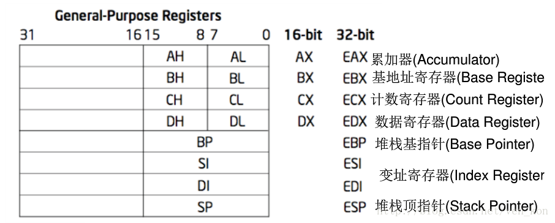

# 参考资料
> 详解80x86架构处理器寄存器https://blog.csdn.net/tcpipstack/article/details/8249941

# 寄存器
8086  CPU 中寄存器总共为 14 个，且均为 16 位 。

即 **AX，BX，CX，DX，SP，BP，SI，DI，IP，FLAG，CS，DS，SS，ES** 共 14 个。

而这 14 个寄存器按照一定方式又分为了通用寄存器，控制寄存器和段寄存器。

# 通用寄存器

## AX，BX，CX，DX 称作为数据寄存器：

AX (Accumulator)：累加寄存器，也称之为累加器；

BX (Base)：基地址寄存器；

CX (Count)：计数器寄存器；

DX (Data)：数据寄存器；

## SP 和 BP 又称作为指针寄存器：

SP (Stack Pointer)：堆栈指针寄存器；

BP (Base Pointer)：基指针寄存器；

## SI 和 DI 又称作为变址寄存器：

SI (Source Index)：源变址寄存器；

DI (Destination Index)：目的变址寄存器；

## 控制寄存器：

IP (Instruction Pointer)：指令指针寄存器；

FLAG：标志寄存器；

## 段寄存器：

CS (Code Segment)：代码段寄存器；

DS (Data Segment)：数据段寄存器；

SS (Stack Segment)：堆栈段寄存器；

ES (Extra Segment)：附加段寄存器；

|寄存器  |说明  |
|----|----|
| $gs | **交替数据段**寄存器 |
| $fs |**交替数据段**寄存器 |
| $es |**交替数据段**寄存器 |
|$ds|**数据段**寄存器 |
|$edi|**目标索引**寄存器 |
|$esi|**源索引**寄存器 |
|$ebp|**帧**指针|
|$esp|**栈**指针 |
|$ebx|**通用**寄存器 |
|$edx|**通用**寄存器 |
|$ecx|**通用**寄存器 |
|$eax|**通用**寄存器 |
|$trapno|**异常向量数** |
|$err|**异常错误代码** |
|$eip|**指令指针** |
|$cs|**代码段**寄存器 |
|$eflags|**标志** |
|$uesp|**用户栈指针** |
|$ss|**堆栈段寄存器** |

