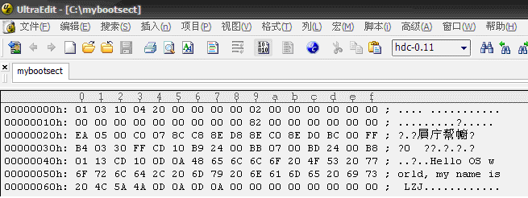
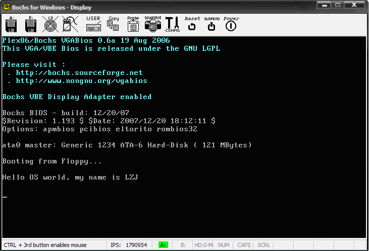
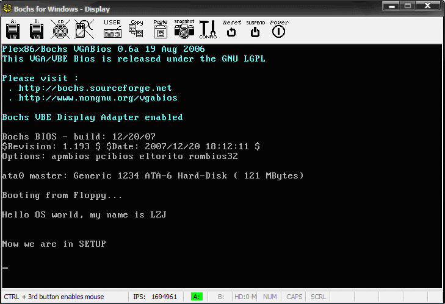

[TOC]
# 操作系统的引导

## 实验的内容
### 改写 bootsect.s
1. 这一部分完成的主要内容是显示操作系统的名字
2. 接着修改如何从 bootsect.s 引导到 setup.s 中去

### 改写 setup.s
1. 从 bootsect.s 到达 setup.s 之后,首先在屏幕输出一条"Now we are in SETUP"
2. setup.s 获得一些基本的硬件参数(内存参数,显卡参数,硬盘参数),并且打印到屏幕上
3. 先不加载 linux 内核

## bootsect.s屏幕输出

bootsect.s 程序会被加载到**0x7C00**处
利用BISO INIT **0x10** 的功能 **0x03** 和 **0x13** 来显示
* **0x03**功能来读取光标位置:
输入: bh = 页号
返回: ch = 扫描开始线; cl = 扫描结束线; dh = 行号(0x00 顶端); dl = 列好(0x00 左端)
* ***0x13** 功能来显示字符串:
输入: al = 放置光标的方式以及规定属性. 0x01表示使用bl中的属性值,光标停在字符串结尾处. bh = 显示页面号; bl = 字符属性; dh = 行号; dl = 列号. cx = 显示的字符串字符数
es:bp 此寄存器对指向要显示的字符串起始位置处

屏幕输出的关键代码如下
``` as86
entry _start
_start:
    mov ah,#0x03        !选择0x03功能
    xor bh,bh           !bh = 0x00
    int 0x10            !用中断功能获得光标位置,放在dx中
    mov cx,#36          !显示字符的数量
    mov bx,#0x0007      !显示页面0,字符属性7(normal)
    mov bp,#msg1        !es:bp 指向要写的字符串
    mov ax,#0x07c0      !INITSEG 的地址
    mov es,ax           !es:bp 指向要写的字符串
    mov ax,#0x1301      !ah = 0x13 代表中断功能; al = 0x01代表bl中的属性
    int 0x10            !使用中断功能,写字符串
inf_loop:
    jmp inf_loop        !无限循环
msg1:
    .byte   13,10       !开始的换行
    .ascii  "Hello OS world, my name is ZYC"
    .byte   13,10,13,10 !结束的两次换行
.org 510
boot_flag:
    .word   0xAA55      !启动的引导扇区标志,BIOS会识别,它必须在引导扇区的最后两个字节
                        !并且可以观察到510+2=512刚好是Image的大小
```
修改后需要编译和连接 bootsect.s
``` bash
$ as86 -0 -a -o bootsect.o bootsect.s
$ ld86 -0 -s -o bootsect bootsect.o
```
`-0`代表生成8086的16位程序, `-a`表示生成与 GNU as 和 ld 部分兼容的代码, `-s`告诉连接器 ld86 去除最后生成的可执行文件中的符号信息, 查看里面的二进制内容可以发现

其中a_magic[0]=0x01，a_magic[1]=0x03，a_flags=0x10（可执行文件），a_cpu=0x04（表示 Intel i8086/8088，如果是 0x17 则表示 Sun 公司的 SPARC），所以 bootsect 文件的头几个字节应该是 01 03 10 04
可是这里生成的 bootsect 文件大小是544 而不是512,是因为多了32字节的文件系统可执行文件的头部,需要去除这个头部
``` bash
$ dd bs=1 if=bootsect of=Image skip=32
```
搬运刚才的镜像, 并且启动
``` bash
# 将刚刚生成的 Image 复制到 linux-0.11 目录下
$ cp ./Image ../Image

# 执行 oslab 目录中的 run 脚本
$ ../../run
```


## 从bootsect.s到setup.s

我们让setup.s 也打印一段字符表示运行到setup部分
``` as86
entry _start
_start:
    mov ah,#0x03        !选择0x03功能
    xor bh,bh           !bh = 0x00
    int 0x10            !用中断功能获得光标位置,放在dx中
    mov cx,#25          !显示字符的数量
    mov bx,#0x0007      !显示页面0,字符属性7(normal)
    mov bp,#msg2        !es:bp 指向要写的字符串
    mov ax,cs           
    mov es,ax           !es:bp 指向要写的字符串
    mov ax,#0x1301      !ah = 0x13 代表中断功能; al = 0x01代表bl中的属性
    int 0x10            !使用中断功能,写字符串
inf_loop:
    jmp inf_loop        !无限循环
msg2:
    .byte   13,10       !开始的换行
    .ascii  "Now we are in SETUP"
    .byte   13,10,13,10 !结束的两次换行
.org 510
boot_flag:
    .word   0xAA55      !启动的引导扇区标志,BIOS会识别,它必须在引导扇区的最后两个字节
                        !并且可以观察到510+2=512刚好是Image的大小
```
准备好了之后回去修改 bootsect.s ,让其载入 setup.s 的代码.
利用 ROM BIOS 中断 INT 0x13 将 setup 模块从磁盘第 2 个扇区开始读到 **0x90200** 开始处，共读 4 个扇区。
* INT 0x13 读扇区使用调用参数设置如下：
ah = 0x02 - 读磁盘扇区到内存；al = 需要读出的扇区数量；
ch = 磁道(柱面)号的低 8 位； cl = 开始扇区(位 0-5)，磁道号高 2 位(位 6-7)；
dh = 磁头号； dl = 驱动器号（如果是硬盘则位 7 要置位）；
es:bx指向数据缓冲区； 如果出错则 CF 标志置位，ah 中是出错码。
``` as86
SETUPLEN=2
SETUPSEG=0x07e0
entry _start
_start:
    mov ah,#0x03
    xor bh,bh
    int 0x10
    mov cx,#36
    mov bx,#0x0007
    mov bp,#msg1
    mov ax,#0x07c0
    mov es,ax
    mov ax,#0x1301
    int 0x10
load_setup:
    mov dx,#0x0000              !磁头号 dh = 0x_00 驱动器号; dl = 0x00
    mov cx,#0x0002              !开始扇区0x2, 磁道(柱面)号为0
    mov bx,#0x0200              !es:bx指向数据缓冲区 es = 0x07C0; bx = 0x0200
    mov ax,#0x0200+SETUPLEN     !ah = 0x02读磁盘扇区到内存; SETUPLEN=2 读扇区数量为2
    int 0x13                    !读取扇区中断
    jnc ok_load_setup           !如果没有出错
    mov dx,#0x0000
    mov ax,#0x0000
    int 0x13
    jmp load_setup
ok_load_setup:
    jmpi    0,SETUPSEG          !加载完毕,跳转到setup程序中去0x07e00
msg1:
    .byte   13,10
    .ascii  "Hello OS world, my name is ZYC"
    .byte   13,10,13,10
.org 510
boot_flag:
    .word   0xAA55
```
通过 make 重新编译
``` bash
$ make BootImage
```
运行程序后可以得到下面的的结果


## setup.s 获得基本硬件参数
setup.s将获得的硬件参数放在内存的0x90000处.
* 中断 0x10 的功能号 ah = 0x03 读取屏幕光标
  输入: bh = 页号
  返回: ch = 扫描开始线；cl = 扫描结束线；dh = 行号(0x00 顶端)；dl = 列号(0x00 最左边)。
* 中断 0x15 的功能号 ah = 0x88
  返回: ax = 从0x100000(1M)开始的扩展内存大小,如果错误ax = 出错码
``` as86
INITSEG  = 0x9000
entry _start
_start:
! Print "NOW we are in SETUP"
    mov ah,#0x03
    xor bh,bh
    int 0x10
    mov cx,#25
    mov bx,#0x0007
    mov bp,#msg2
    mov ax,cs
    mov es,ax
    mov ax,#0x1301
    int 0x10

    mov ax,cs
    mov es,ax
! init ss:sp
    mov ax,#INITSEG             
    mov ss,ax                   !当前运行的地方
    mov sp,#0xFF00              !初始化堆栈

! Get Params
    mov ax,#INITSEG
    mov ds,ax                   !把ds设置为0x9000
    mov ah,#0x03                !0x10中断的功能ah = 0x03
    xor bh,bh                   !页号0
    int 0x10                    !中断
    mov [0],dx                  !返回的行号,列号存在 0x90000
    mov ah,#0x88                !0x15中断的功能ah = 0x88
    int 0x15                    !触发中断
    mov [2],ax                  !把内存大小放在 0x90002
    mov ax,#0x0000              
    mov ds,ax                   !ds=0x0000
    lds si,[4*0x41]             !将0x104的四个字节读出来,ds放段地址,si放段内偏移地址
    mov ax,#INITSEG
    mov es,ax
    mov di,#0x0004              !传送目的地址 es = 0x9000, di = 0x0004
    mov cx,#0x10                !传输字节数16
    rep
    movsb

! Be Ready to Print
    mov ax,cs
    mov es,ax
    mov ax,#INITSEG
    mov ds,ax

! Cursor Position
    mov ah,#0x03
    xor bh,bh
    int 0x10                    !获得光标位置
    mov cx,#18                  !字符数量18
    mov bx,#0x0007
    mov bp,#msg_cursor
    mov ax,#0x1301
    int 0x10                    !显示字符
    mov dx,[0]                  !把光标读出来
    call    print_hex           !打印
! Memory Size
    mov ah,#0x03
    xor bh,bh
    int 0x10
    mov cx,#14
    mov bx,#0x0007
    mov bp,#msg_memory
    mov ax,#0x1301
    int 0x10
    mov dx,[2]
    call    print_hex
! Add KB
    mov ah,#0x03
    xor bh,bh
    int 0x10
    mov cx,#2
    mov bx,#0x0007
    mov bp,#msg_kb
    mov ax,#0x1301
    int 0x10
! Cyles
    mov ah,#0x03
    xor bh,bh
    int 0x10
    mov cx,#7
    mov bx,#0x0007
    mov bp,#msg_cyles
    mov ax,#0x1301
    int 0x10
    mov dx,[4]
    call    print_hex
! Heads
    mov ah,#0x03
    xor bh,bh
    int 0x10
    mov cx,#8
    mov bx,#0x0007
    mov bp,#msg_heads
    mov ax,#0x1301
    int 0x10
    mov dx,[6]
    call    print_hex
! Secotrs
    mov ah,#0x03
    xor bh,bh
    int 0x10
    mov cx,#10
    mov bx,#0x0007
    mov bp,#msg_sectors
    mov ax,#0x1301
    int 0x10
    mov dx,[12]
    call    print_hex

inf_loop:
    jmp inf_loop

print_hex:
    mov    cx,#4            !循环次数4
print_digit:
    rol    dx,#4            !循环左移指令,这样可以方便取出最高位
    mov    ax,#0xe0f        !ah=0x0e是中断功能, al=0x0f是半字节掩码
    and    al,dl            !取半个字节
    add    al,#0x30         !数字 ascii 的偏移
    cmp    al,#0x3a         !如果是数字,打印数字
    jl     outp
    add    al,#0x07         !如果是字母,加上字母的偏移
outp:
    int    0x10             !打印字符
    loop   print_digit
    ret
print_nl:                   !打印换行
    mov    ax,#0xe0d        ! CR
    int    0x10
    mov    al,#0xa          ! LF
    int    0x10
    ret

msg2:
    .byte 13,10
    .ascii "NOW we are in SETUP"
    .byte 13,10,13,10
msg_cursor:
    .byte 13,10
    .ascii "Cursor position:"
msg_memory:
    .byte 13,10
    .ascii "Memory Size:"
msg_cyles:
    .byte 13,10
    .ascii "Cyls:"
msg_heads:
    .byte 13,10
    .ascii "Heads:"
msg_sectors:
    .byte 13,10
    .ascii "Sectors:"
msg_kb:
    .ascii "KB"

.org 510
boot_flag:
    .word 0xAA55
```