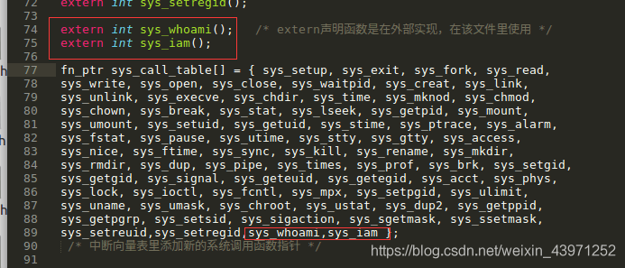
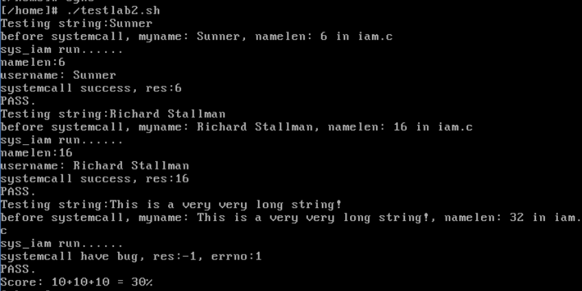
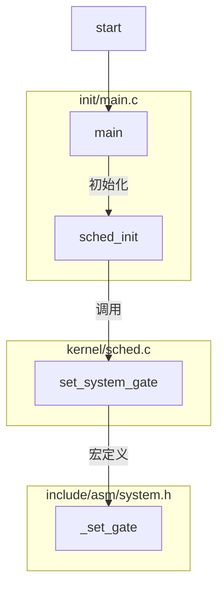
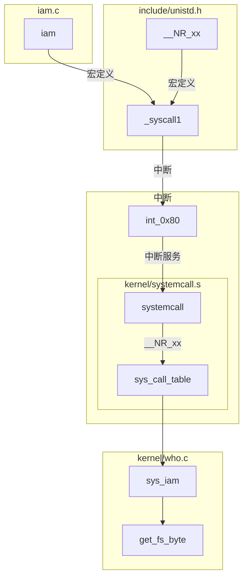

[TOC]
# 系统调用

实验的完成参考了[https://blog.csdn.net/weixin_43971252/article/details/89714559](https://blog.csdn.net/weixin_43971252/article/details/89714559)

## 实验内容
1. 应用程序 `iam()`
   ``` C
    int iam(const char* name);
   ```
   将 `name` 的内容保存下来.长度不得超过23个字符.返回拷贝的字符数.
2. 应用程序 `whoami()`
   ``` C
    int whiami(char* name, unsigned int size);
   ```
   把名字的内容从内核中拷贝到`name`指向的地址空间中.返回值是拷贝的字符数.

实现的效果是
``` shell
$ ./iam lizhijun

$ ./whoami

lizhijun
```

## 应用程序如何调用系统调用
调用系统调用，是调用系统库中为该系统调用编写的一个接口函数，叫 API（Application Programming Interface）。API 并不能完成系统调用的真正功能，它要做的是去调用真正的系统调用，过程是：

* 把系统调用的编号存入 EAX；
* 把函数参数存入其它通用寄存器；
* 触发 0x80 号中断（int 0x80）。

在应用程序`iam()`和`whoami()`中要有:
``` C
/* 有它，_syscall1 等才有效。详见unistd.h */
#define __LIBRARY__

/* 有它，编译器才能获知自定义的系统调用的编号 */
#include "unistd.h"

/* iam()在用户空间的接口函数 */
_syscall1(int, iam, const char*, name);

/* whoami()在用户空间的接口函数 */
_syscall2(int, whoami,char*,name,unsigned int,size);
```

`_syscall1` 和 `_syscall2` 是两个宏定义,这两个宏定义在`include/unistd.h`

``` C
//在 include/unistd.h
##define __NR_iam    72

#define _syscall1(type,name,atype,a) \
type name(atype a) \
{ \
long __res; \
__asm__ volatile ("int $0x80" \
    : "=a" (__res) \
    : "0" (__NR_##name),"b" ((long)(a))); \
if (__res >= 0) \
    return (type) __res; \
errno = -__res; \
return -1; \
}
```
将`_syscall1(int, iam, const char*, name);`套用进去可以得到
``` C
##define __NR_iam    72
int iam(const char* name)
{
    long __res;
    __asm__ volatile ("int $0x80"
        : "=a" (__res)
        : "0" (__NR_iam),"b" ((long)(name)));
    if (__res >= 0)
        return (int) __res;
    errno = -__res;
    return -1;
}
```
这个宏定义把`__NR_iam`存入 **eax**, `fd` 存入 **ebx** ,触发 **0x80** 中断,返回值存入`__res`
* 这里提到的`unistd.h`需要修改到我们写的linux操作系统中的`/usr/include`目录下的头文件去,这里的头文件是我们在linux操作系统中使用gcc编译的时候会使用到的库.

## 配置 int 0x80 中断

在内核初始化的时候会运行到 `init/main.c` 中的 `sched_init()`
``` C
void main(void)
{
//    ……
    time_init();
    sched_init();       //int 0x80 中断配置在这里完成
    buffer_init(buffer_memory_end);
//    ……
}
```
`sched_init()` 在 `kernel/sched.c` 中定义为：
``` C
void sched_init(void)
{
//    ……
    set_system_gate(0x80,&system_call);
}
```
`set_system_gate`作为宏,定义在`include/asm/system.h`
``` C
#define set_system_gate(n,addr) \
    _set_gate(&idt[n],15,3,addr)

#define _set_gate(gate_addr,type,dpl,addr) \
__asm__ ("movw %%dx,%%ax\n\t" \
         "movw %0,%%dx\n\t" \
         "movl %%eax,%1\n\t" \
         "movl %%edx,%2" \
         : \
         : "i" ((short) (0x8000+(dpl<<13)(type<<8))), \
         "o" (*((char *) (gate_addr))), \
         "o" (*(4+(char *) (gate_addr))), \
         "d" ((char *) (addr)),"a" (0x00080000))
```
这里实际上就是填写了0x80这个中断的IDT表项, 触发中断后会运行到 addr 的地址,也就是`system_call`

## 发送 0x80 中断之后
配置好之后,产生中断会到`system_call`, 定义在`kernel/system_call.s`
``` as

!……
! # 这是系统调用总数。如果增删了系统调用，必须做相应修改
nr_system_calls = 72
!……

.globl system_call
.align 2
system_call:

! # 检查系统调用编号是否在合法范围内
    cmpl \$nr_system_calls-1,%eax
    ja bad_sys_call
    push %ds
    push %es
    push %fs
    pushl %edx
    pushl %ecx

! # push %ebx,%ecx,%edx，是传递给系统调用的参数
    pushl %ebx

! # 让ds, es指向GDT，内核地址空间
    movl $0x10,%edx
    mov %dx,%ds
    mov %dx,%es
    movl $0x17,%edx
! # 让fs指向LDT，用户地址空间
    mov %dx,%fs
    call sys_call_table(,%eax,4)
    pushl %eax
    movl current,%eax
    cmpl $0,state(%eax)
    jne reschedule
    cmpl $0,counter(%eax)
    je reschedule
```
产生中断之后会把 **syscall** 传递进来的参数参数**压栈**, 改变寻址方式, 切换到内核态, 通过 `eax` 在 `sys_call_table` 查找对应的处理函数.
`sys_call_table`定义在`include/linux/sys.h`中


## 内核处理函数 sys_iam() 和 sys_whoami()
建立一个文件`kernel/who.c`
``` C
/* 功能：核心态文件，在who.c里实现系统调用sys_iam()与sys_whoami() */
    
#include<errno.h>         /* linux-0.11/include */
#include<unistd.h>
#include<asm/segment.h>  /* linux-0.11/include/asm */
#include<linux/kernel.h>
/* 直接包含的头文件是到linux-0.11/include目录 */

#define MAXLEN 23
char username[MAXLEN+1] = {0};        /* 内核态下，存储名字 */

int sys_iam(const char* myname){   /* myname为_syscallx调用时保存好了的 */

	unsigned int i = 0;
	unsigned int namelen = 0;

	/* get_fs_byte(const char * addr) 从用户空间逻辑地址addr取出一个字节数据 */
	while(get_fs_byte(myname+namelen)!='\0')
		++namelen;                          
	if(namelen > MAXLEN){
		errno = EINVAL;    /* #define EINVAL  22 : Invalid argument */   
		return -1;
	}
	while(i < namelen){
		username[i] = get_fs_byte(myname+i);  /* 将用户态下传递的字符串参数拷贝到内核中保存 */
		++i;
	}
	username[i] = '\0';;
	return namelen;
}

int sys_whoami(char* myname, unsigned int size){

	unsigned int i = 0;
	unsigned int namelen = 0;
	while(username[namelen]!='\0')
		++namelen;
	if(size < namelen){   /* size小于所需的拷贝空间 */
		errno = EINVAL;
		return -1;
	}
	for(; i <= namelen; ++i){
		put_fs_byte(username[i], myname+i); /* 将内核态里的数据拷贝到用户态文件里 */
	}
	return namelen;
}

```
这里获得的名字是存储在用户态的地址上, 通过 `include/asm/segment.h` 下的两个接口, 可以把数据从用户态地址读出来, 也可以放回去
``` C
extern inline unsigned char get_fs_byte(const char * addr)
{
    unsigned register char _v;
    __asm__ ("movb %%fs:%1,%0":"=r" (_v):"m" (*addr));
    return _v;
}
extern inline void put_fs_byte(char val,char *addr)
{
    __asm__ ("movb %0,%%fs:%1"::"r" (val),"m" (*addr));
}
```

## 修改Makefile
上面添加的`kernel/who.c`可以和其它 Linux 代码编译链接到一起，必须要修改 Makefile 文件。
我们要修改的是 `kernel/Makefile`。需要修改两处。
``` makefile
OBJS  = sched.o system_call.o traps.o asm.o fork.o \
        panic.o printk.o vsprintf.o sys.o exit.o \
        signal.o mktime.o who.o
```
添加了 `who.o`
``` makefile
### Dependencies:
who.s who.o: who.c ../include/linux/kernel.h ../include/unistd.h
exit.s exit.o: exit.c ../include/errno.h ../include/signal.h \
  ../include/sys/types.h ../include/sys/wait.h ../include/linux/sched.h \
  ../include/linux/head.h ../include/linux/fs.h ../include/linux/mm.h \
  ../include/linux/kernel.h ../include/linux/tty.h ../include/termios.h \
  ../include/asm/segment.h
```
添加了 `who.s who.o: who.c ../include/linux/kernel.h ../include/unistd.h`
修改完成后 `make all` 可以将 `who.c` 加入内核中

## 编写应用程序
这里的代码时丢到虚拟机环境下运行的应用程序, 可以在外部编辑好之后传到虚拟机环境再编译和运行.
* iam.c 部分, 得到 shell 输入的 `name` 参数, 检查用户的输入, 调用给内核去执行
``` C
#define __LIBRARY__
#include<unistd.h>
#include<stdio.h>   
#include<errno.h>

/* 功能:用户态文件,测试系统调用iam() */  

/* 系统调用: */
/* 第一个是函数返回值类型，第二个为函数名，第三个是参数1的数据类型，第四个是参数1的名称，依次类推 */
_syscall1(int,iam,const char*,myname)

#define NAMELEN 50    /* 定义最大长度为50 */
char myname[NAMELEN] = {0}; /* 用户态下，存储名字,并且要初始化 */

/* argc是命令行参数的个数，argv存储了所有的命令行输入的所有参数的值 */
/* 比如./iam warm-like-spring  :得到argc=2,argv[0]=./iam,argv[1]=warm-like-spring */
int main(int argc, char* argv[])
{
	int res = 0;    /* 用于接受系统调用后的返回值 */
	unsigned int namelen = 0;  /* 名字的实际长度 */

	if(argc < 2){
		printf("Input arguments is less!\n");
		return -1;
	}
	else {
		while(argv[1][namelen] != '\0'){       /* 读取并拷贝main参数接收的输入名字字符串 */
			myname[namelen] = argv[1][namelen];
			++namelen;
		}
		printf("before systemcall, myname: %s, namelen: %d in iam.c\n",myname,namelen);
		res = iam(myname);  /* 传递拷贝的参数进行调用 */
	}

	if(res == -1) 
		printf("systemcall have bug, res:%d, errno:%d\n",res,errno);  /* 打印对应的错误信息码 */
	else
		printf("systemcall success, res:%d\n",res);
	return 0;
}

```
* whoami.c 部分, 把内核中的名称读取出来
``` C
#define __LIBRARY__
#include<unistd.h>
#include<stdio.h>
#include<errno.h>

/* 功能:用户态文件,测试系统调用whoami() */

_syscall2(int, whoami, char*, myname, unsigned int, size)

#define SIZE 23

int main(int argc, char** argv)
{
	char myname[SIZE+1] = {0}; /* 定义初始化 */
	unsigned int res = 0;

	res = whoami(myname, SIZE+1);
	if(res == -1)
		printf("systemcall have bug, res:%d, errno:%d\n",res,errno); 
	else{
		printf("%s\n",myname);
	}
	return 0;
}

```
编译写好的源代码
``` shell
gcc -o iam iam.c -Wall
gcc -o whoami whoami.c -Wall
```

## 测试功能 

把 `testlab2.sh` 放到同一个目录下运行

测试程序输入三次名字, 检查每次的输出, 其中两次是正确的信息, 一次是超出长度的信息

## 总结
### 中断初始化

### iam, whoami 类似


### 添加一个新的系统调用
* 在`include/unistd.h`添加 `#define __NR_xx`
* 在`kernel/systemcall.s`中,增加系统调用数量
* 在`sys_call_table`添加新的table
* 在`kernel`编写内核函数 sys_xxx
* 编写应用程序,要记得添加`syscall`