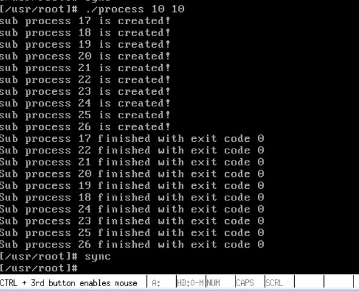

# 进程运行轨迹的跟踪和统计

> 实验参考:https://www.lanqiao.cn/courses/reports/341159/
> linux内核完全注释 **init/main.c** 、 **kernel/fork.c** 、 **kernel/sched.c**


## 实验内容

* process.c 应用程序: 实现所有子进程都并行运行, 每个进程运行时间不超过30s; 打印所有子进程的id, 并且在所有子进程结束之后再推出父进程.
* /var/process.log 日志文件: 内核去维护这个日志文件, 吧所有进程的运行轨迹都记录在这个log 文件当中.
  * 文件格式为  `|   pid |   X   |   time    |` 
  * pid 是进程的 id
  * X 是 **N(新建), J(就绪), R(运行), W(阻塞), E(退出)** 的其中一个
  * time 表示 X 的发送时间, 这里记录的是系统的滴答时间
  * 三个参数之间用制表符分隔开
* 分析log 文件, 统计该程序建立的所有进程的等待时间, 完成时间, 运行时间; 计算平均等待时间, 平均完成时间, 吞吐量. 可以使用 stat_log.py 进行统计.

## 编写样本程序

编写一个样本程序可以启动多个子线程， 每个子线程分别有CPU任务和IO任务。可以再Linux上测试通过之后，再放到0.11下运行。

``` C
#include <stdio.h>
#include <unistd.h>
#include <time.h>
#include <sys/time.h>
#include <stdlib.h>

#define HZ      (100.0)

void cpuio_bound(int last, int cpu_time, int io_time);

int main(int argc, char* argv[])
{
    int last_time, p_num, p_time, exit_code;
    int pid;
    int i;
    if (argc != 3)      /*检查输入的参数 */
    {
        printf("Example: \"./process last_time p_num\"\n");
        return  (22);
    }
    else
    {
        last_time = atoi(argv[1]);  /* 运行时间，最高不超过30s */
        p_num = atoi(argv[2]);      /* 子线程数量 */
        if (last_time%p_num == 0)
        {
            p_time = last_time / p_num;
            for (i = 0; i < p_num; i++) {
                pid = fork();
                if (pid == 0) { /*子进程运行到里面*/
                    cpuio_bound(last_time, (p_num - i)*p_time, p_time); /*建立一系列cpu_time越来越少的线程，0 <= cpu_time <= last_time*/
                    return  (0);
                }
                else   /* 父进程运行这里 */
                    printf("sub process %d is created!\n", pid);
            }
            for (i = 0; i < p_num; i++) {
                 pid=wait(&exit_code);
                 printf("Sub process %d finished with exit code %d\n", pid, exit_code);
            }

        }
        else
        {
            printf("Example: \"./process last_time p_num\"\n and n must be the divisor of last. \n");
            return  (22);
        }
    }
    return  (0);
}

/* 
 * 此函数按照参数占用CPU和IO时间
 * last: 函数实际占用CPU和IO的总时间, 不包括就绪队列的时间, 就是实际运行的时间
 * cpu_time: 一次连续占用CPU的时间, >=0是必须的
 * io_time: 一次IO消耗的时间, >=0是必须的
 * 如果 last > cpu_time + io_time, 则会往复多次占用CPU和IO
 * 所有的时间单位是秒
 */
void cpuio_bound(int last, int cpu_time, int io_time)
{
    struct tms start_time, current_time;
    clock_t utime, stime;
    int sleep_time;

    while(last > 0)     /*没有持续时间就退出*/
    {
        times(&start_time);  /* 记录开始时间 */
        do 
        {
            times(&current_time);
            utime = current_time.tms_utime - start_time.tms_utime;  /*执行用户代码的时间*/
            stime = current_time.tms_stime - start_time.tms_stime;  /*执行内核代码的时间*/
        } while(((utime + stime) / HZ) < cpu_time);  /*不断循环，模拟一个cpu_time秒的时间*/
        last -= cpu_time;

        if(last <= 0)   /*没有持续时间就退出*/
            break;

        sleep_time = 0;
        while (sleep_time < io_time)  /*用sleep来模拟IO操作，模拟一个io_time秒的时间*/
        {
            sleep(1);
            sleep_time++;
        }
        last -= sleep_time;
    }
}
```





