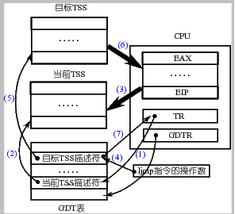
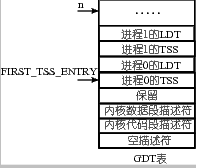
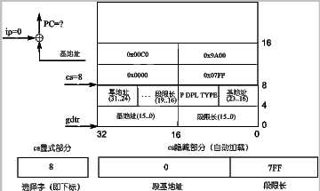
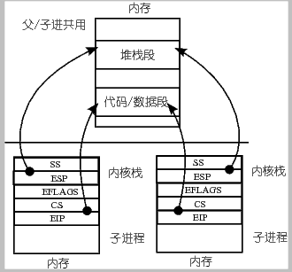
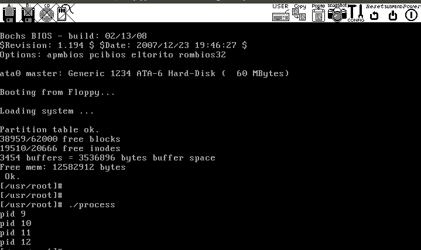

[TOC]
# 实验内容

* 编写汇编程序 `switch_to`
* 完成主体框架
* 在主体框架下依次完成PCB切换、内核栈切换、LDT切换等
* 修改 `fork()`, 由于是基于内核栈的切换，所以进程需要创建出完成内核栈切换的样子
* 修改PCB， 即 `task_struct` 结构，增加对应的内容域，同时处理修改结构造成的影响
* 用修改的 Linux 0.11 仍然可以启动，正常的使用
* （选做）分析实验3的日志，体会修改前后系统运行的差别。

# TSS切换
在现在的linux 0.11 中，进程的切换时依靠任务状态段（Task State Segment, 简称 TSS）的切换来完成的。
在X86 系统架构，每个任务（进程或线程）都对应一个独立的TSS， TSS 就是内存中的一个结构体， 其中包含了CPU 所有寄存器的映像。任务寄存器（Task Register， 简称TR）指向当前进程对应的TSS 结构体，所谓TSS 切换就是将CPU 中所有的寄存器复制到TR 指向的TSS 结构体中保存起来， 同时找到一个目标TSS, 就是要切换到下一个进程对应的TSS， 将其中存放的寄存器映像“扣在”CPU上， 就完成了执行现场的切换

x86架构上只需要一条指令就可以完成这样的切换，即图中 **ljmp** 指令。
其工作过程为：
1. 用TR 中存取的段选择符在GDT 表中找到当前TSS 内存位置，需要用段表中的一个描述符来描述TSS 段。TR，CS，DS等寄存器的功能是完全类似的。
2. 找到了当前的TSS 段， 将CPU 中的寄存器映像存放到这段内存区域中， 相当于拍了一个快照。
3. 存放了当前进程的执行现场后，切换到目标进程的现场，找目标TSS 段的方法与之前一致。
4. 一旦将目标TSS 中的所有寄存器映像扣在CPU 上， 就相当于切换到了目标进程的执行现场了，因为哪里有目标进程停下时的 **CS：EIP**，因此目标进程就从这里开始执行，目标进程就变成了当前进程。并把TR 修改为当前TSS段的描述符所在的位置。
``` C
#define switch_to(n) {
    struct{long a,b;} tmp;
    __asm__(
        "movw %%dx,%1"
        "ljmp %0" ::"m"(*&tmp.a), "m"(*&tmp.b), "d"(TSS(n)
    )
 }

#define FIRST_TSS_ENTRY 4

#define TSS(n) (((unsigned long) n) << 4) + (FIRST_TSS_ENTRY << 3))
```
GDT 表的结构如下图所示，所以第一个 TSS 表项，即 0 号进程的 TSS 表项在第 4 个位置上，4<<3，即 4 * 8，相当于 TSS 在 GDT 表中开始的位置，TSS（n）找到的是进程 n 的 TSS 位置，所以还要再加上 n<<4，即 n * 16，因为每个进程对应有 1 个 TSS 和 1 个 LDT，每个描述符的长度都是 8 个字节，所以是乘以 16，其中 LDT 的作用就是上面论述的那个映射表，关于这个表的详细论述要等到内存管理一章。TSS(n) = n * 16 + 4 * 8，得到就是进程 n（切换到的目标进程）的 TSS 选择子，将这个值放到 dx 寄存器中，并且又放置到结构体 tmp 中 32 位长整数 b 的前 16 位，现在 64 位 tmp 中的内容是前 32 位为空，这个 32 位数字是段内偏移，就是 jmpi 0, 8 中的 0；接下来的 16 位是 n * 16 + 4 * 8，这个数字是段选择子，就是 jmpi 0, 8 中的 8，再接下来的 16 位也为空。所以 swith_to 的核心实际上就是 ljmp 空, n*16+4*8，现在和前面给出的基于 TSS 的进程切换联系在一起了。


# 本实验内容
ljmp 执行时间很长，改为堆栈实现的方式，要实现基于内核栈的任务切换，主要完成如下三件工作：
（1）重写 switch_to；
（2）将重写的 switch_to 和 schedule() 函数接在一起；
（3）修改现在的 fork()。

## switch_to入口
switch_to需要用到当前进程的 PCB、目标进程的 PCB、当前进程的内核栈、目标进程的内核栈等信息来进行切换。只要告诉新 switch_to()函数一个指向目标进程 PCB 的指针就可以了。同时还要将 next 也传递进去，虽然 TSS(next)不再需要了，但是 LDT(next)仍然是需要的。
``` C
/*********************************kernel/sched.c*********************************/
@@ -104,8 +105,9 @@ void math_state_restore()
 void schedule(void)
 {
     int i,next,c;
-    struct task_struct ** p;
+    struct task_struct ** p, *pnext;
 
+    pnext = &(init_task.task);
 /* check alarm, wake up any interruptible tasks that have got a signal */
 
     for(p = &LAST_TASK ; p > &FIRST_TASK ; --p)
@@ -130,7 +132,7 @@ void schedule(void)
             if (!*--p)
                 continue;
             if ((*p)->state == TASK_RUNNING && (*p)->counter > c)
-                c = (*p)->counter, next = i;
+                c = (*p)->counter, next = i, pnext = *p;
         }
         if (c) break;
         for(p = &LAST_TASK ; p > &FIRST_TASK ; --p)
@@ -138,7 +140,7 @@ void schedule(void)
                 (*p)->counter = ((*p)->counter >> 1) +
                         (*p)->priority;
     }
-    switch_to(next);
+    switch_to(pnext, _LDT(next));
 }
```

## 实现switch_to
由于是 C 语言调用汇编，所以需要首先在汇编中处理栈帧，即处理 ebp 寄存器；接下来要取出（通过`8(%ebp)`）表示下一个进程 PCB 的参数（pnext），并和 current 做一个比较，如果等于 current，则什么也不用做；如果不等于 current，就开始进程切换，依次完成 PCB 的切换、TSS 中的内核栈指针的重写、内核栈的切换、LDT 的切换以及 PC 指针（即 CS:EIP）的切换。

``` C
/*********************************kernel/system_call.s*********************************/
switch_to:
    pushl %ebp
    movl %esp,%ebp
    pushl %ecx
    pushl %ebx
    pushl %eax
    movl 8(%ebp),%ebx
    cmpl %ebx,current
    je 1f
```

### 切换PCB
PCB 的切换可以采用下面两条指令，其中 `ebx` 是从参数中取出来的下一个进程的 PCB 指针, 经过这两条指令以后，eax 指向现在的当前进程，ebx 指向下一个进程，全局变量 current 也指向下一个进程。
``` C
/*********************************kernel/system_call.s*********************************/
    movl %ebx,%eax
    xchgl %eax,current
```

### TSS 中内核栈指针的重写
定义两个变量,`tss` 用来存储0 号进程的TSS 内存。现在虽然不使用 TSS 进行任务切换了，但是 Intel 的这态中断处理机制还要保持，所以仍然需要有一个当前 TSS，这个 TSS 就是我们定义的那个全局变量 tss，即 0 号进程的 tss，所有进程都共用这个 tss，任务切换时不再发生变化。`ESP0(%ecx)` 表示 %ecx(也就是 tss结构)偏移为 4的位置，这个位置就是存放 esp0的位置。
``` C
/*********************************kernel/sched.c*********************************/
@@ -60,6 +60,7 @@ static union task_union init_task = {INIT_TASK,};
 long volatile jiffies=0;
 long startup_time=0;
 struct task_struct *current = &(init_task.task);
+struct tss_struct *tss = &(init_task.task.tss);
 struct task_struct *last_task_used_math = NULL;
 
 struct task_struct * task[NR_TASKS] = {&(init_task.task), };

/*********************************kernel/system_call.s*********************************/
 @@ -60,6 +61,9 @@ sa_restorer = 12
 
 nr_system_calls = 72
 
+ESP0 = 4
+KERNEL_STACK = 12

+    movl tss,%ecx
+    addl $4096,%ebx
+    movl %ebx,ESP0(%ecx)
```

### 切换内核栈
将寄存器 esp（内核栈使用到当前情况时的栈顶位置）的值保存到当前 PCB 中，再从下一个 PCB 中的对应位置上取出保存的内核栈栈顶放入 esp 寄存器，这样处理完以后，再使用内核栈时使用的就是下一个进程的内核栈了。现在的 Linux 0.11 的 PCB 定义中没有保存内核栈指针这个域（kernelstack），所以需要加上成员`kernelstack`。
``` C
/*********************************include/linux/sched.h*********************************/
@@ -82,6 +83,7 @@ struct task_struct {
     long state;    /* -1 unrunnable, 0 runnable, >0 stopped */
     long counter;
     long priority;
+    long kernelstack;
     long signal;
     struct sigaction sigaction[32];
     long blocked;    /* bitmap of masked signals */
```

`%eax`在上方通过`xchgl %eax,current`现在存储的是当前PCB 结构的地址，`KERNEL_STACK(%eax)`向后偏移12 位就是成员`kernelstack`, 这里将当前 esp 存入到当前PCB中。并把下一个 pnext 的PCB 中的 esp寄存器拿出来。
``` C
/*********************************kernel/system_call.s*********************************/
+KERNEL_STACK = 12

+   movl %esp,KERNEL_STACK(%eax)
! 再取一下 ebx，因为前面修改过 ebx 的值
+   movl 8(%ebp),%ebx
+   movl KERNEL_STACK(%ebx),%esp
```

根据变化修改结构体的定义,添加0 号进程的 esp 即栈指针的初始化。
``` C
/*********************************include/linux/sched.h*********************************/
@@ -113,7 +115,7 @@ struct task_struct {
  * your own risk!. Base=0, limit=0x9ffff (=640kB)
  */
 #define INIT_TASK \
-/* state etc */    { 0,15,15, \
+/* state etc */    { 0,15,15,PAGE_SIZE+(long)&init_task, \
 /* signals */    0,{{},},0, \
 /* ec,brk... */    0,0,0,0,0,0, \
 /* pid etc.. */    0,-1,0,0,0, \
```

 ### 切换LDT
 再下一个切换就是 LDT 的切换了，指令 movl 12(%ebp),%ecx 负责取出对应 LDT(next)的那个参数，指令 lldt %cx 负责修改 LDTR 寄存器，一旦完成了修改，下一个进程在执行用户态程序时使用的映射表就是自己的 LDT 表了，地址空间实现了分离。
 
 这两句代码的含义是重新取一下段寄存器 fs 的值，这两句话必须要加、也必须要出现在切换完 LDT 之后，这是因为在实践项目 2 中曾经看到过 fs 的作用——通过 fs 访问进程的用户态内存，LDT 切换完成就意味着切换了分配给进程的用户态内存地址空间，所以前一个 fs 指向的是上一个进程的用户态内存，而现在需要执行下一个进程的用户态内存，所以就需要用这两条指令来重取 fs。

不过，细心的读者可能会发现：fs 是一个选择子，即 fs 是一个指向描述符表项的指针，这个描述符才是指向实际的用户态内存的指针，所以上一个进程和下一个进程的 fs 实际上都是 0x17，真正找到不同的用户态内存是因为两个进程查的 LDT 表不一样，所以这样重置一下 fs=0x17 有用吗，有什么用？要回答这个问题就需要对段寄存器有更深刻的认识，实际上段寄存器包含两个部分：显式部分和隐式部分，如下图给出实例所示，就是那个著名的 jmpi 0, 8，虽然我们的指令是让 cs=8，但在执行这条指令时，会在段表（GDT）中找到 8 对应的那个描述符表项，取出基地址和段限长，除了完成和 eip 的累加算出 PC 以外，还会将取出的基地址和段限长放在 cs 的隐藏部分，即图中的基地址 0 和段限长 7FF。为什么要这样做？下次执行 jmp 100 时，由于 cs 没有改过，仍然是 8，所以可以不再去查 GDT 表，而是直接用其隐藏部分中的基地址 0 和 100 累加直接得到 PC，增加了执行指令的效率。现在想必明白了为什么重新设置 fs=0x17 了吧？而且为什么要出现在切换完 LDT 之后？
 ``` C
/*********************************kernel/system_call.s*********************************/
+/* ! switch LDT */
+    movl 12(%ebp),%ecx
+    lldt %cx
+
+
+    movl $0x17,%ecx /* fs descript the pointer of user state memory*/
+    mov %cx,%fs
 ```
 

 ### 其他修改
 switch_to最后一段
 ``` C
/*********************************kernel/system_call.s*********************************/
+/* math process*/
+    cmpl %eax,last_task_used_math
+    jne 1f
+    clts
+
+1: popl %eax
+    popl %ebx
+    popl %ecx
+    popl %ebp
+ret
 ```
 函数声明
 ``` C
/*********************************kernel/system_call.s*********************************/
+.globl switch_to, first_return_from_kernel
 ```

## 修改fork()
开始修改 fork() 了，和书中论述的原理一致，就是要把进程的用户栈、用户程序和其内核栈通过压在内核栈中的 SS:ESP，CS:IP 关联在一起。

另外，由于 fork() 这个叉子的含义就是要让父子进程共用同一个代码、数据和堆栈，现在虽然是使用内核栈完成任务切换，但 fork() 的基本含义不会发生变化。

将上面两段描述联立在一起，修改 fork() 的核心工作就是要形成如下图所示的子进程内核栈结构。
fork 进程的父子进程结构
fork就是对子进程的内核栈进行初始化。通过 `get_free_page()`给子进程申请一页的空间，`krnstack`指向栈顶的位置。就可以找到子进程的内核栈位置，接下来就是初始化 krnstack 中的内容了。

``` C
/****************************************kernel/fork.c*************************************/
@@ -74,6 +75,7 @@ int copy_process(int nr,long ebp,long edi,long esi,long gs,long none,
		long ebx,long ecx,long edx,
		long fs,long es,long ds,
		long eip,long cs,long eflags,long esp,long ss)
     struct task_struct *p;
     int i;
     struct file *f;
+    long *krnstack;

     p = (struct task_struct *) get_free_page();
     if (!p)
@@ -90,6 +92,7 @@ int copy_process(int nr,long ebp,long edi,long esi,long gs,long none,
     p->utime = p->stime = 0;
     p->cutime = p->cstime = 0;
     p->start_time = jiffies;
+    /*
     p->tss.back_link = 0;
     p->tss.esp0 = PAGE_SIZE + (long) p;
     p->tss.ss0 = 0x10;
@@ -111,6 +114,34 @@ int copy_process(int nr,long ebp,long edi,long esi,long gs,long none,
     p->tss.gs = gs & 0xffff;
     p->tss.ldt = _LDT(nr);
     p->tss.trace_bitmap = 0x80000000;
+    */
+    krnstack = (long *)(PAGE_SIZE + (long)p);
+    *(--krnstack) = ss & 0xffff;
+    *(--krnstack) = esp;
+    *(--krnstack) = eflags;
+    *(--krnstack) = cs & 0xffff;
+    *(--krnstack) = eip;

+    *(--krnstack) = ds;
+    *(--krnstack) = es;
+    *(--krnstack) = fs;
+    *(--krnstack) = gs;
+    *(--krnstack) = esi;
+    *(--krnstack) = edi;
+    *(--krnstack) = edx;
```
接下来的工作就需要和 switch_to 接在一起考虑了，应该从 “切换内核栈” 完事的那个地方开始，现在到子进程的内核栈开始工作了，接下来做的四次弹栈以及 ret 处理使用的都是子进程内核栈中的东西，为了能够顺利完成这些弹栈工作，子进程的内核栈中应该有这些内容，所以需要对 krnstack 进行初始化.
现在到了 ret 指令了，这条指令要从内核栈中弹出一个 32 位数作为 EIP 跳去执行，所以需要弄一个函数地址（仍然是一段汇编程序，所以这个地址是这段汇编程序开始处的标号）并将其初始化到栈中。我们弄的一个名为 first_return_from_kernel 的汇编标号，然后可以用语句 *(--krnstack) = (long) first_return_from_kernel; 将这个地址初始化到子进程的内核栈中，现在执行 ret 以后就会跳转到 first_return_from_kernel 去执行了。
``` C
/****************************************kernel/fork.c*************************************/
+    *(--krnstack) = (long)first_return_from_kernel;
+    *(--krnstack) = ebp;
+    *(--krnstack) = ecx;
+    *(--krnstack) = ebx;
+    *(--krnstack) = 0;
```
接下来应该那个“内核级线程切换五段论”中的最后一段切换了，即完成用户栈和用户代码的切换，依靠的核心指令就是 iret，当然在切换之前应该回复一下执行现场，主要就是 eax,ebx,ecx,edx,esi,edi,gs,fs,es,ds 等寄存器的恢复.
``` C
/****************************************kernel/system_call.s*************************************/
+first_return_from_kernel:
+    popl %edx
+    popl %edi
+    popl %esi
+    pop %gs
+    pop %fs
+    pop %es
+    pop %ds
+    iret
```
最后别忘了将存放在 PCB 中的内核栈指针修改到初始化完成时内核栈的栈顶
``` C
/****************************************kernel/fork.c*************************************/
+    p->kernelstack = krnstack;
```

# 实验结果



# 思考

## 问题1
针对下面的代码片段：
``` C
movl tss,%ecx
addl $4096,%ebx
movl %ebx,ESP0(%ecx)
```
回答问题：
（1）为什么要加 4096；
（2）为什么没有设置 tss 中的 ss0。
1. 下一个进程的PCB刚好就在下一个页的位置，一个页地址大小为4096
2. 因为进程的切换不靠tss进行，但CPU的机制造成对每个进程仍然会有TR寄存器、tss的设置等内容，所以可以让所有进程都共用tss0的空间。所以不需要设置tss0。

## 问题2
针对代码片段：
``` C
*(--krnstack) = ebp;
*(--krnstack) = ecx;
*(--krnstack) = ebx;
*(--krnstack) = 0;
```
回答问题：

（1）子进程第一次执行时，eax=？为什么要等于这个数？哪里的工作让 eax 等于这样一个数？
（2）这段代码中的 ebx 和 ecx 来自哪里，是什么含义，为什么要通过这些代码将其写到子进程的内核栈中？
（3）这段代码中的 ebp 来自哪里，是什么含义，为什么要做这样的设置？可以不设置吗？为什么？
1. 这里eax等于0，即返回值。这样设置就可以用if(!fork())来判断是不是子进程。最后一行完成了这件事
2. ebx、ecx都来自copy_process函数，存放的是父进程的ebx和ecx。通过将父进程的参数压入栈中，可以保证子进程回到用户态运行时具有和父进程相同的环境
3. ebp也来自copy_process函数，存放的是父进程的用户栈指针。即在fork刚刚执行完copy_process的时候，它的用户栈是父进程的用户栈，而非自己的用户栈。当子进程进行其他操作时，造成需要的栈将要与父进程不同了，才会创建自己的用户栈。这么做的好处时当一些子进程什么都不做，系统不用分配额外的空间。当然也可以一创建子进程就为它分配一个新的栈，esp指向新的栈顶

## 问题3
为什么要在切换完 LDT 之后要重新设置 fs=0x17？而且为什么重设操作要出现在切换完 LDT 之后，出现在 LDT 之前又会怎么样？
1. 切换LDT时，会切换进程使用的用户栈。此时，会利用fs查找它指向的描述符表，并且取出隐藏部分：段基址与段限长放在cs。如果查完表不重新赋值，下次查表的时候就还会查这个表，不能起到切换LDT的作用。放在切完LDT是因为，switch_to之后下一个进程可能会查其他表，不在切完LDT的时候赋值就会影响其他表的查找。