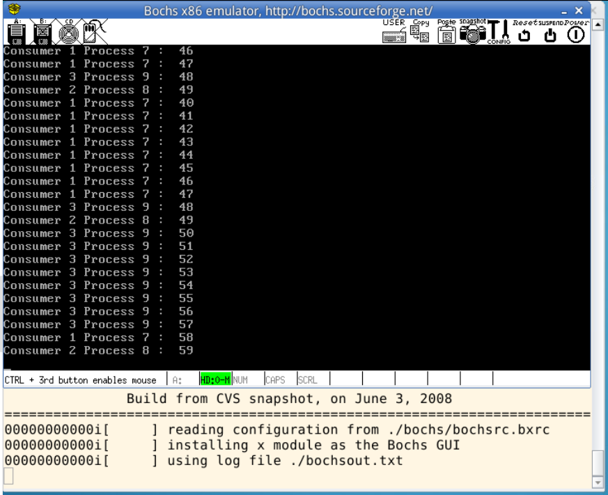

# 实验内容
在 lunux0.11 中实现信号量，用信号量解决生产者和消费者问题
## 用信号量解决生产者消费者问题
Ubuntu 上编写"pc.c", 解决生产者消费者问题：
1. 建立一个生产者进程， N个消费者进程
2. 用文件建立一个共享缓冲区
3. 生产者进程依次向缓冲区写入整数 0， 1， 2， ...， M （M > 500）
4. 消费者进程从缓冲区读数，每次读一个，并将读出的数字从缓冲区删除， 然后将本进程 ID 和 读出数字到标准输出
5. 缓冲区同时最多只能保存 10 个数。

pc.c 中将会用到 sem_open()、sem_close()、sem_wait() 和 sem_post() 等信号量相关的系统调用，请查阅相关文档。
> 《UNIX 环境高级编程》是一本关于 Unix/Linux 系统级编程的相当经典的教程。如果你对 POSIX 编程感兴趣，建议买一本常备手边

## 实现信号量
实现一套符合 POSIX 规范的信号量的缩水版， 它的函数原型和标准并不完全相同， 只包含如下系统调用
``` C
sem_t *sem_open(const char *name, unsigned int value);
int    sem_wait(sem_t *sem);
int    sem_post(sem_t *sem);
int    sem_unlink(const char *name);
```
* sem_open() 创建一个信号量， 或者打开一个已经存在的信号量
  * sem_t 是信号量类型
  * name 是信号量的名字。不同的进程提供同样的 name 共享同一个信号量
  * value 是信号量的初值， 只有在新建信号量的时候才会有效， 其他情况下参数忽略
  * 返回信号量的唯一标识， 如果失败返回 NULL
* sem_wait() 就是信号量 P 原子操作。如果条件不满足，一直等待信号量。
  * 返回 0 表示成功， -1 表示失败
* sem_post() 是信号量 V 原子操作。如果有等待信号量的进程， 它会唤醒其中的一个
  * 返回 0 表示成功， -1 表示失败
* sem_unlink() 删除名称为 name 的信号量
  * 返回 0 表示成功， -1 表示失败
  
实现的代码在 kernel/sem.c 新建文件上实现。 通过 ubuntu 移植来的 pc.c 来测试自己实现的信号量。

# 信号量
Linux 的信号量秉持 POSIX 规范。
生产者-消费者问题基本结构
``` C 
Producer()
{
    // 生产一个产品 item;

    // 空闲缓存资源
    P(Empty);

    // 互斥信号量
    P(Mutex);

    // 将item放到空闲缓存中;
    V(Mutex);

    // 产品资源
    V(Full);
}

Consumer()
{
    P(Full);
    P(Mutex);

    //从缓存区取出一个赋值给item;
    V(Mutex);

    // 消费产品item;
    V(Empty);
}
```

# 多进程共享文件
Linux 通过 C 语言， 可以通过三种方法进行文件的读写：
* 使用标准 C 的 fopen(), fread(), fwrite(), fseek(), fclose();
* 使用系统调用 open(), read(), write(), lseek(), close();
* 通过内存镜像文件, 使用 mmap() 系统调用

fork() 函数调用成功后， 子进程会继承父进程拥有的大多数资源， 包括打开的文件。 子进程可以直接使用这些文件指针， 描述符， 句柄来访问文件。

使用标准 C 的文件操作函数要注意， 他们使用的是进程空间内的文件缓冲区， 父进程和子进程之间不共享这个缓冲区。 因此每次写操作之后必须 fflush() 将数据更新到磁盘， 其他进程才能读到数据。

# 终端也是临界资源
多个进程同时输出时， 终端也成为了一个临界资源， 所以要做好互斥保护。 printf() 之后， 信息保存在输出缓冲区中， 用 fflush(stdout) 可以确保数据送达终端。

# 原子操作、睡眠、唤醒
锁必然是一种原子操作，通过模仿 0.11 中的锁来实现信号量。
多进程对于磁盘的并发访问是一个需要锁的地方， Linux0.11 的基本处理方法是才内存中划出一块缓存，加速磁盘的访问。进程提出磁盘访问请求首先要到磁盘缓存中去找，如果有就直接返回；如果没有就申请一段磁盘缓存，向磁盘发送读写请求。请求发出后，首先要睡眠等待，因为磁盘读写很慢，需要让CPU执行其他进程。因此会有多个进程同时操作磁盘缓存，这里的磁盘缓存也需要考虑互斥问题，必然也用到了锁，睡眠和唤醒。


# 实验结果


# 参考文献
> https://www.lanqiao.cn/courses/reports/1321123