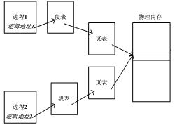
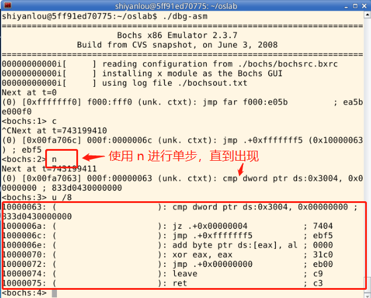
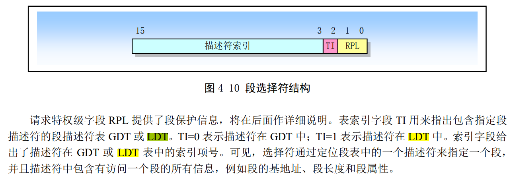
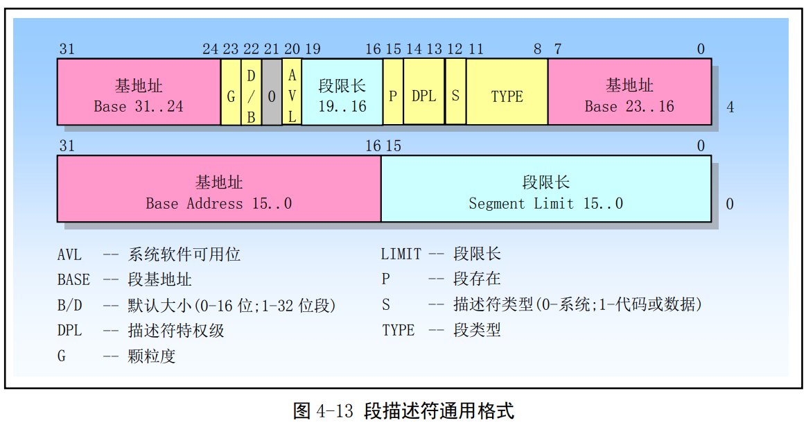
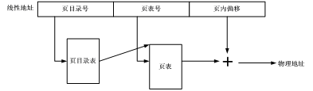
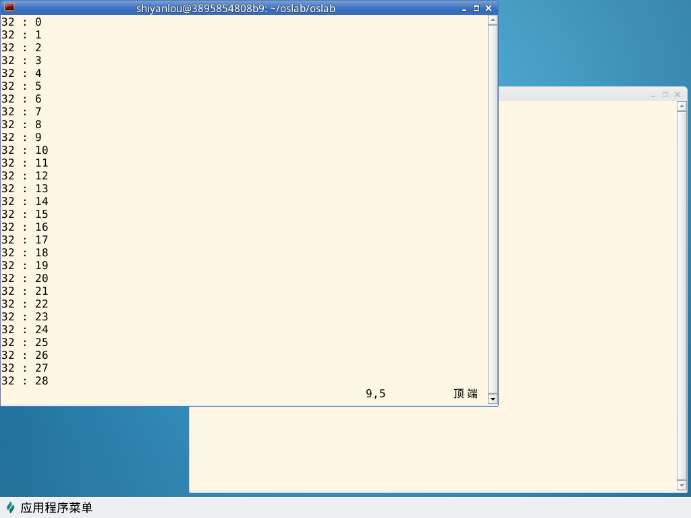

# 实验内容
* 用 Bochs 调试工具跟踪 Linux 0.11 的地址翻译（地址映射）过程，了解 IA-32 和 Linux 0.11 的内存管理机制；
* 在 Ubuntu 上编写多进程的生产者—消费者程序，用共享内存做缓冲区；
* 在信号量实验的基础上，为 Linux 0.11 增加共享内存功能，并将生产者—消费者程序移植到 Linux 0.11。

## 跟踪地址翻译过程
首先以汇编级调试的方式启动 Bochs，引导 Linux 0.11，在 0.11 下编译和运行 test.c。它是一个无限循环的程序，永远不会主动退出。然后在调试器中通过查看各项系统参数，从逻辑地址、LDT 表、GDT 表、线性地址到页表，计算出变量 i 的物理地址。最后通过直接修改物理内存的方式让 test.c 退出运行。
test.c 的代码如下：
``` C
#include <stdio.h>

int i = 0x12345678;
int main(void)
{
    printf("The logical/virtual address of i is 0x%08x", &i);
    fflush(stdout);
    while (i)
        ;
    return 0;
}
```

## 基于共享内存的生产者—消费者程序
本项实验在 Ubuntu 下完成，与信号量实验中的 pc.c 的功能要求基本一致，仅有两点不同：

* 不用文件做缓冲区，而是使用共享内存；
* 生产者和消费者分别是不同的程序。生产者是 producer.c，消费者是 consumer.c。两个程序都是单进程的，通过信号量和缓冲区进行通信。

Linux 下，可以通过 shmget() 和 shmat() 两个系统调用使用共享内存。

## 共享内存的实现
进程之间可以通过页共享进行通信，被共享的页叫做共享内存，结构如下图所示：

本部分实验内容是在 Linux 0.11 上实现上述页面共享，并将上一部分实现的 producer.c 和 consumer.c 移植过来，验证页面共享的有效性。
具体要求在 **mm/shm.c** 中实现 **shmget()** 和 **shmat()** 两个系统调用。它们能支持 producer.c 和 consumer.c 的运行即可，不需要完整地实现 POSIX 所规定的功能。
* shmget()
``` C
int shmget(key_t key, size_t size, int shmflg);
```
shmget() 会新建/打开一页内存，并返回该页共享内存的 shmid（该块共享内存在操作系统内部的 id）。

所有使用同一块共享内存的进程都要使用相同的 key 参数。

如果 key 所对应的共享内存已经建立，则直接返回 shmid。如果 size 超过一页内存的大小，返回 -1，并置 errno 为 EINVAL。如果系统无空闲内存，返回 -1，并置 errno 为 ENOMEM。

shmflg 参数可忽略。

* shmat()
``` C
void *shmat(int shmid, const void *shmaddr, int shmflg);
```
shmat() 会将 shmid 指定的共享页面映射到当前进程的虚拟地址空间中，并将其首地址返回。

如果 shmid 非法，返回 -1，并置 errno 为 EINVAL。

shmaddr 和 shmflg 参数可忽略。

# 实验过程

## IA-32 地址翻译过程
Linux 0.11 完全遵循 IA-32（Intel Architecture 32-bit）架构进行地址翻译，Windows、后续版本的 Linux 以及一切在 IA-32 保护模式下运行的操作系统都遵循此架构。因为只有这样才能充分发挥 CPU 的 MMU（内存管理单元） 的功能。

关于此地址翻译过程的细节，请参考《注释》一书中的 5.3.1-5.3.4 节。

## 通过汇编调试来人工翻译
### 准备
通过 ./dbg-asm 启动调试器， 将测试程序放入 Linux0.11 中去编译运行， 启动调试器之后输入命令 C, continue 程序运行， 等待程序运行启动 Linux0.11. 在 bochs 虚拟机启动测试程序。 看到如下打印信息
``` 
The logical/virtual address of i is 0x00003004
```
这个地址 0x00003004 是应用程序的虚拟地址， 在任何人的机器上都是一样的。

### 暂停
在 test.c 程序运行的时候在命令行按 **Ctrl+c** , 程序暂停运行， 通过单步调试让程序运行到比较指令那一行。

这一行汇编是将 **ds:0x3004 和 0x00000000** 比较， 如果不是 0 程序就会继续循环。

### 段表
ds:0x3004 是虚拟地址， ds 表示这个地址属于 ds 段。 首先要找到 ds 段表的具体信息。 应用程序的段表存在应用程序对应的 LDT 中， 段的信息叫段描述符。通过用 sreg 命令（是在调试窗口输入）：
``` 
<bochs:4> sreg
cs:s=0x000f, dl=0x00000002, dh=0x10c0fa00, valid=1
ds:s=0x0017, dl=0x00003fff, dh=0x10c0f300, valid=3
ss:s=0x0017, dl=0x00003fff, dh=0x10c0f300, valid=1
es:s=0x0017, dl=0x00003fff, dh=0x10c0f300, valid=1
fs:s=0x0017, dl=0x00003fff, dh=0x10c0f300, valid=1
gs:s=0x0017, dl=0x00003fff, dh=0x10c0f300, valid=1
ldtr:s=0x0068, dl=0xa2d00068, dh=0x000082fa, valid=1
tr:s=0x0060, dl=0xa2e80068, dh=0x00008bfa, valid=1
gdtr:base=0x00005cb8, limit=0x7ff
idtr:base=0x000054b8, limit=0x7ff
```

ldtr:s = 0x0068 = 0000000001101000b, 这里特权等级 00b 表示最高特权， TI = 0 表示描述符在 GDT 中， 是 GDT 表中的 1101b 也就是 13 号位置。

通过xp /32w 0x00005cb8 查看从 GDT 基地址(物理地址)开始，32 个字的内容，及 GDT 表的前 16 项，如下
```
<bochs:5> xp /32w 0x00005cb8
[bochs]:
0x00005cb8 <bogus+       0>:    0x00000000    0x00000000    0x00000fff    0x00c09a00
0x00005cc8 <bogus+      16>:    0x00000fff    0x00c09300    0x00000000    0x00000000
0x00005cd8 <bogus+      32>:    0xa4280068    0x00008901    0xa4100068    0x00008201
0x00005ce8 <bogus+      48>:    0xf2e80068    0x000089ff    0xf2d00068    0x000082ff
0x00005cf8 <bogus+      64>:    0xd2e80068    0x000089ff    0xd2d00068    0x000082ff
0x00005d08 <bogus+      80>:    0x12e80068    0x000089fc    0x12d00068    0x000082fc
0x00005d18 <bogus+      96>:    0xa2e80068    0x00008bfa    0xa2d00068    0x000082fa
0x00005d28 <bogus+     112>:    0xc2e80068    0x000089f8    0xc2d00068    0x000082f8
```
GDT中每一个表项为 64 位( 8 字节)，所以段表信息存在 **0x00005cb8+13*8** ，输入 xp /2w 0x00005cb8+13*8，得到：
```
<bochs:6> xp /2w 0x00005cb8+13*8
[bochs]:
0x00005d20 <bogus+       0>:    0xa2d00068    0x000082fa
```

“0x**a2d0**0068 0x**00**0082**fa**” 将其中的加粗数字组合为“0x**00faa2d0**”，这就是 LDT 表的物理地址。

xp /8w 0x00faa2d0，得到：
```
<bochs:7> xp /8w 0x00faa2d0
[bochs]:
0x00faa2d0 <bogus+       0>:    0x00000000    0x00000000    0x00000002    0x10c0fa00
0x00faa2e0 <bogus+      16>:    0x00003fff    0x10c0f300    0x00000000    0x00fab000
```

### 段描述符
在保护模式下，段寄存器有另一个名字，叫段选择子，因为它保存的信息主要是该段在段表里索引值，用这个索引值可以从段表中“选择”出相应的段描述符。
ds 的值是 0x0017。

其中 RPL 是请求特权级，当访问一个段时，处理器要检查 RPL 和 CPL（放在 cs 的位 0 和位 1 中，用来表示当前代码的特权级），即使程序有足够的特权级（CPL）来访问一个段，但如果 RPL（如放在 ds 中，表示请求数据段）的特权级不足，则仍然不能访问，即如果 RPL 的数值大于 CPL（数值越大，权限越小），则用 RPL 的值覆盖 CPL 的值。
而段选择子中的 TI 是表指示标记，如果 TI=0，则表示段描述符（段的详细信息）在 GDT（全局描述符表）中，即去 GDT 中去查；而 TI=1，则去 LDT（局部描述符表）中去查。
看看上面的 ds，0x0017=0000000000010111（二进制），所以 RPL=11，可见是在最低的特权级（因为在应用程序中执行），TI=1，表示查找 LDT 表，索引值为 10（二进制）= 2（十进制），表示**找 LDT 表中的第 3 个段描述符**（从 0 开始编号）。
LDT 和 GDT 结构相同， 都是占 64 位 8 字节， 所以是第三项 0x00003fff 0x10c0f300， 用 sreg 输出中 ds 所在行的 dl 和 dh 值可以验证找到的描述符是否正确。

“0x**0000**3fff 0x**10**c0f3**00**” 组合成为 **0x10000000**

### 段基址和线性地址
段描述符 “0x**0000**3fff 0x**10**c0f3**00**” 组合成为 **0x10000000**。这就是 ds 段在线性地址空间中的起始地址。用同样的方法也可以算算其它段的基址，都是这个数。
段基址+段内偏移，就是线性地址了。所以 ds:0x3004 的线性地址就是：
``` 
0x10000000 + 0x3004 = 0x10003004
```
用 calc ds:0x3004 命令可以验证这个结果。

### 页表
从线性地址计算物理地址，需要查找页表。线性地址变成物理地址的过程如下：

首先需要算出线性地址中的页目录号、页表号和页内偏移，它们分别对应了 32 位线性地址的 10 位 + 10 位 + 12 位，所以 0x10003004 的页目录号是 64，页号 3，页内偏移是 4。

IA-32 下，页目录表的位置由 CR3 寄存器指引。“creg”命令可以看到：
``` 
CR0=0x8000001b: PG cd nw ac wp ne ET TS em MP PE
CR2=page fault laddr=0x10002f68
CR3=0x00000000
    PCD=page-level cache disable=0
    PWT=page-level writes transparent=0
CR4=0x00000000: osxmmexcpt osfxsr pce pge mce pae pse de tsd pvi vme
```

说明页目录表的基址为 0。看看其内容，“xp /68w 0”：
```
0x00000000 :    0x00001027    0x00002007    0x00003007    0x00004027
0x00000010 :    0x00000000    0x00024764    0x00000000    0x00000000
0x00000020 :    0x00000000    0x00000000    0x00000000    0x00000000
0x00000030 :    0x00000000    0x00000000    0x00000000    0x00000000
0x00000040 :    0x00ffe027    0x00000000    0x00000000    0x00000000
0x00000050 :    0x00000000    0x00000000    0x00000000    0x00000000
0x00000060 :    0x00000000    0x00000000    0x00000000    0x00000000
0x00000070 :    0x00000000    0x00000000    0x00000000    0x00000000
0x00000080 :    0x00ff3027    0x00000000    0x00000000    0x00000000
0x00000090 :    0x00000000    0x00000000    0x00000000    0x00000000
0x000000a0 :    0x00000000    0x00000000    0x00000000    0x00000000
0x000000b0 :    0x00000000    0x00000000    0x00000000    0x00ffb027
0x000000c0 :    0x00ff6027    0x00000000    0x00000000    0x00000000
0x000000d0 :    0x00000000    0x00000000    0x00000000    0x00000000
0x000000e0 :    0x00000000    0x00000000    0x00000000    0x00000000
0x000000f0 :    0x00000000    0x00000000    0x00000000    0x00ffa027
0x00000100 :    0x00faa027    0x00000000    0x00000000    0x00000000
```
页目录和页表都是 32 位 4 字节。 这 32 位中前 20 位是物理页框号，后面是一些属性信息（其中最重要的是最后一位 P）。其中第 65 个页目录项就是我们要找的**页表头**，用“xp /w **0+64*4**”查看：
```
0x00000100 :    0x00faa027
```
其中的 027 是属性，显然 P=1，其他属性实验者自己分析吧。页表所在物理页框号为 0x00faa，即页表在物理内存的 0x00faa000 位置。从该位置开始查找 3 号**页表项**，得到（xp /w **0x00faa000+3*4**）：
```
0x00faa00c :    0x00fa7067
```

### 物理地址
线性地址 0x10003004 对应的物理页框号为 0x00fa7，和页内偏移 0x004 接到一起，得到 **0x00fa7004**，这就是变量 i 的物理地址。可以通过两种方法验证。
第一种方法是用命令 page 0x10003004，可以得到信息：
```
linear page 0x10003000 maps to physical page 0x00fa7000
```
第二种方法是用命令 xp /w 0x00fa7004，可以看到：
```
0x00fa7004 :    0x12345678
```
现在，通过直接修改内存来改变 i 的值为 0，命令是： setpmem 0x00fa7004 4 0，表示从 0x00fa7004 地址开始的 4 个字节都设为 0。然后再用“c”命令继续 Bochs 的运行，可以看到 test 退出了，说明 i 的修改成功了，此项实验结束。

## 实现共享内存

### Linux 中的共享内存
Linux 支持两种方式的共享内存。一种方式是 shm_open()、mmap() 和 shm_unlink() 的组合；另一种方式是 shmget()、shmat() 和 shmdt() 的组合。本实验建议使用后一种方式。

### 获得空闲物理空间 
函数 get_free_page() 用来获得一个空闲物理页面，在 mm/memory.c 文件中：
``` C
unsigned long get_free_page(void)
{
    register unsigned long __res asm("ax");
    __asm__("std ; repne ; scasb\n\t"
            "jne 1f\n\t"
            "movb $1,1(%%edi)\n\t"
            // 页面数*4KB=相对页面起始地址
            "sall $12,%%ecx\n\t"
            // 在加上低端的内存地址，得到的是物理起始地址
            "addl %2,%%ecx\n\t"
            "movl %%ecx,%%edx\n\t"
            "movl $1024,%%ecx\n\t"
            "leal 4092(%%edx),%%edi\n\t"
            "rep ; stosl\n\t"
            //edx赋给eax，eax返回了物理起始地址
            "movl %%edx,%%eax\n"
            "1:" :"=a" (__res) :"0" (0),"i" (LOW_MEM),"c" (PAGING_PAGES),
            "D" (mem_map+PAGING_PAGES-1):"di","cx","dx");
    return __res;
}

static unsigned char mem_map [ PAGING_PAGES ] = {0,};
```

### 地址映射
有了空闲的物理页面，接下来需要完成线性地址和物理页面的映射，Linux 0.11 中也有这样的代码，看看 mm/memory.c 中的 do_no_page(unsigned long address)，该函数用来处理线性地址 address 对应的物理页面无效的情况（即缺页中断），do_no_page 函数中调用一个重要的函数 get_empty_page(address)，其中有：
``` C
// 函数 get_empty_page(address)
unsigned long tmp=get_free_page();
// 建立线性地址和物理地址的映射
put_page(tmp, address);
```

### 获得空闲虚拟地址
有了空闲物理页面，也有了建立线性地址和物理页面的映射，但要完成本实验还需要能获得一段空闲的虚拟地址空闲。

要从数据段中划出一段空间，首先需要了解进程数据段空间的分布，而这个分布显然是由 exec 系统调用决定的，所以要详细看一看 exec 的核心代码，do_execve（在文件 fs/exec.c 中）。

在函数 do_execve() 中，修改数据段（当然是修改 LDT）的地方是 change_ldt，函数 change_ldt 实现如下：
``` C
static unsigned long change_ldt(unsigned long text_size,unsigned long * page)
{
    /*其中text_size是代码段长度，从可执行文件的头部取出，page为参数和环境页*/
    unsigned long code_limit,data_limit,code_base,data_base;
    int i;

    code_limit = text_size+PAGE_SIZE -1;
    code_limit &= 0xFFFFF000;
    //code_limit为代码段限长=text_size对应的页数（向上取整）
    data_limit = 0x4000000; //数据段限长64MB
    code_base = get_base(current->ldt[1]);
    data_base = code_base;

    // 数据段基址 = 代码段基址
    set_base(current->ldt[1],code_base);
    set_limit(current->ldt[1],code_limit);
    set_base(current->ldt[2],data_base);
    set_limit(current->ldt[2],data_limit);
    __asm__("pushl $0x17\n\tpop %%fs":: );

    // 从数据段的末尾开始
    data_base += data_limit;

    // 向前处理
    for (i=MAX_ARG_PAGES-1 ; i>=0 ; i--) {
        // 一次处理一页
        data_base -= PAGE_SIZE;
        // 建立线性地址到物理页的映射
        if (page[i]) put_page(page[i],data_base);
    }
    // 返回段界限
    return data_limit;
}
```

## 实验代码

### 生产者
生产者申请一段共享内存， 然后往共享内存去放数据
``` C
#define	__LIBRARY__
#include <unistd.h>		/*  include some constant*/
#include <fcntl.h>			/*  include printf() fflush()*/
#include <stdio.h>
#include <sys/sem.h>

_syscall0(int, fork)
_syscall0(int, getpid)
_syscall3(int, lseek, int, fildes, off_t, offset, int, origin)
_syscall0(int, sync)

_syscall2(sem_t *, sem_open, const char *, name, unsigned int, value)
_syscall1(int, sem_wait, sem_t *, sem)
_syscall1(int, sem_post, sem_t *, sem)
_syscall1(int, sem_unlink, const char *, name)

#define 	BUF_SIZE		10
#define		CONSUMER_NUM	10
#define 	KEY 			183
#define 	SHM_SIZE 		(BUF_SIZE+1)*sizeof(short)

int  main (void)
{
	int 			i;
	int				pid;
	int				shm_id;
	short		   *shmp;
	unsigned short  count			= 0;
	unsigned short	tmp				= 0;
	unsigned char   buf[BUF_SIZE] 	= {0};
	char 			empty_name[10]	= "empty";
	char 			full_name[10]	= "full";
	char 			mutex_name[10]	= "mutex";
	sem_t		   *empty, *full, *mutex;

	sem_unlink(empty_name);
	sem_unlink(full_name);
	sem_unlink(mutex_name);

	empty 	= sem_open(empty_name, BUF_SIZE);
	full		= sem_open(full_name, 0);
	mutex	= sem_open(mutex_name, 1);

	/* 使用KEY值申请一块共享物理内存 */
	shm_id = shmget(KEY, SHM_SIZE, IPC_CREAT | 0666);
	if(shm_id == -1)
	{
		/* 申请共享内存失败 */
		printf("shmget error!\n");
		return -1;
	}
	shmp = (short*)shmat(shm_id,NULL,0);/* 返回共享物理内存的逻辑地址 */
	
	/*  Producer 0*/
	pid = getpid();
	while (count <= 600)
	{
		sem_wait(empty);
		sem_wait(mutex);

		printf("Producer 1 process %d :%d\n", pid, count);
		fflush(stdout);

		*(shmp++) = count++;

		if(!(count % BUF_SIZE))
			shmp -= 10;

		sem_post(mutex);
		sem_post(full);
	}
	
	return  (0);
}
```

### 消费者
消费者从共享内存中拿数据， 这里 `index ` 变量页放在了共享内存， 用于多进程之间使用这个变量正常的取出数据
``` C
#define	__LIBRARY__
#include <unistd.h>		/*  include some constant*/
#include <fcntl.h>			/*  include printf() fflush()*/
#include <stdio.h>
#include <sys/sem.h>

_syscall0(int, fork)
_syscall0(int, getpid)
_syscall3(void *, shmat,int ,shmid,const void *,shmaddr,int,shmflg);
_syscall3(int, shmget, key_t, key, size_t, size, int, shmflg);
_syscall2(sem_t *, sem_open, const char *, name, unsigned int, value)
_syscall1(int, sem_wait, sem_t *, sem)
_syscall1(int, sem_post, sem_t *, sem)
_syscall1(int, sem_unlink, const char *, name)

#define 	BUF_SIZE		10
#define		CONSUMER_NUM	3
#define 	KEY 			183

int  main (void)
{
	int 			i;
	int				pid;
	int 			shm_id; 
	short 		   *shmp, *index;
	unsigned short  count			= 0;
	unsigned short	tmp				= 0;
	unsigned char   buf[BUF_SIZE] 	= {0};
	char 			empty_name[10]	= "empty";
	char 			full_name[10]	= "full";
	char 			mutex_name[10]	= "mutex";
	sem_t		   *empty, *full, *mutex;

	sem_unlink(empty_name);
	sem_unlink(full_name);
	sem_unlink(mutex_name);

	empty 	= sem_open(empty_name, BUF_SIZE);
	full		= sem_open(full_name, 0);
	mutex	= sem_open(mutex_name, 1);

	/*使用和生产者同一个KEY值，会返回同一个shm_id(指向同一个内存空间)*/
	shm_id = shmget(KEY,0,0);
	if(shm_id == -1) {
		/*申请共享内存失败*/
		printf("shmget error!\n");
		return -1;
	}
	shmp = (short*)shmat(shm_id,NULL,0);/*返回共享物理内存的逻辑地址*/
	index = shmp + BUF_SIZE;
	*index = 0;

	/*  Consumer 0~9*/
	for(i = 0; i < CONSUMER_NUM; i++) {
		if(!fork()) {
			pid = getpid();
			while(1) {
				sem_wait(full);
				sem_wait(mutex);

				printf("Consumer 1 process %d : %d", pid, shem[*index]);
				fflush(stdout);
				if(*index == 9) {
					*index = 0;
				} else {
					(*index)++;
				}

				sem_post(mutex);
				sem_post(empty);	
			}
			return  (0);
		}
	}
	while(1);
	
	return  (0);
}
```

### 共享内存部分
``` C
#include <errno.h>
#include <sys/types.h>
#include <linux/sched.h>
#include <linux/mm.h>
#include <linux/kernel.h>

/*error code*/
#define ENOMEM 2
#define ENOFIND 3
/*sys_shmget  flag*/
#define SHM_FREE    1

#define MAX_PAGES 5
#define PAGE_SIZE 4096

typedef struct {
    int           key;
    int             shmid;
    unsigned long   page;
}shm_t;

shm_t   shm[MAX_PAGES] = { {0,0,0},{0,0,0},{0,0,0},{0,0,0},{0,0,0} };
int     _shm_counter = 0;

int  sys_shmget (int  key, size_t size, int shmflg)
{
    int i, j = -1;
    if (!key)
        return  (-1);
    if (size > PAGE_SIZE)
      return -EINVAL;

    for (i = MAX_PAGES - 1; i >= 0; i--) {
        if (shm[i].key == key) { /*找到匹配的key*/
            if (shmflg == SHM_FREE) {   /*回收资源*/
                shm[i].key = 0;
                shm[i].shmid = 0;
                return  0;
            }
            return shm[i].shmid;
        }
        if (shm[i].key == 0)
            j = i;
    }
    
    if (i == -1) {
        if (shmflg == SHM_FREE) {
            return  -ERROR;
        }
    }
    if (j == -1) {              /*没有空闲位置*/
        return  -ERROR;
    } else if(j >= 0) {         /*一个新的 key,分配一个新位置*/
        /*
         * 分配一个新的物理页， 把地址赋给 page 
         */
        shm[j].page = get_free_page();
        if (!shm[j].page)
            return -ENOMEM;
        shm[j].key = key;
        shm[j].shmid = ++_shm_counter;
        return  shm[j].shmid;
    }

}

void* sys_shmat(int shmid, const void* shmaddr, int shmflg)
{
    int i;
    unsigned long  offset;

    for (i = 0; i < MAX_PAGES; i++) {
        if (shm[i].shmid == shmid)
            break;
    }
    if(i == MAX_PAGES)
        return (void *)(-EINVAL);

    offset = current->brk;
    for (offset = current->brk; offset < 0x400000; offset = offset + PAGE_SIZE){
        page_dir = (unsigned long*)(((current->start_code + offset) >> 20) & 0xffc);
        if (!(*page_dir & 1))
            continue;
        page_table = (unsigned long*)(0xfffff000 & *page_dir);
        table_off = ((current->start_code + offset) >> 12) & 0x03FF;
        /*
         * 找到一个空的页表项, 也就是空的虚拟地址
         */
        if (!(1 & *(page_table + table_off * 4)))  /*找到一个空的页表项, 也就是空的虚拟地址*/
        {
            /*
             * page 是空闲物理地址
             * current->start_code + offset 是空闲虚拟地址
             * 这里将空闲地址映射起来
             */
            if (put_shm_page(shm[i].page, current->start_code + offset) < 0)
                return (void *)-1;
            else
                return offset;
        }
    }
    return (void*)-1;
}
```

### 共享内存地址映射

``` C
int  put_shm_page(unsigned long page, unsigned long address)
{
  unsigned long tmp, * page_table;
  /* NOTE !!! This uses the fact that _pg_dir=0 */
  if (page < LOW_MEM || page >= HIGH_MEMORY)
      printk("Trying to put page %p at %p\n", page, address);
  page_table = (unsigned long*)((address >> 20) & 0xffc);
  if ((*page_table) & 1)
      page_table = (unsigned long*)(0xfffff000 & *page_table);
  else {
      if (!(tmp = get_free_page()))
          return -1;
      *page_table = tmp | 7;
      page_table = (unsigned long*)tmp;
  }
  /* 
   * 找到虚拟地址对应页表项， 把物理地址放入页表项中， 就建立好了这一页的映射关系
   */
  page_table[(address >> 12) & 0x3ff] = page | 7;
  /* no need for invalidate */
  page -= LOW_MEM;
  (mem_map[page >>12])++; /*更新 mem_map 标志这个 page 已经映射*/
  return 0;
}
```

### 实验结果


# 参考资料
> 实验环境: https://www.lanqiao.cn/courses/115/learning?id=573
> 实验笔记： https://www.lanqiao.cn/courses/reports/1380089
> 参考《注释》一书中的 5.3.1-5.3.4 节。