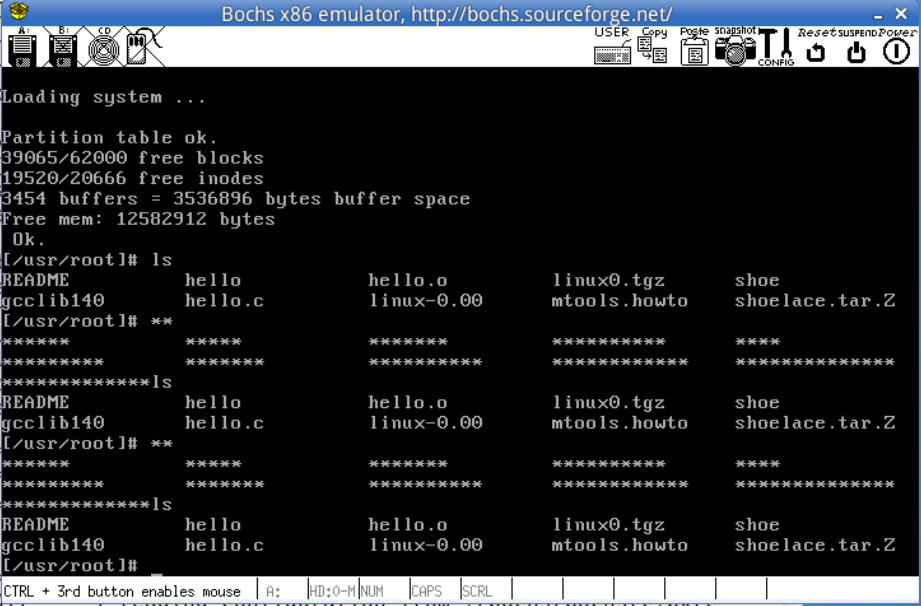

# 终端设备的控制

# 实验内容
用户按一次 `F12` 后， 把应用程序向终端输出的所有字母都替换为 `*`。用户再按一次 `F12` 一切又恢复正常， 第三次按 `F12`, 再进行输出替换。
以 `ls` 命令为例
``` 
# ls
hello.c hello.o hello
# **
*****.* *****.* *****
```

## 键盘输入处理过程
键盘 I/O 是典型的中断驱动，在 kernel/chr_drv/console.c 文件中：
``` C
void con_init(void)  //控制台的初始化
{
    // 键盘中断响应函数设为 keyboard_interrupt
    set_trap_gate(0x21, &keyboard_interrupt);
}
```
所以每次按键有动作，keyboard_interrupt 函数就会被调用，它在文件 kernel/chr_drv/keyboard.S（注意，扩展名是大写的 S）中实现。
keyboard_interrupt 被调用后，会将键盘扫描码做为下标，调用数组 key_table 保存的与该按键对应的响应函数。
``` C
keyboard_interrupt:
    ...
	call key_table(,%eax,4)
    ...
    call do_tty_interrupt
    ...
```

## 输出字符
printf() 等输出函数最终都是调用 write() 系统调用，所以控制好 write()，就能控制好输出字符。

# 开始实验
## f12 入口、
``` C
F12_func:
        call output_star
        ret
```

## console.c
每次运行函数都把 flag 的数值翻转
``` C
unsigned long star_flag = 0x00;
void output_star(void)
{
        if(star_flag)
                star_flag = 0;
        else
                star_flag = 1;
}

    ...
    if(star_flag)
        c = 0x2A;
    ...
```
在函数输出的最后根据标志位把输出改为 `*`

## 实验结果


# 参考资料 
> 实验环境：https://www.lanqiao.cn/courses/115/learning?id=574