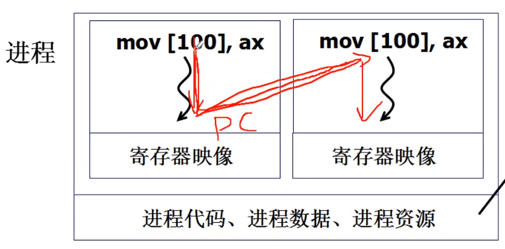

[TOC]
# 用户级线程

对执行的指令进行跳转，却不切换进程内部的资源，例如内存映射表。
保留了切换的特点，减少了进程切换的代价，线程的切换更加快。


## 实现一个浏览器
``` C
void GetData(char *URL, char *p){...};
void Show(char *p){...};
void WebExplore()
{
    char URL[] = "http://cms.hit.edu.cn";
    char buffer[1000];
    pthread_create(..., GetData, URL, buffer);
    pthread_create(..., Show, buffer);          //创建两个线程
}
```
核心是Yield函数来完成切换。


# 当两个执行序列使用一个栈

工作流程：首先执行函数`A()`,调用函数`B()`时，会将返回地址压栈104，再调用`Yield()`函数时，也会压栈204。通过线程1的Yield跳转到地址300去执行`C()`，到调用函数`D()`的时候会压栈304，再运行到调用`Yield()`函数时，会压栈404。线程2的Yield跳转回204的位置。在函数`B()`执行结束后`}`，会出栈运行到地址404去。这里就错了，正常的情况我们希望回到104位置。**这样说明两个执行序列不能使用同一个栈。**

# 两个执行序列使用两个栈

工作流程：首先执行函数`A()`,调用函数`B()`时，会将返回地址压栈104，再调用`Yield()`函数时，也会压栈204。通过线程1的Yield先切换到线程2的栈空间，再跳转到地址300去执行`C()`，到调用函数`D()`的时候会压栈304，再运行到调用`Yield()`函数时，会压栈404。线程2的Yield先切换到线程1的栈空间，再跳转回204的位置。在函数`B()`执行结束后`}`，会出栈运行到地址204去。这里还是错了，又重新跑到204的位置去又执行了一边，正常的情况我们希望回到104位置。
# 再修改一下Yield

上面的第二次调用Yield的流程中，左后每次都会通过jmp到指定的地址中，导致要跳转的栈会多一个地址204。通过去掉jmp指令，Yield函数运行到`}`的时候会弹栈204，还是可以到达指定的地址，并且在`B()`结束返回后会弹栈104，正常运行。

# 两个线程的样子：两个TCB，两个栈，切换的PC存在栈中
ThreadCreate函数的核心就是做出**TCB，栈空间，PC放到栈中**三件事情
``` C
void ThreadCreate(A)
{
    TCB *tcb = malloc();        //申请TCB结构
    *stack = malloc();          //申请栈的空间
    *stack = A;                 //把线程启动的函数放在栈顶，也是PC要运行的地址
    tcb.esp = stack;            //把栈的指针指向栈顶a
}
```