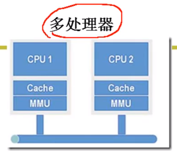
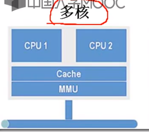
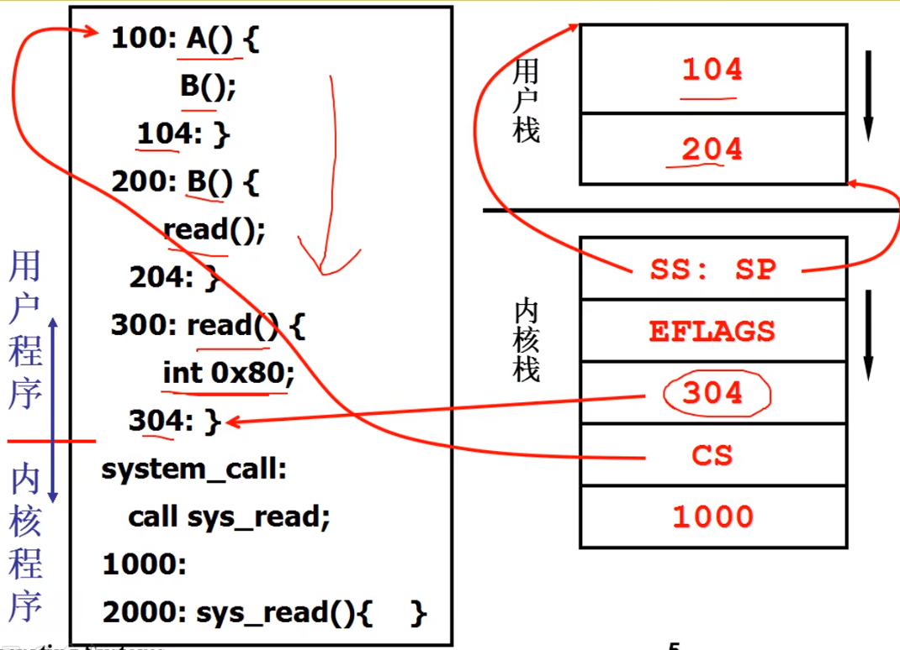
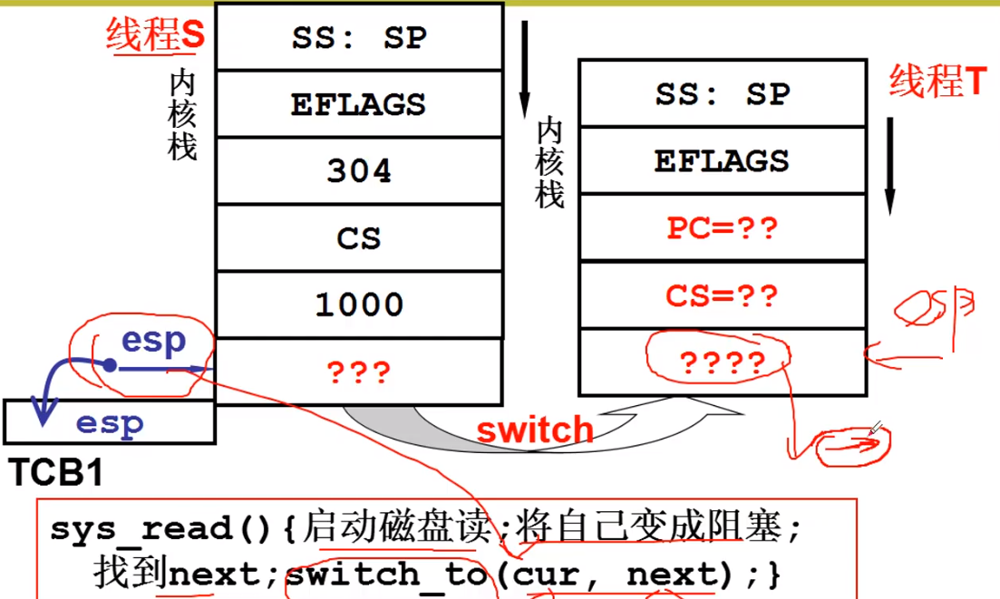
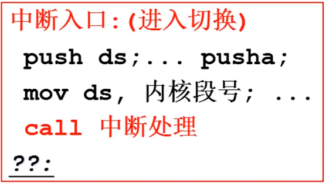
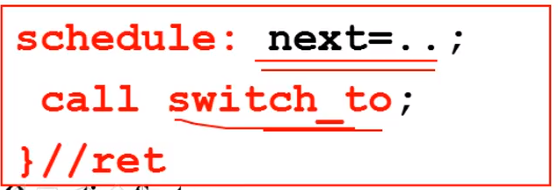
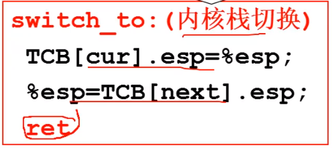
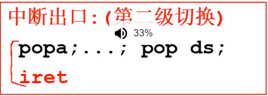

# 内核级线程
## 开始核心级线程


系统中有多个核心，使用多核核心级线程同时给多个分配任务，同时触发，同时执行，成为并行。
跟之前学习的同时触发，交替执行的逻辑做一个区别，之前的叫做并发。

内核态和用户态的线程切换不同，用户态是切换TCB和栈，而内核态中是要切换TCB和**一套栈**。一套栈包括了线程的用户栈和内核栈，内核栈通过压入的指针将两个栈关联起来。

* 从用户态线程运行到内核态线程，完成栈的关联


* 进入线程的内核中之后，如果遇到阻塞，需要切换到其他的内核态的线程中去。在切换完成之后，从切换的内核态线程的内核iret返回该线程的用户态中去执行。


## 内核线程switch_to的五段论

* 通过中断进入内核态
  

* 进行中断处理函数，如果遇到阻塞，就要切换到其他线程。
.png)

* 通过调度函数schedule下跳转到switch_to来切换内核线程。


* 在内核中进行TCB的切换


* 内核切换完成之后通过iret回到切换的线程的用户态下执行程序


## 线程创建
``` C
void ThreadCreate()
{
    TCB tcb = get_free_page();
    *krlstack = ...;
    *userstack传入;
    /*
     * TODO: 填写两个stack;
     */
    tcb.esp=krlstack;
    tcb.state=就绪;
    tcb入队；
}
```