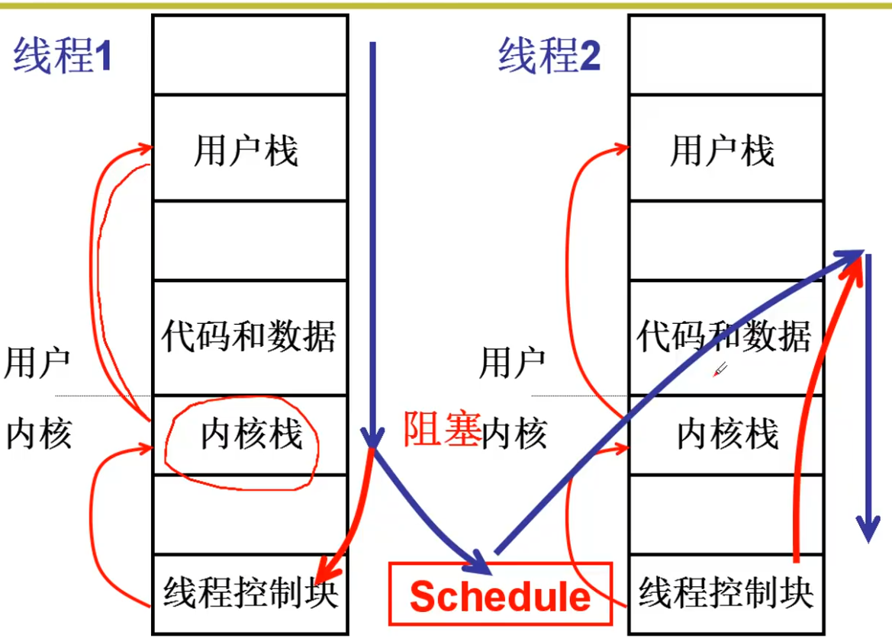
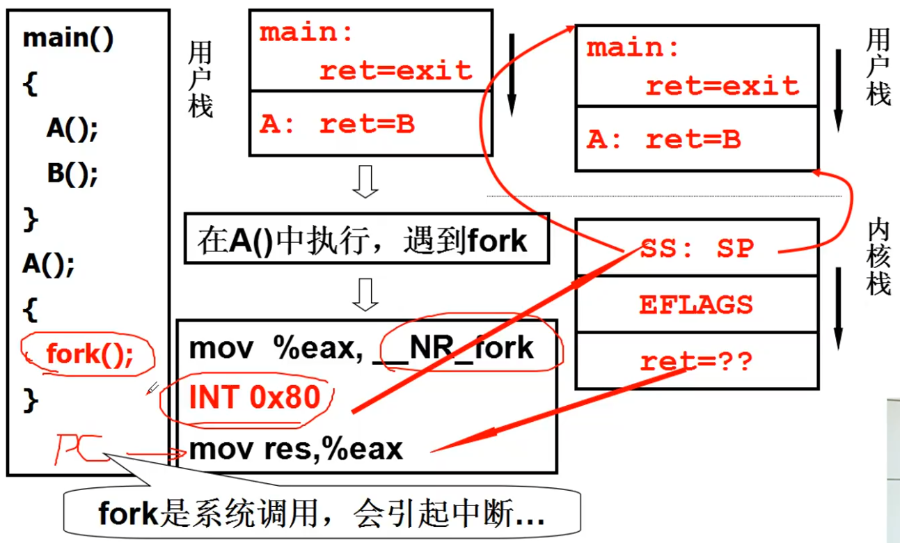
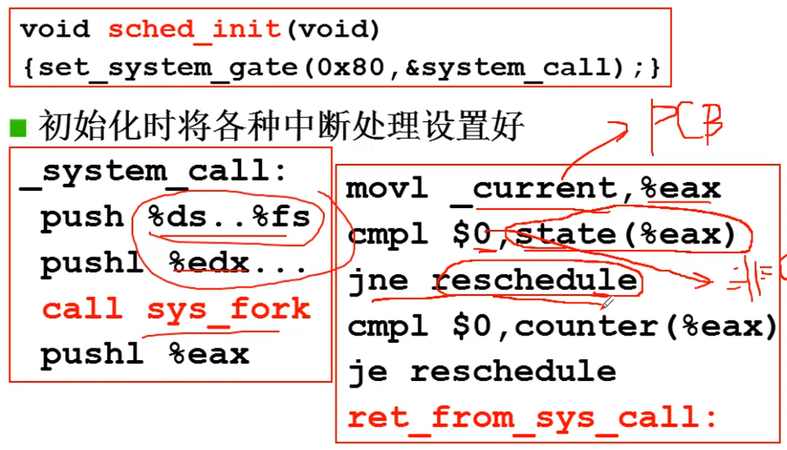
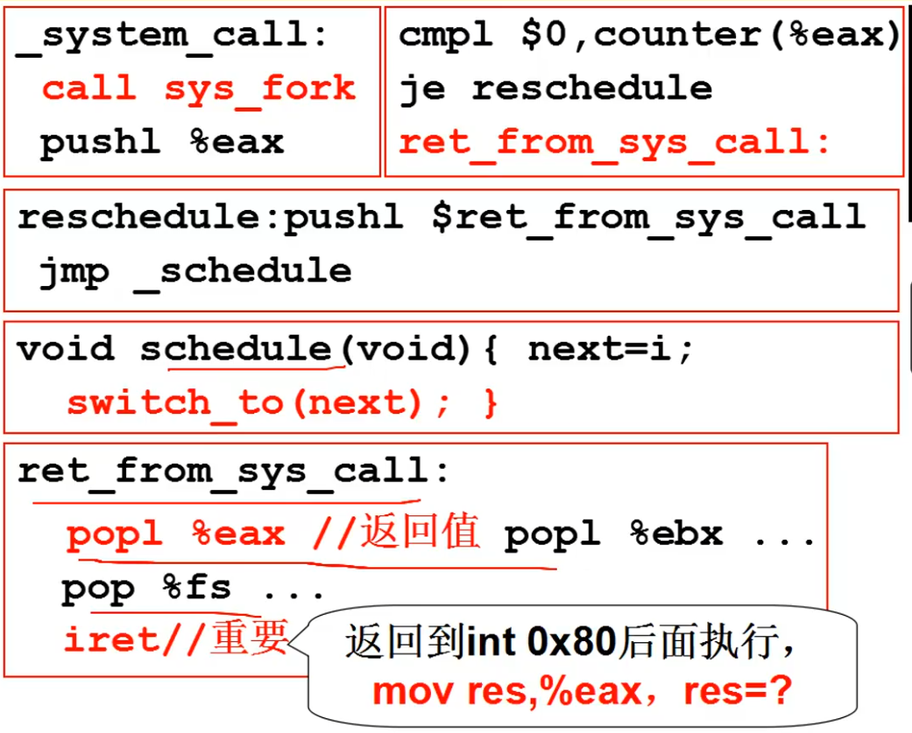
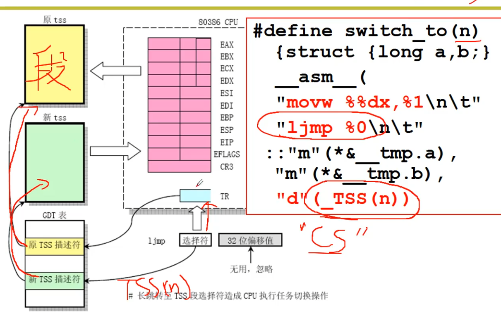
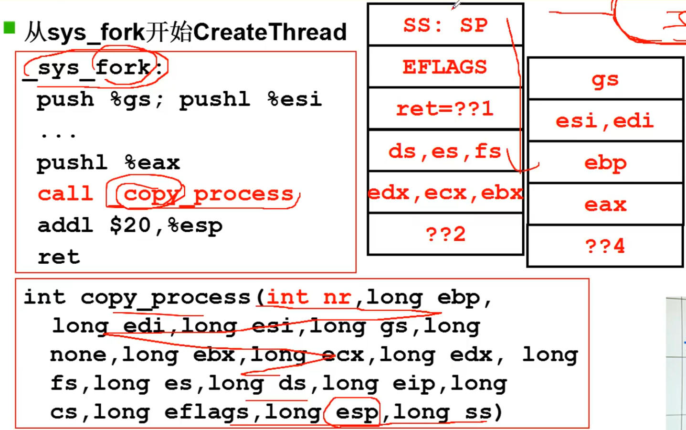
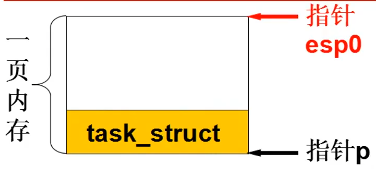
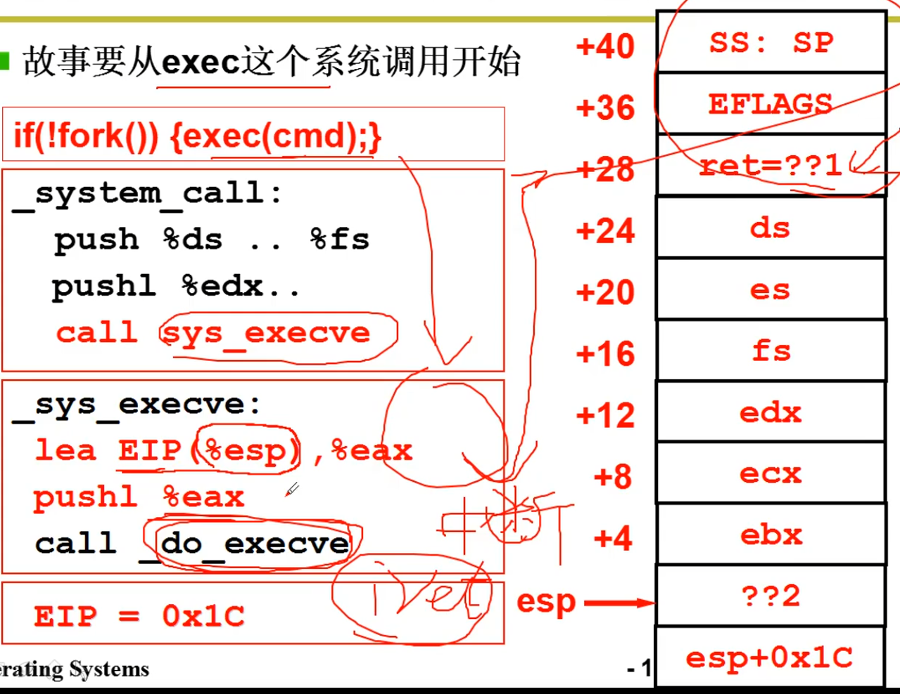
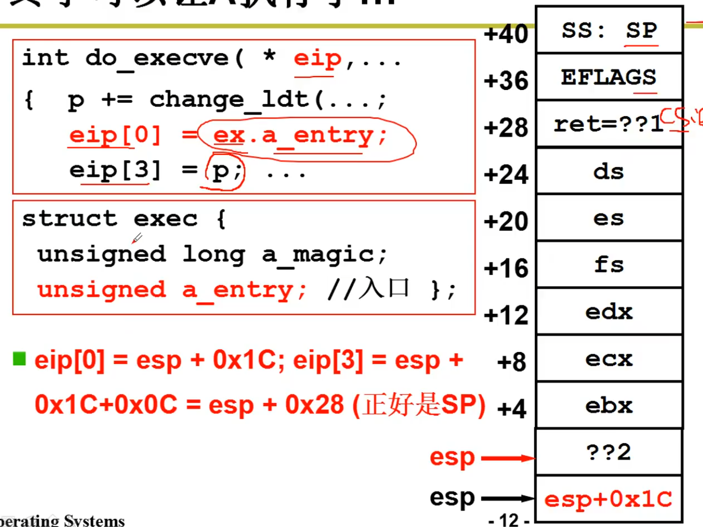

# 内核级线程实现



* 系统进入内核的过程，从主函数进入执行A函数()，A函数执行完接着就是执行B()所以A的ret的要出栈的地址就是B()函数的开头地址。在A的执行过程中遇到fork()函数，通过`INT 0x80`中断来进入内核态。内核栈压栈用户栈的开始和结束的地址，并且压栈ret返回地址。在用户栈进入内核栈的时候，首先压栈的都是用户的现场。


* 调用system_call，首先保存用户的现场，调用sys_fork。_current其实就是PCB，state(%eax)就是读取了PCB的状态。如果比较得到非零的值，则表示进入阻塞，调用reschedule来进行调度。counter(%eax)是读取PCB的时间片，如果时间片到0，也会触发调度函数reschedule


* 中断的出口，一堆pop，恢复用户态下的上下文


* 五段论的switch_to，通过ljmp来切换tss段


* 从sys_fork开始CreateThreada, _copy_process函数的参数，从左往右依次入栈
  

* copy_process函数：创建栈
  ``` C
    p = (struct task_struct *)get_free_page();
    //申请内存空间
    p->tss.esp0 = PAGE_SIZE + (long)p;
    p->tss.ss0 = 0x10;
    //创建内核栈
    p->tss.ss = ss & 0xFFFF;
    p->tss.esp = esp;
    //创建用户栈（和父进程共用栈）
  ```
  
  ``` C
    p->tss.eip = eip;
    p->tss.cs = cs & 0xFFFF;
    //将执行地址cs:eip放在tss中
    p->tss.eax = 0;
    p->tss.ecx = ecx;
    //执行时的寄存器也放入
    p->tss.ldt = _LDT(nr);
    set_tss_desc(gdt + (nr<<1) + FIRST_TSS_ENTRY, &(p->tss));
    set_ldt_desc(gdt + (nr<<1) + FIRST_LDT_ENTRY, &(p->ldt));
    //内存跟着切换
    p->state = TASK_RUNNING;
  ```

* 子进程一旦创建出来首先执行的会跟父进程一样，通过exec(cmd)往下到系统调用sys_execve, 把 %esp+0x1C 赋给 %eax 并且压栈。接着调用_do_execve,调用这个函数需要用的参数已经压栈，栈如右图所示，%esp+0x1C的位置刚好就是iret的地址。
  
  接着到_do_execve, 其中 eip 刚好就是之前的 %esp+0x1C 的值。把要执行的程序的入口地址赋予 eip[0],也就是将地址写到了要 iret 的位置。且 eip[3] 刚好就是 sp 指针。
  