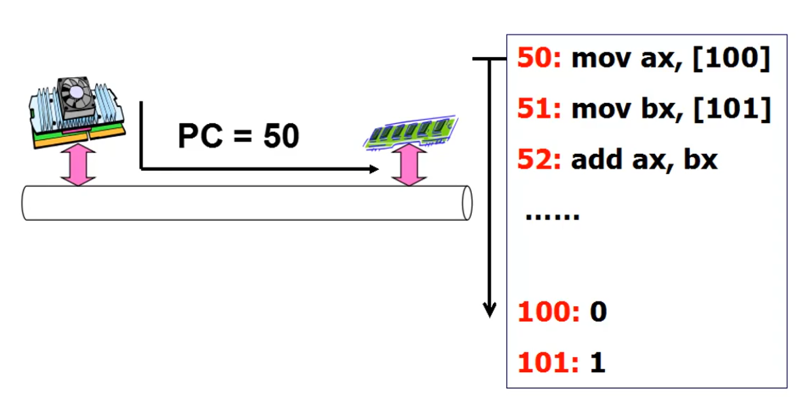
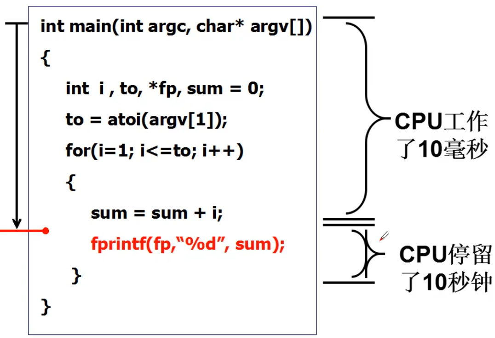
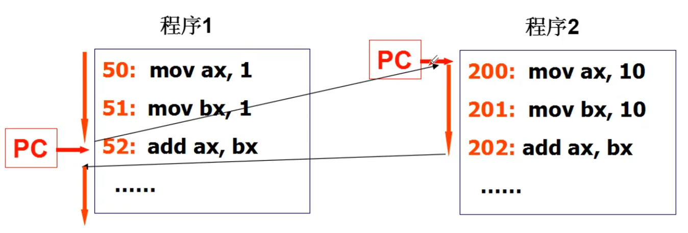
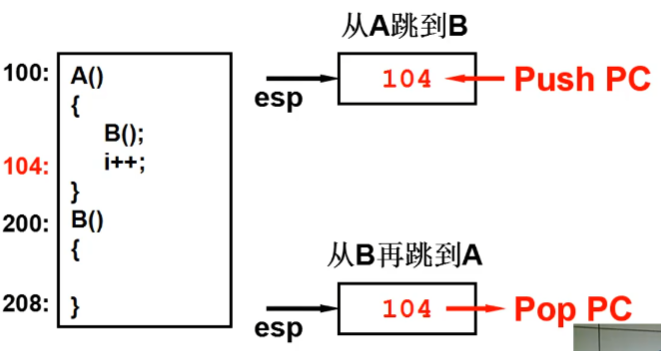
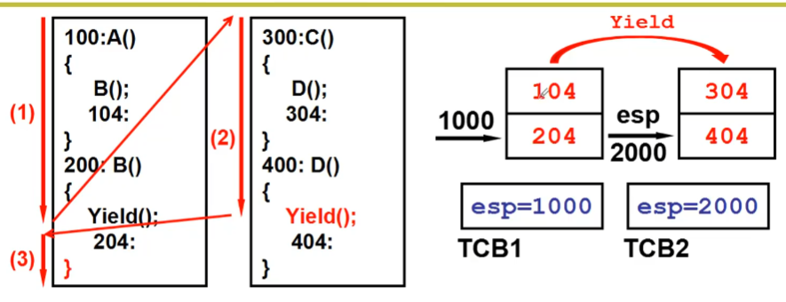
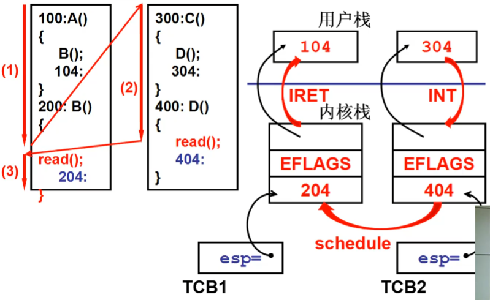
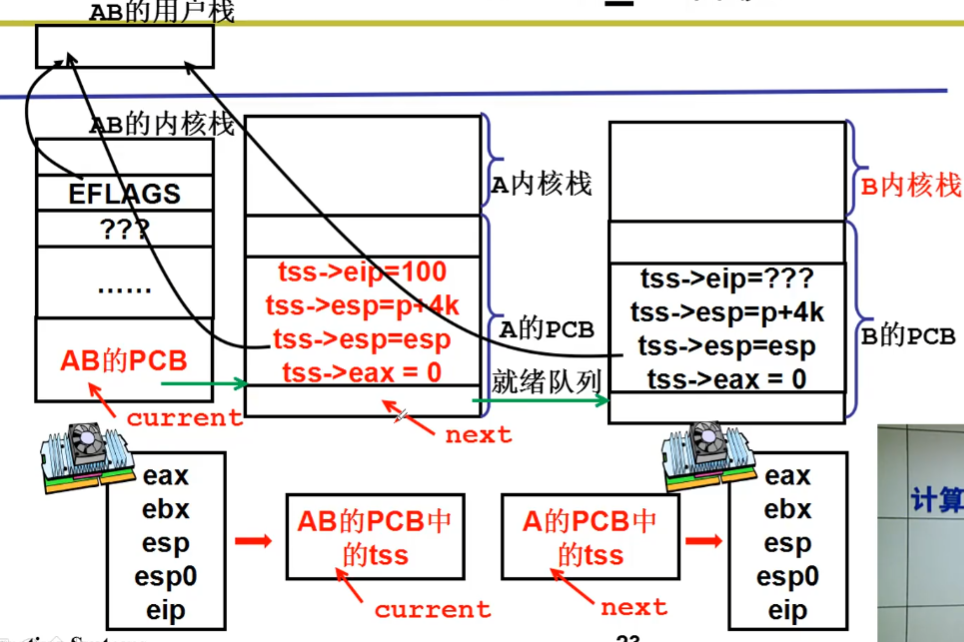
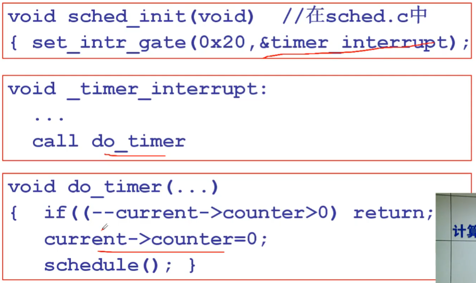

# 操作系统那棵树

## 运转 CPU
* CPU不断的从内存中取址执行

* CPU没有更加有效的运转，在IO口等慢速工作时，CPU没有被充分利用起来。

* 为了重复利用CPU，需要在等待的时候把CPU切换到其他地方去


## CPU的跳转
* 函数的跳转，在调用的时候压栈返回的地址，等函数执行完出栈跳转到对应的地址

* 一个栈在进行跳转的时候，会出现栈的混乱。为了解决，采用两个栈+两个TCB

* 引入内核态的切换，需要考虑内核栈也要进行切换


## 设计一个系统
在屏幕上交替的打印 A 和 B，实现这个这个系统先从用户代码开始
``` C
    main()
    {
        if(!fork()){while(1)printf("A");}
        if(!fork()){while(1)printf("B");}
        wait();
    }
```
首先通过fork函数来创建子进程的需要的结构，通过返回的res来判断运行的是子进程还是父进程，子进程返回的res为0，父进程res为非0。执行fork函数需要通过0x80中断进入内核，执行到对应的内核函数sys_fork，在sys_fork内copy_process来拷贝一个新的线程，通过copy_process申请内存区域，调整栈指针，构建PCB。这样一个fork就执行结束了，在这里fork返回的时候没有调用调度函数来进行线程的切换，而是继续向下执行下一个fork，第二个fork运行结束之后就会创建出两个没有调用的子线程。最后通过wait()，来调用内系统内部sys_waitpid，在系统内核中调用schedule()来进行线程的切换。这时就会切换到打印A的线程中去。

但是屏幕只会打印A出来，我们需要想办法在合适的时候进行切换。就可以通过定时器的中断来让当前线程的计数值counter--,等减到0的时候去调用schedule()函数进行线程的切换。

定时器的中断一旦配置好了之后，就会定时运行，这样两个线程就会完成自动的切换。