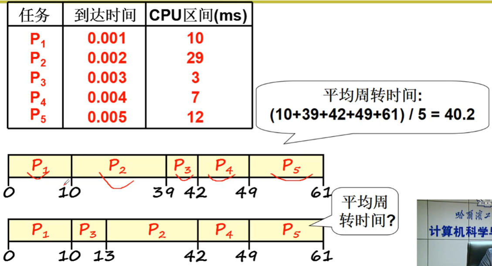
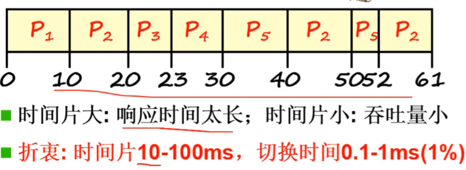

# CPU 调度策略

## 直观想法
* FIFO
  先入先出，谁先进入就先调度谁
* Priority
  短任务适当优先。如果任务的时间越来越长，适当降低优先级。

* 怎么做到进程满意
  * 尽快结束任务：任务周转时间（任务进入到任务退出）短
  * 用户操作尽快响应：响应时间（操作发送到操作响应）短
  * 系统内耗时间少，吞吐量（完成任务量）大

## 怎样合理
响应时间小=》切换次数多=》系统内耗大=》吞吐量小
* CPU约束型任务
* IO约束型任务

## 基本调度算法
### First Come, First Served(FCFS)
先来的任务优先服务

### SJF：短作业优先
短的任务优先的特点是平均周转时间最短，缺点是响应时间无法保证

### RR(Round Robin): 时间片轮转调度

### 响应时间和周转时间同时要求
假设前台任务需要保证响应时间，后台任务需要保证周转时间。
**一个想法**: 定义前台任务和后台任务两个任务队列，前台任务之间调度使用**RR**算法保证响应时间，后台任务之间调度使用**SJF**算法保证周转时间，两个任务队列之间采用**优先级**调度。前台任务优先级高，后台任务优先级低，这样会首先去调度前台的任务。

* 这样的调度方式会使得后台任务总是不能执行
* 如果后台任务优先级动态提高，后台使用 SJF 调度执行就会导致前台任务响应时间边长
* 如果前台后台都采用时间片，就退化成了单一的 RR 调度，周转时间又无法保证
* 综上会导致无休止的悖论中

下一节课介绍一个巧妙的调度算法