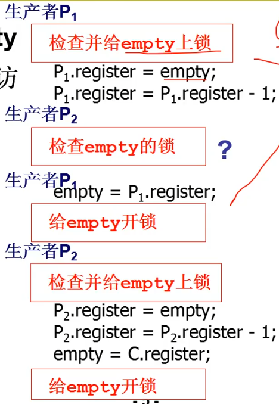
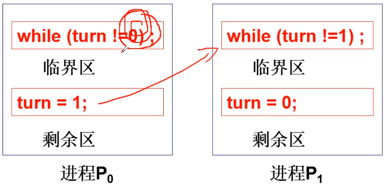
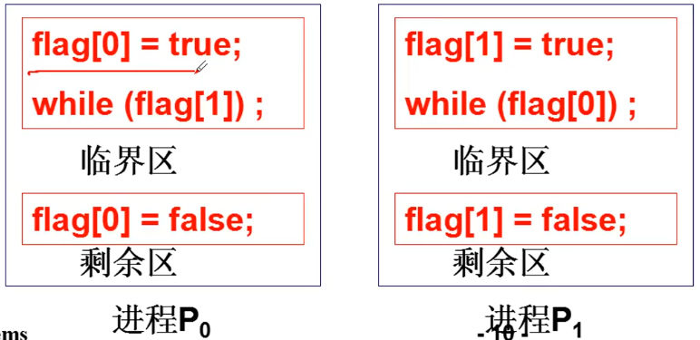
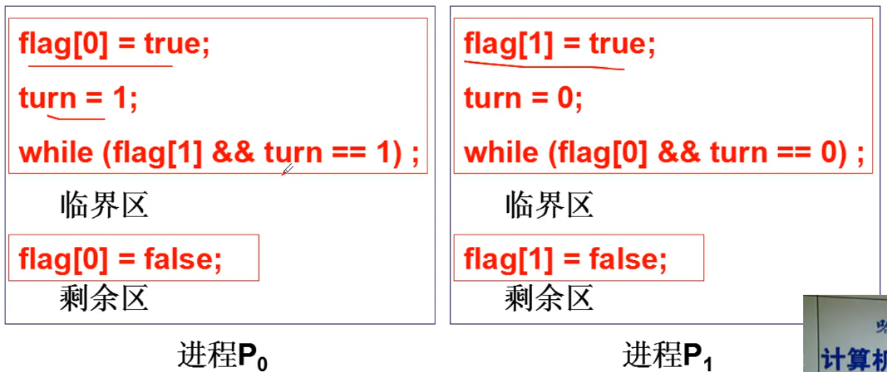
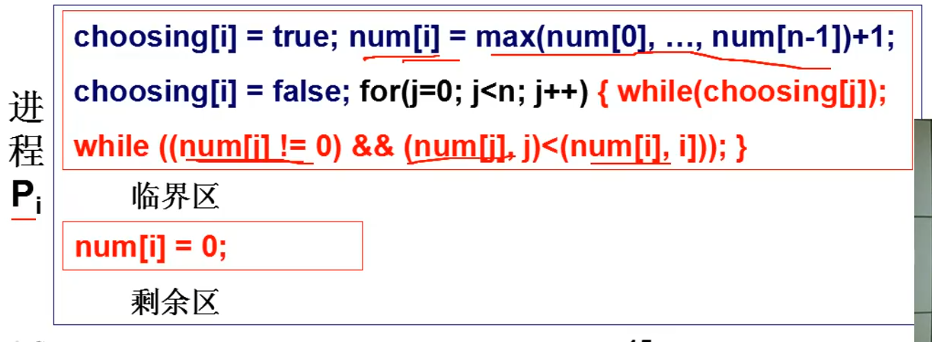
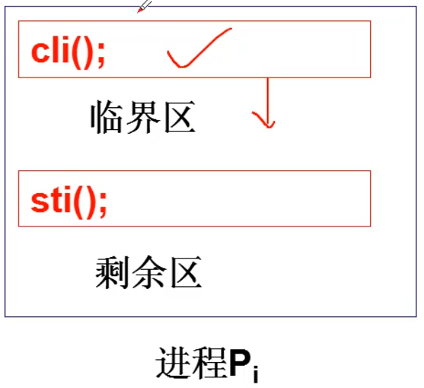
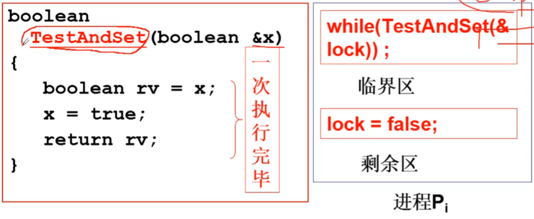

# 信号量临界区保护
信号量：通过对这个量的访问和修改，让多进程有序推进。

## 共同修改信号量引出的问题
``` C
/*
 * 信号量 empty
 */
empty = -1;

P(empty) {
    register = empty;
    register = register - 1;
    empty    = register;
}

Producer (item) {
    P(empty);
    ...
}
p(empty)
```
假设有两个进程，生产者P1和生产者P2，那么可能会有下面的调度
``` C
P1.register = empty;
P1.register = P1.register - 1;
P2.register = empty;
P2.register = P2.register - 1;
empty = P1.register;
empty = P2.register;
```
本来两个进程来等待资源，信号量的值应该 **- 2**，但是经过这种调度之后的信号量只 **- 1**，发生了错误。
* 竞争条件：和调度有关的共享数据语义错误

## 解决竞争条件

一旦获得 empty 的操作权限，就直接做完。
* 临界区：一次只允许一个进程进入该进程的那一段代码

## 临界区代码保护原则
* 基本原则：互斥进入，如果一个程序在临界区执行，则其他进程不允许进入。进程间的约束关系成为互斥(mutual exclusion)，这保证了临界区。
* 好了临界区原则
  * 有空让进：若干进程要求进入空间临界区时，应尽快使一进程进入临界区。
  * 有限等待：从进程发出进入请求到允许进入，不能无限等待

### 轮换法

* 满足互斥进入要求
* 不满足有空让进：进程P0执行完之后 turn = 1了，要等P1也执行才会再让 P0 执行，P1 有可能进入阻塞状态，那么P0 也会跟着等待。也就是P0 完成之后不能再次进入。

### 标记法

* 满足互斥进入
* 如果在标记处发送调度，可能会导致两个标志位都置位，那么程序会发送死锁

### 非对称标记法
结合轮换和标记的思想

* 满足互斥进入
* 满足有空让进
* 必会发生死锁
* 满足有限等待
* 缺点是只有两个进程

### 面包店算法
仍然是标记和轮转的结合
* 轮转：每个进程都获得一个序号，序号最小的进入
* 标记：当序号是0 的进程离开后，不为0 的序号立即标记 
面包店：每个进入商店的客户都获得一个号码，号码小的优先得到服务，号码相同时，名字靠前的先服务

* 互斥进入：一定有(num[i],i) < (num[j],j), 一个进程进去临界区
* 有空让进：如果没有进程进入到临界区中，那么领取的号一定就是最小的
* 有限等待：通过轮转离开临界区的进程再一次进入拍的序号最大，左移最多进入一个临界区等待n 个进程

### 另一种解法-关中断
如果发送了临界区的竞争关系，一定是发送了调度造成了冲突，通过关闭中断组织调度。

什么时候不好使：多CPU（多核）

### 硬件原子指令法

如果lock锁为真，return返回也是真，会在这里自旋等待。如果lock锁为假，进入临界区执行，并让lock锁为真。左边的赋值都是在一条指令中完成，称为硬件原子指令法。