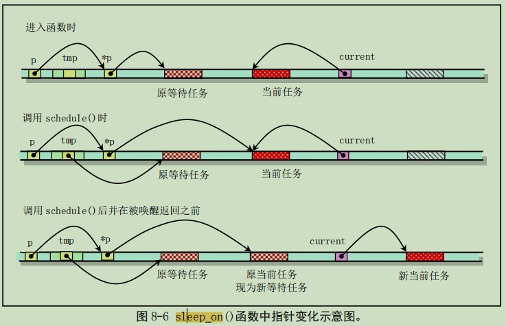
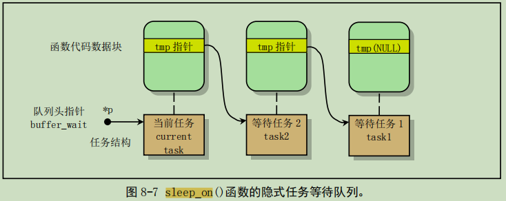

# 信号量的代码实现

## 从纸上到实际
* 用户态程序 producer.c
``` C
main() {
(1) sd = sem_open("empty");
(2) for (int i = 0; i < 5; i++) {
        sem_wait(sd);
        write(fd, &i, sizeof(int));
    }
}
```
在用户态程序中打开一个信号量，再等待这个信号量表示文件可用，下面再向这个文件写入数据。

* 信号量的创建 sem.c 进入内核
``` C
typedef struct {
    char            name[20];
    int             value;
    task_struct    *queue;
}semtable[20];

sys_sem_open(char *name)
{
    在semtable中寻找name对上的;
    没找到则创建;
    返回对应的下标;
}

sys_sem_wait(int sd)
{
    cli();
    if(semtable[sd].value -- < 0) {
        设置自己为阻塞;
        将自己加入 semtable[sd].queue 中
        schedule();
    }
    sti();
}
```
因为有对 PCB 进行的操作，所以函数都会运行到内核态中进行处理。

## Linux 中的信号量
### 读磁盘块
``` C
bread(int dev, int block) {
    struct buffer_head *bh;     //申请一个buffer
    ll_rw_block(READ,bh);       //从磁盘读取数据放到缓冲
    wait_on_buffer(bh);         //等待磁盘读完由磁盘中断将其唤醒，也是一种同步
}
lock_buffer(buffer_head *bh) {
    cli();
    while(bh->b_block)          //这个while后面解释
        sleep_on(&bh->b_wait);
    bh->block = 1;
    sti();
}
void sleep_on(struct task_struct **p) {
    struct task_struct *tmp;
    tmp = *p;                   //暂存上一个任务结构
    *p = current;               //将当前任务结构放入队列
    current->state = TASK_UNINTERRUPTIBLE;
    schedule();                 //调度
    if (tmp)
        tmp->state = 0'
}
```

这里有一个全世界最隐蔽的队列放入

* 在调用调度函数之前，tmp指向原等待任务，*p和current都指向当前任务
* 在调用调度函数之后，tmp还是指向原等待任务，*p指向了新的等待任务，current指向切换过去的进程

调用了 sleep_on 的任务，此时就是添加的新的任务。在进入 schedule 函数的时候tmp临时变量会压栈，所以就会成为跟随本任务中的信息。如果再一次发生 sleep_on ，新的 tmp 就会指向旧的 sleep 任务，当完成之后返回，tmp 会重新出栈，仍然会指向原等待任务。
调度函数完成之后，表示睡眠已经结束，那么此时 tmp 中放的是下一个需要唤醒的进程，那么就把下一个进程的 state 置 0。


* while的解释
这里的 while 而不是 if 的原因，如果是 if 一次性只能唤醒一个等待信号量的进程，而这个进程也一定是先来的；如果是 while 一次性可以唤醒所有等待信号量的进程，根据优先级再去决定那个进程哪个先执行。

### 队列中唤醒
磁盘中断
``` C
static void read_intr(void) {
    ...
    end_request(1);
    ...
}
end_request(int update) {
    ...
    unlock_buffer(CURRENT->hb);
    ...
}
unlock_buffer(struct buffer_head *bh) {
    bh->b_lock = 0;         //把锁置成 0
    wake_up(&hb->wait);
}
wake_up(struct task_struct **p) {
    if (p && *p) {
        (**p).state = 0;
        *p = NULL;
    }
}
```