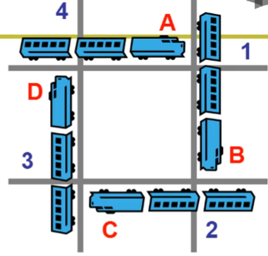
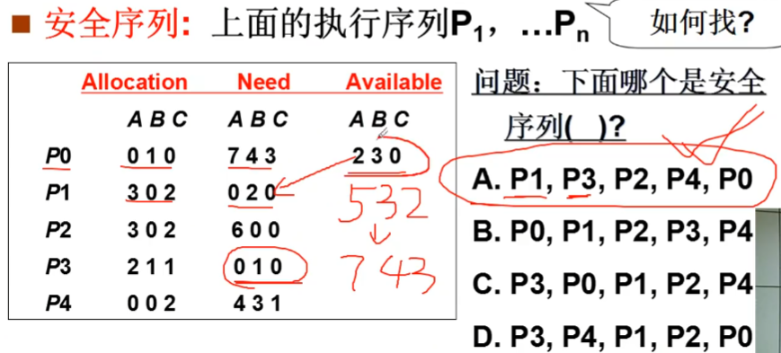
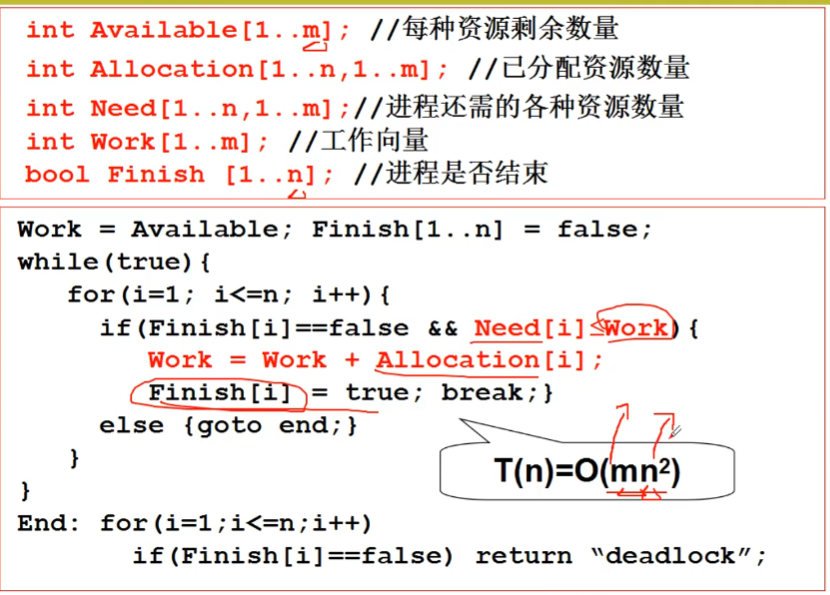
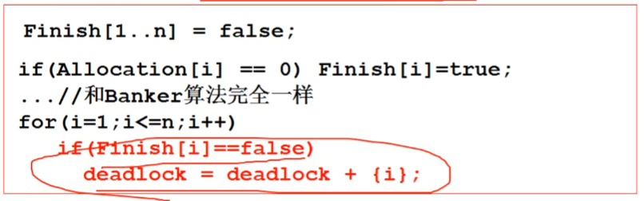

# 死锁处理

## 如果信号量这样使用
``` C
Producer(item) {
    P(mutex);       //(1)检查一下 mutex:1 -> 0
    P(empty);       //(2)检查一下 empty:0 -> -1
                    //(3)阻塞等待 mutex         
    ...
    V(mutex);
    V(full);
}
Consumer(item) {
    P(mutex);       //(4)检查一下 mutex:0 -> -1
                    //(5)阻塞等待 mutex
    P(full);
    ...
    V(mutex);
    V(empty);
}
```
此时两个进程都进入阻塞状态，P运行需要信号量 empty，其产生在C下方。而C的继续运行需要 mutex 。而P下方 mutex 的释放，需要上面的 empty 信号量释放。这样信号量的需求构成了一个**环路等待**，发生了死锁。

## 死锁的成因
形象的表示死锁的发生

* 资源的互斥使用，一旦占有别人无法使用
* 进程占有了一些资源没有释放，又去申请其他资源
* 各自所占有的资源和相互申请的资源形成了环路等待

必要条件：
* 互斥使用(Mutual exclusion): 资源的固有特性
* 不可抢占(No preemption): 资源只能资源放弃
* 请求和保持(Hold and wait): 进程必须占有资源，再去申请
* 循环等待(Circular wait): 资源分配图中存在一个环路

## 死锁的处理方法
* 死锁的预防：破坏死锁产生的条件
* 死锁的避免：检测每个资源请求，如果造成死锁就拒绝
* 死锁检测和恢复：当出现死锁，让一些进程回滚，让出资源
* 死锁忽略：就好像没有出现过死锁一样

### 死锁预防
* 在进程执行前，一次性申请所有需要的资源，不会占有资源再去申请其他资源
  * 缺点1：编程困难
  * 缺点2：许多资源在分配很长时间后才使用，资源利用率低
* 对资源类型排序，资源申请必须按序进行
  * 缺点：还是会造成资源浪费

### 死锁避免：判断请求是否引起死锁
* 如果系统中所有的进程存在一个可完成的执行序列P1，P2，...，Pn，则系统处于安全状态



找安全序列的银行家算法

算法的时间复杂度较高，执行的代价较大
当进程的请求出现时，先假装分配，调用应行家算法计算是否有一条安全序列，如果找不到这个安全序列，那么进程就继续在这里等待资源。

### 死锁的检测和恢复
* 缺点：每次申请都执行 $O(mn^{2})$，效率低。
  * 定时检测，或者是发现资源利用率低时检测，也是通过银行家算法，看是否有死锁的产生
    
  * 选择进程回滚，但是会出现很多问题，应该选择哪个进程回滚？看优先级还是看占有的资源？怎么实现回滚？修改的文件怎么办？

### 死锁忽略
许多通用操作系统，PC机上的Windows和Linux，都采用忽略死锁的方法。