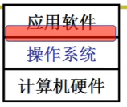
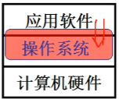
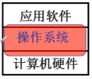

[TOC]
# 什么是操作系统

## 学习操作系统的层次
1. 从应用探到操作系统
   
   集中在接口上:
   * 使用显示器 : printf
   * 使用CPU : fork
   * 使用文件 : open, read

    
2. 从应用软件进入操作系统

    一段文字如何写到磁盘

    
3. 从硬件设计实现到操作系统

    给一个板子,配一个操作系统

    