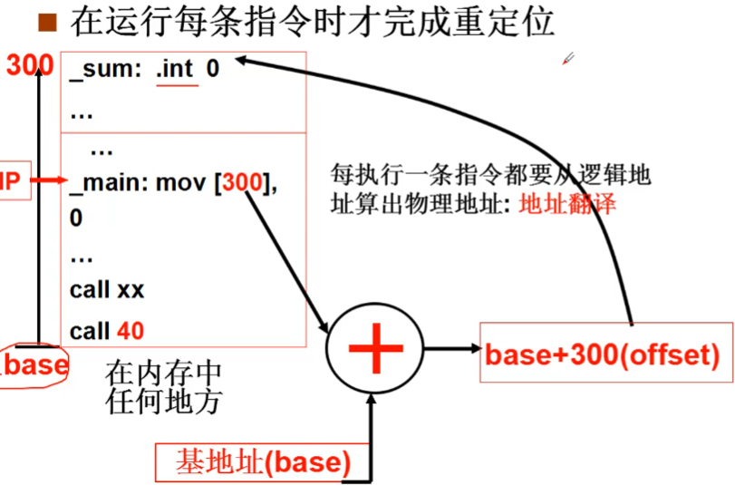

# 内存使用与分段

将程序放在内存中， CPU不断从内存中取指执行

C 语言编译成为汇编， 调用 main() 用过 call _main 也就是跳转到地址是 40 的地方，那么在实际的物理内存上 _main 就要放在物理内存 40 的位置， call 指令放在物理内存 0 的位置。

然而实际上 0 地址不是随便就能用的， 所以应用程序应该放在一块空闲的内存中去。这样程序中的地址就要修改成相对地址。

## 重定位

这一修改地址的行为叫做重定位。
在哪里完成重定位？
* 编译时重定位， 在嵌入式系统中， 预先知道哪一段空闲， 直接将程序固定在这个位置， 程序在内存中的固定位置
* 载入时重定位， 载入时重定位需要时间修改地址，一旦载入了内存就不能动了

## 交换
程序载入之后还需要移动，重复利用内存

* 运行时重定位，每条指令只有在运行的时候才完成重定位

运行时重定位， 就需要进行地址翻译。 一个程序要执行， 首先申请一段空闲内存， 将这个内存的地址赋给 PCB 结构， 就拿到了这个进程要使用的一段内存。 PC 放到初始地址， 然后就可以开始执行。 在执行的时候每一句指令都需要进行地址翻译， 这样就可以正常运行了。

## 内存分段
程序由若干部分(段)组成，每个段都有各自的特点、用途，这样的好处就是可以独立的考虑每个段。 段内定位具体的指令：<段号:段内偏移>

将内存分段分别放入内存

* DS = 1, DS 基地址是 180K, [DS:100] 就表示 180K + 100 的地址
* CS = 0, CS 基地址是 360K, jmpi 100,CS 表示跳转到 360K + 100 的地址

### 再看 GDT 和 LDT

操作系统切换进程的时候也会跟着切换 LDT 表， 根据 LDT 表的段号找到对应段号的**段基址**， 把这个段基址作为地址翻译的基址， CPU 就能访问对应进程的内存空间。
所以 GDT 和 LDT 分别就是描述操作系统和进程(应用程序)的内存分段结构的。在运行时重定位用这俩个表来进行地址翻译。

# 参考资料
> https://www.bilibili.com/video/BV1d4411v7u7?p=20