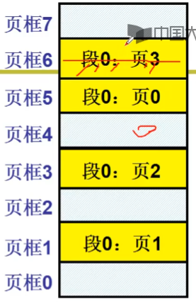
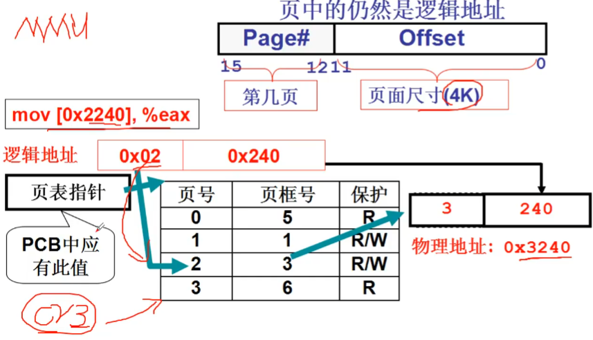

# 内存分区与分页

## 固定分区和可变分区
可变分区的管理-请求分配

申请一段 100K 的内存， 从空闲区域给 100K 的内存分配， 分配的内存要从空闲分区表减去， 并添加到已分配分区表

段 2 不再需要， 那么就释放这一段的内存， 释放的内存重新放入空闲分区表， 并从已分配分区表中去除

如果又提出一个内存请求 40K ，又集中不同的适配方法。
* 首先适配就是从分配的指针往后给最前面的一个空闲分区；最简单最快
* 最佳适配就是挑选大小最接近的一个空闲分区；容易产生细小碎片
* 最差适配就是挑选大小差别最大的一个空闲分区；得到的空闲分区大小比较均匀

## 内存分页
如果需求一个 160K 的内存空间， 虽然整个内存上的总空闲空间 > 160K， 但是没有一整块的空闲分区 > 160K, 这就是产生了**内存碎片**。 需要将内存碎片合并， 进行内存紧缩， 但是内存紧缩需要大量的时间。
从连续到离散， 将内存分成页， 针对每个段内存请求， 系统一页一页的分配给这个段。 

所以就需要**页表**来提供地址的重定位，x86中页表指针寄存器是 **CR3** 。一个逻辑地址高四位 0x02 用来表示页号， 低12位 0x240 用来表示页内的偏移， 通过 CR3 找到页表， 在页表中找到对应页号， 就可以找到对应页框号拿到了真是物理地址加上偏移就可以访问对应内存, 也就是将物理页号转换为真实页号

# 参考资料
> https://www.bilibili.com/video/BV1d4411v7u7?p=21&spm_id_from=pageDriver