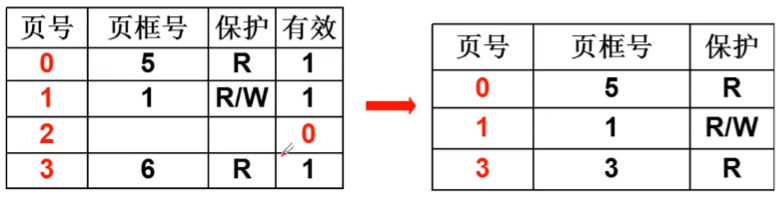

# 多级页表和快表
在 32 位的系统中， 地址是 32 位的， 内存的大小最多有 $2^{32} = 4G$， 页表的大小通常是 $2^{12} = 4K$ ， 那总共就会产生 $2^{20} = 1M$ 的页表。所有的页表项放在内存中， 就需要 4M 内存， 在系统中每个并发的进程都会包含一个页表， 那么就会用到大量的内存空间来存放进程页表。 并且进程的大部分的逻辑地址根本不会用到。

## 尝试：只放用到的页
只有用到的逻辑页才有页表项。 但是这导致了页号不连续， 就需要查找比较、折半， 这意味着每访问一次内存就要访问多次来进行地址翻译， 造成大量时间上的浪费。
如果节省时间， 就需要让页表连续， 那么页表又会占用大量内存， 造成空间浪费。
所以我们需要一种方法， **既要连续有要占用空间少**。

## 尝试：多级页表
分为页目录和页表

每个页表下是 4K 的空间， 每个页目录下是 4M 的空间。
多级页表也有缺点， 多一级页表多访问内存一次， 尤其是 64 位系统中， 页表的级数会更多。引入了快表来记住最近使用的内存映射。

# 参考资料
> https://www.bilibili.com/video/BV1d4411v7u7?p=22&spm_id_from=pageDriver
