# 段页结合的实际内存管理
段页需要同时存在， 段面向用户， 页面向硬件。
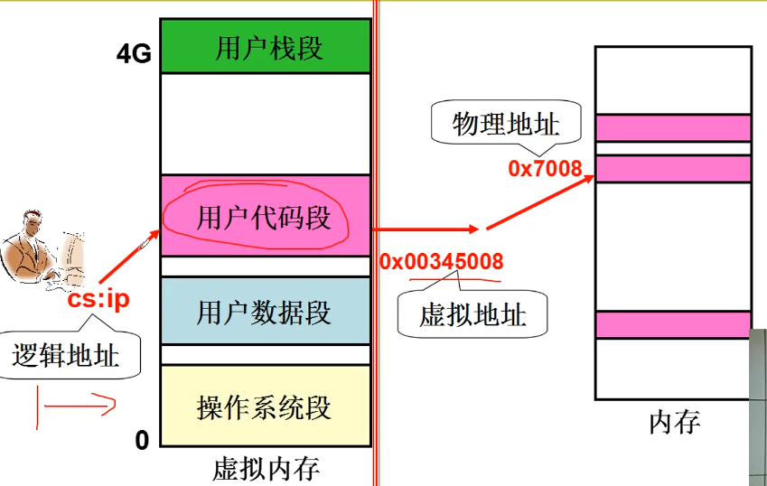

段页同时存在的重定位（地址翻译）
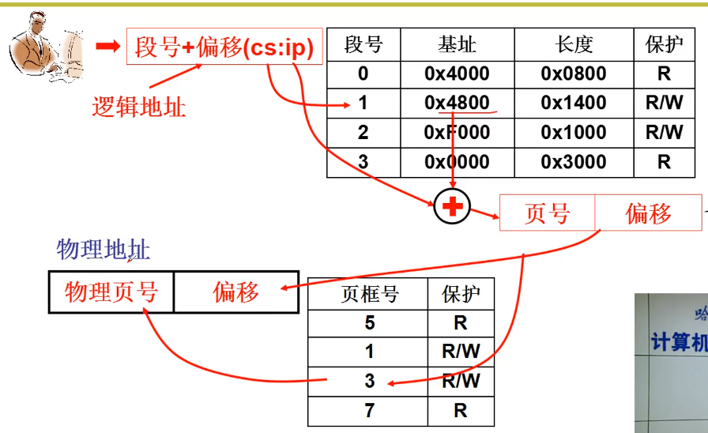
用户输入要访问的地址是**逻辑地址**，由 **段号:偏移** 组成。通过段号找到段的基址并且加上偏移量得到一个地址， 这个地址就是**虚拟地址**， 开放给应用程序知道的地址。 操作系统拿到虚拟地址， 通过页号查找对应真实物理地址的页框号， 将真实页号替换进去让内存访问， 这样内存才拿到了真实的**物理地址**。

## 开始
内存管理的核心就是内存分配
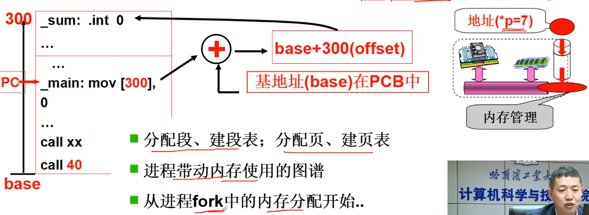

如何将程序载入到段页式的内存中？ 对用户的程序采取分区的方法变成一段一段的形式， 并且建立起一个段号和基址对应的段分配表。 操作系统将分好的虚拟段通过分页的方式存在实际的物理内存中， 并且建立页表来让系统进程内存的地址翻译。
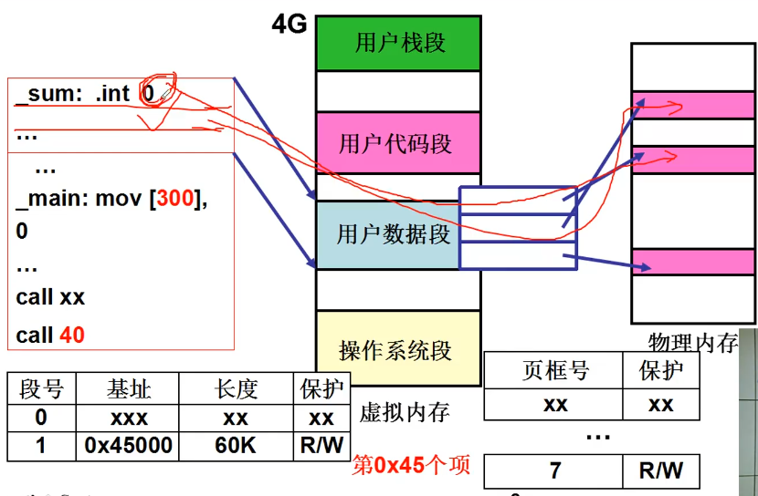

## fork()
* fork() -> sys_fork -> copy_process
``` C
//在 linux/kernel/fork.c
int copy_process (int nr, long ebp, ...)
{
    ...
    copy_mem(nr, p);
    ...
}
```
* 分析 copy_mem()
``` C
int copy_mem (int nr, task_struct *p)
{
    ...
    unsigned long   new_data_base;
    new_data_base = nr * 0x4000000;     //64M * nr
    set_base(p->ldt[1], new_data_base);
    set_base(p->ldt[2], new_data_base);
    ...
}
```
将虚拟内存的基址分配给进程作为进程的基址。 代码中 **nr** 代表进程号， 那么 0 号进程的基址就是 0， 1 号进程的基址就是 0x4000000 （64M），以此类推进程的基址为固定的 64M 分割。ldt[1], ldt[2] 分别代表了代码段和数据段， 这里分配的都是同样的基址。
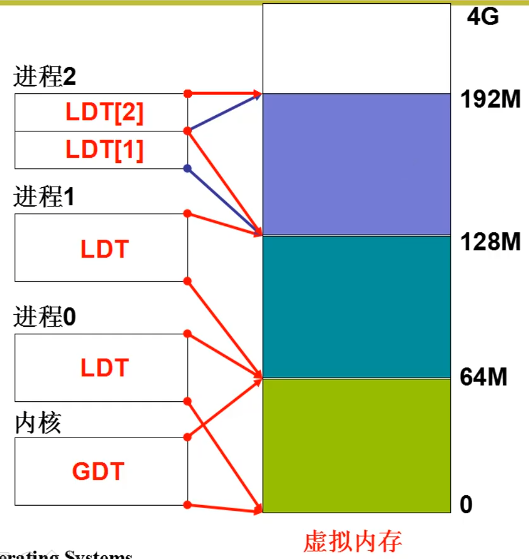

## 建页表
``` C
int copy_mem (int nr, task_struct *p)
{
    ...
    unsigned long   old_data_base;
    old_data_base = get_base(current->ldt[2]);
    copy_page_tables(old_data_base, new_data_base, data_limit);
    ...
}
```
父进程已经分配了页表， 这里将页表复制给子进程， 这样子进程也得到了跟父进程同样的页表， 映射用一部分内存。
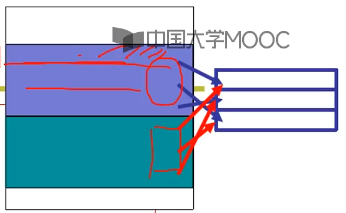

``` C
int copy_page_tables (unsigned long from, unsigned long to, long size)
{
    ...
    from_dir = (unsigned long *)((from >> 20) & 0xffc);
    to_dir   = (unsigned long *)((to   >> 20) & 0xffc);
    size     = (unsigned long)(size + 0x3fffff) >> 22;
    for (; size-- > 0; from_dir++, to_dir++) {
        from_page_table = (0xfffff000 & *from_dir);
        ...
    }
    ...
}
```
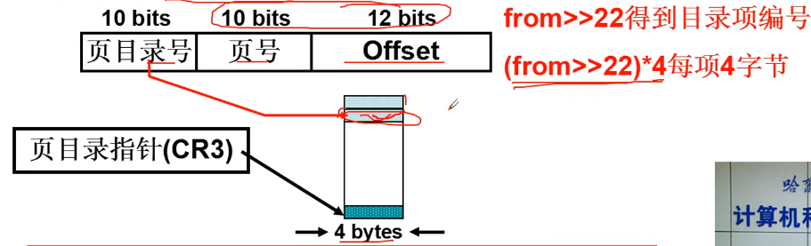
这里将虚拟地址右移了 20 位， 首先需要将虚拟地址右移 22 位来得到对应的项目录号， 又因为每一个项目录号是由 4byte 组成， 那么最终项目录号对应的地址还需要左移 2 位， 所以得到了右移 20 位。from_dir， to_dir 就是页目录号所在的地址。
函数传进来的参数是地址的大小，单位是一个地址， 通过(size + 0x3fffff) >> 22 之后就可以将地址的大小转换为有多少个 0x400000 (bit31~bit22 刚好是项目录号的地址位置)， 也就是转换为有多少个目录大小。
在循环里把页目录的地址存在页表中去。

``` C
    for (; size-- > 0; from_dir++, to_dir++) {
        ...
        to_page_table   = get_free_page();
        *to_dir = ((unsigned long)to_page_table?) | 7;
        ...
    }

```
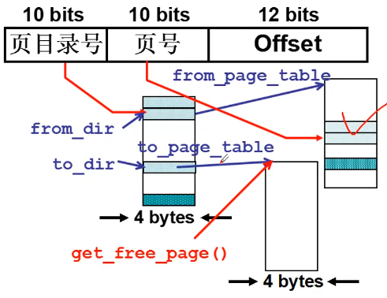
目标内存申请一个新物理内存的页，将页的地址传给目标内存。

``` C
// nr = 1024
for (; nr-- > 0; from_page_table++, to_page_table++) {
    this_page  = *from_page_table;          //取值
    this_page &= ~2;    //只读
    *to_page_table   = this_page;           //拷贝
    *from_page_table = this_page;           //赋值
    this_page -= LOW_MEM;
    this_page >>= 12;
    mem_map[this_page]++; 
}
```
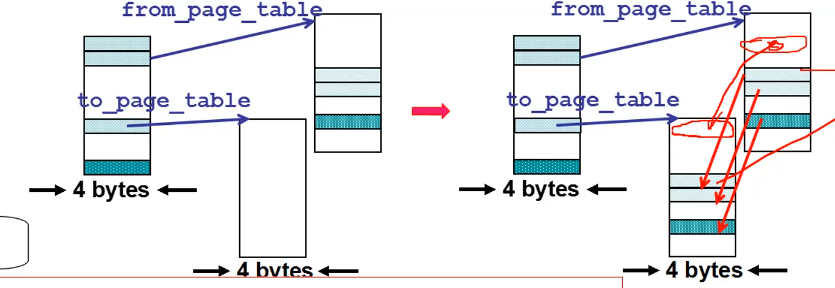
接下来需要将父进程的页表拷贝给子进程， 取值出来加上只读标记， 将对应内容放回父进程原内存和子进程中， 并且最后要给 mem_nap 对应的地方++。

## 使用内存的过程
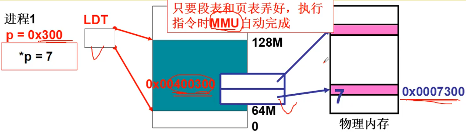
进程 1 要在地址 0x300 的地方放入 7 ， 首先从逻辑地址转换到虚拟地址， 翻译到虚拟地址的过程是通过计算机硬件 MMU 自动完成的，只需要建立段表的时候配置好 LDT 。 操作系统再把虚拟地址通过多级目录的地址翻译转为物理内存的实际地址， 并把数据放在地址总线上， 这样物理内存中就放入了数据 7。
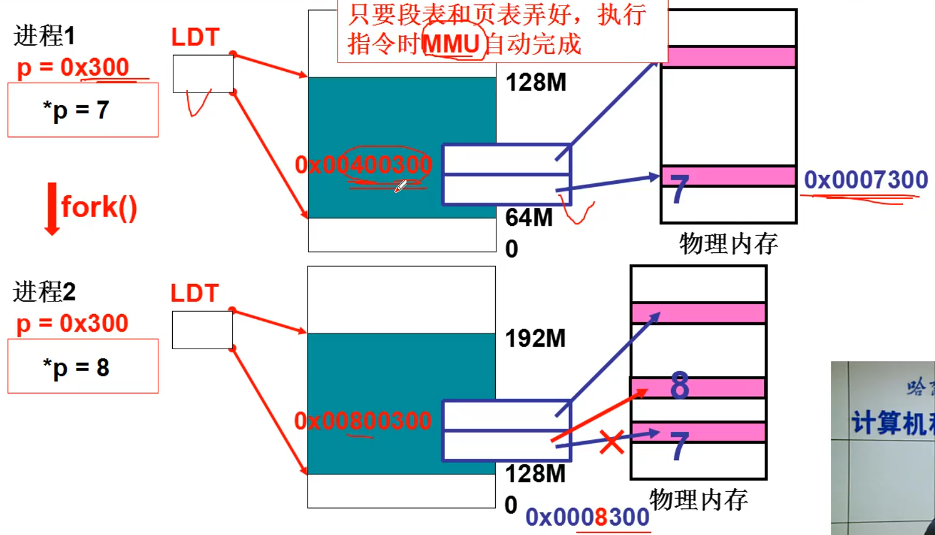
如果通过 fork() 出来的进程 2 要往 0x300 的地方放入 8 呢？首先也是一样通过 MMU 翻译成虚拟地址，操作系统通过虚拟地址会找到一个标记为只读的地址， 这个地址就是从父进程拷贝过来的， 并且里面还存着进程 1 在刚才写入的 7， 这时如果要写入新的数据， 操作系统就会分配一个新的页， 并且修改进程 2 的映射表， 再把数据放入这个分配的新内存空间中去。这里也就是 **写时复制(Copy On Write)** 的概念。

# 参考资料
> https://www.bilibili.com/video/BV1d4411v7u7?p=23