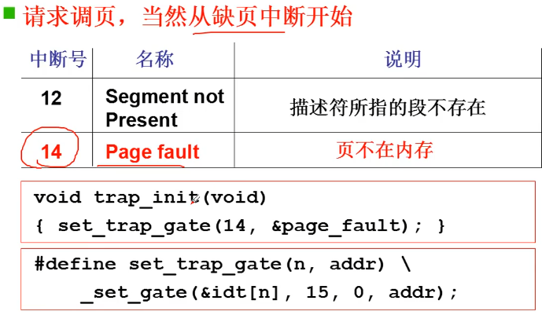

# 内存换入-请求调页

用换入换出可以实现“大内存”

通过换入和换出可以让真正需要使用的部分加载到物理内存中， 又在不使用的时候从内存中释放。

## 请求调页

用户访问一个逻辑地址， 通过内存分段查询到对应的虚拟地址， 在页表中查询之后发现页号没有对应的映射。 这时 MMU 会触发 **缺页中断** ， 在中断处理函数中将磁盘中的内存数据放入物理内存并更新到页表的映射， 程序回到原来的访问这个内存的位置， 这是用户就可以访问到这个地址的内存了。

## 实际系统的请求调页
### 从中断开始

从芯片手册中查询缺页中断对应的中断号， 配置好中断触发和对应的中断服务

进入中断处理函数首先进行压栈、保存现场、标志内核选择子。 将页错误线性地址(虚拟地址)放到 %edx, 再把其压栈， 准备给 C 函数调用。
``` C
// 在 linux/mm/memory.c 中
void do_no_page (unsigned long error_code, unsigned long address)
{
    address &= 0xfffff000;  //取页面地址
    tmp = address-current->start_code;  //页面对应的偏移
    if (!current->executable || tmp >= current->end_data) {
        get_empty_page(address);
        return;
    }
    page = get_free_page();
    bread_page(page, current->executable->i_dev, nr);
    put_page(page, address);
}
```
取出页面地址， 想一个新的页放在 page 中， 并且从磁盘中去读一个页的数据，把数据读到这个页的位置， 最后修改这一段内存对应的映射。

``` C
//在 linux/mm/memory.c 中
unsigned long put_page (unsigned long page, unsigned long address)
{
    unsigned long tmp, *page_table;
    page_table = (unsigned long *)((address >> 20)&ffc);
    if ((*page_table)&1)
        page_table = (unsigned long *)(0xfffff000 & *page_table);
    else {
        tmp = get_free_page();
        *page_table = tmp | 7;
        page_table = (unsigned long *)tmp;
    }
    page_table[(address >> 12) & 0x3ff] = page | 7;
    return  page;
}
```
page_table 首先拿到了页目录项， 再从目录项里面取到了页的地址， 这里的页目录项和页地址都是首地址， 那么就相当于 page_table 作为一个指针指向这一个页表的首地址， 就可以通过一个页表数组来管理这个页表中的数据。 **(address >> 12)&3ff** 得到的就是第几个页表， 最后就把实际的物理内存的地址放到这个页表中去了。

page | 7 表示修改一些物理内存的标志位。这里就把低三位置一。P = 1 表示现在是有效物理页， R/W = 1 位表示可读可写， U/S = 1 表示普通用户。

# 参考资料 
> https://www.bilibili.com/video/BV1d4411v7u7?p=24&spm_id_from=pageDriver