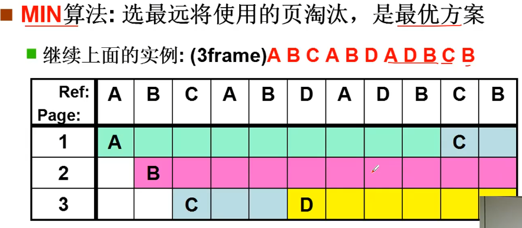

# 内存换出

## 换出的时刻
在缺页中断的时候， 需要通过 get_free_page() 获得一个新的页， 如果这时候发现页面不够了， 就需要进行换出。

## FIFO页面置换

**评价准则**：缺页次数， FIFO 导致 7 次缺页

## MIN页面置换

缺页次数， MIN 导致 5 次缺页
MIN 算法没办法知道计算机将来发生运行的情况

## LRU页面置换
用过去的历史预测将来。 LRU(Least Recently Used)算法， 选择最近最长一段时间没有使用的页来淘汰。

### 时间戳实现

问题在于： 想要知道系统在什么时候用这一部分内存， 就需要在查页表的时候， 更新时间戳。 这样就会导致每次查页表就会增加多余的操作， 实现代价太大。

### 页码栈实现

同样每次地址访问要增加多次操作， 代价依然太大。

### 二次机会算法实现
**二次机会算法(Second Chance Replancement)**， 每个页增加一个引用位。也叫做 **时钟算法(Clock Algorithm)**
* 每次访问一页时， 硬件自动设置该位
* 选择淘汰页， 按一定时间扫描该位， 是 1 则清 0， 并继续扫描； 是 0 则淘汰页

通过一个快扫描指针来清除 R 位， 在用一个慢扫描指针来选择淘汰页。

## 组合起来

# 参考资料
> https://www.bilibili.com/video/BV1d4411v7u7?p=25