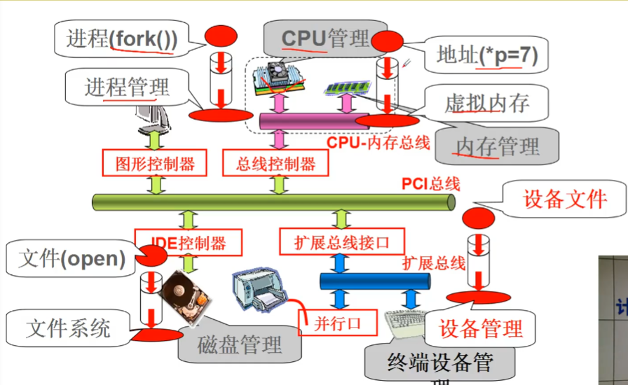
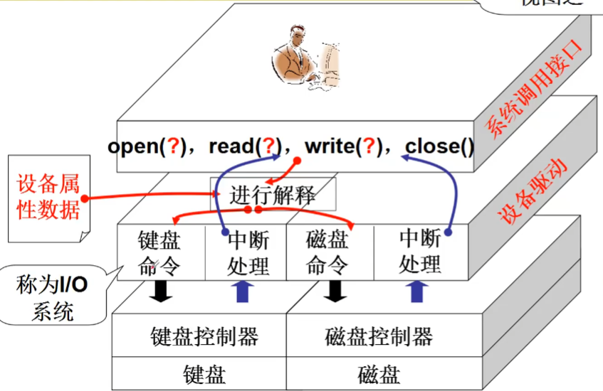
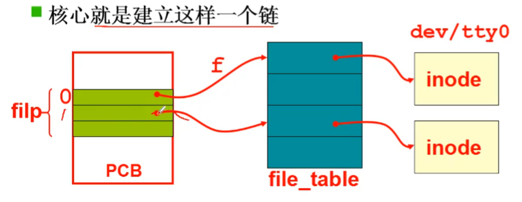
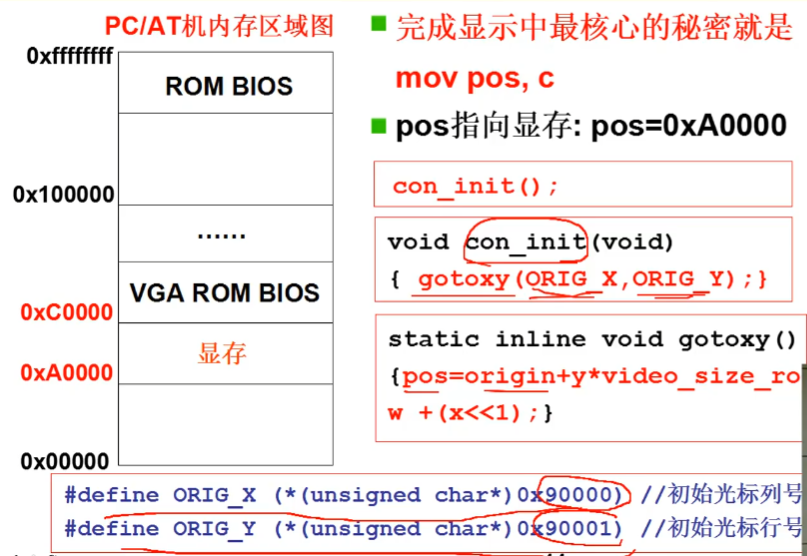
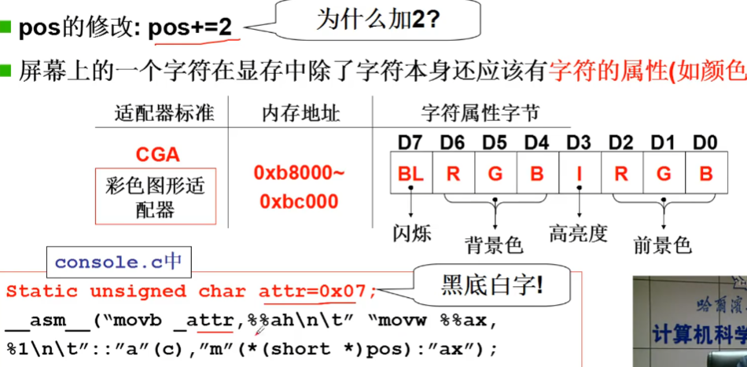
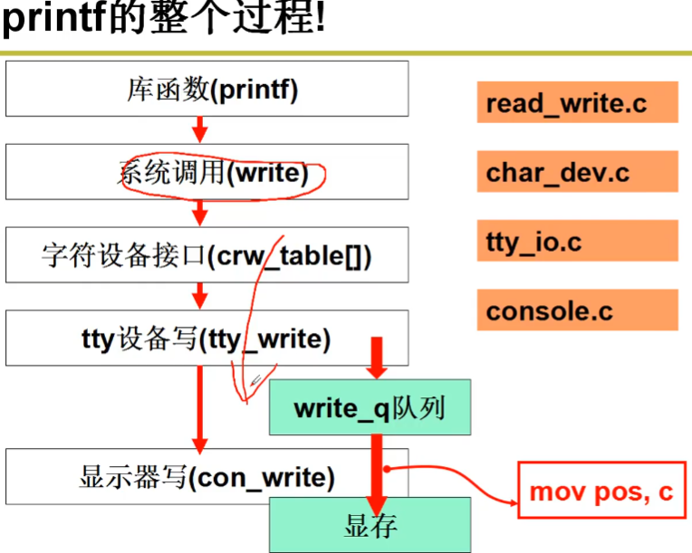

# IO 与显示器

操作系统让外设工作流程：
1. 通过 out xxx,al 来向外设发出命令
2. 外设完成工作之后向 CPU 发出终端
3. CPU 将数据读取到内存中


## 文件视图
向设备控制器的寄存器写值需要查寄存器地址， 内容的格式和语义... 操作系统需要给用户提供一个简单的视图 - **文件视图**


## 操作外设的程序
``` C
int fd = open("/dev/xxx");
for (int i = 0; i < 10; i++) {
    write(fd, i, sizeof(int));
}
close(fd);
```
* 不论什么设备都是 open, read, write, close。 操作系统为用户提供统一的接口！
* 不同设备对应不同的设备文件 (/dev/xxx), 操作系统根据设备文件找到控制器的地址、内容格式等

## 给显示器输出

### 开始
``` C
printf("Host Name: %s", name);
```
printf 库先创建 buf 将格式化输出都写到那里， 然后再调用 `write(1, buf, ...)` 
``` C
//再 linux/fs/read_write.c
int  sys_write (unsigned int fd, char *buf, int count)    //fd 是找到 file 的索引
{
    struct file *file;
    file = current->filp[fd];   //从当前进程中拿来一个文件
    inode = file->f_inode;      // 拿到文件里面的信息
}
```
file 的目的就是得到 inode， 这就是显示器的信息。

### filp 由来
从当前进程的 pcb 中得到 filp, 所以 filp 从 fork 中来
``` C
int  copy_process (...) {
    *p = *current;
    for (i = 0; i < NR_OPEN; i++)
        if((f = p->file[i]))
            f->f_count++;
}
```
filp 是从父进程拷贝过来的， 一开始是通过 **shell** 进程启动了 whoami 命令：
``` C
void  main (void)
{
    if (!fork())
    {
        init();
    }
}

void  init (void)
{
    open("/dev/tty0", O_RDWR, 0);   //在系统初始化时打开文件， 0号文件
    dup(0);                         //复制文件 0 ， 1 号文件
    dup(0);                         //复制文件 0 ， 2 号文件
    execve("/bin/sh", argv, envp);
}
```

### open 系统调用
``` C
//在 linux/fs/open.c
int  sys_open (const char *filename, int flag)
{
    i = open_namei(filename, flag, &inode); //解析文件目录， 找到 inode
    current->filp[fd] = f;
    f->f_mode = inode->i_mode;
    f->f_inode = inode;                     //把 inode 拿过来
    f->f_count = 1;
    return fd;
}
```


### 向屏幕输出
``` C
//在 linux/fs/read_write.c
int  sys_write (unsigned int fd, char *buf, int cnt)
{
    inode = file->f_inode;
    if(S_ISCHR(inode->i_mode))          //是否为字符设备
        return rw_char(WRITE, inode->i_zone[0], buf, cnt);
        ...
}
```
`inode->i_zone[0]` 字段可以查到这是字符设备的第几个设备
``` C
typedef (*crw_ptr)(int rw, unsigned minor, char *buf, int count)
static crw_ptr crw_table[] = {..., rw_ttyx, ...};       //tty对应第四个

//在 linux/fs/char_dev.c
int  rw_char (int rw, int dev, char *buf, int cnt)
{
    crw_ptr call_addr = crw_table[MAJOR(dev)];
    call_addr(rw, dev, buf ,cnt);
    ...
}
```
拿到字符设备后， 就可以找到对应的处理函数
``` C
static int rw_ttyx(int rw, unsigned minor, char *buf, int count)
{
    return  ((rw = READ) ? tty_read(minor, buf) : tty_write(minor, buf));
}
```
再转到 **tty_write（）， 实现输出的核心函数**

``` C
//在 linux/kernel/tty_io.c
int tty_write(unsigned channel, char *buf, int nr)
{
    ...
    char c, *b = buf;
    struct tty_struct *tty;
    tty = channel + tty_table;          //拿到对应的 tty 设备
    sleep_if_full(&tty->write_q);       //等待缓冲区非满
    while (nr > 0 && !FULL(tty->write_q)) {
        c = get_fs_byte(b);             //从用户缓冲取字符出来
        if (c == '\r') {
            PUTCH(13, tty->write_q);
            continue;
        }
        if (O_LCUC(tty))
            c = toupper(c);
        b++;
        nr--;
        PUTCH(c, tty->write_q);         //取出的字符放在队列中
    }
    tty->write(tty);
    ...
}
```
`tty->write(tty)` 也就是调用了 `con_write`
``` C
//在 include/linux/tty.h
struct tty_struct {
    void (*write)(struct tty_struct *tty);
    struct tty_queue read_q, write_q;
}
struct tty_struct tty_table[] = {
    {con_write, {0, 0, 0, 0, ""}, {0, 0, 0, 0, ""}},
    {},
    ...
}
```
到了 con_write
``` C
// 在 linux/kernel/chr_drv/console.c
void con_write(struct tty_struct *tty)
{
    GETCH(tty->write_q, c);
    if (c > 31 && c<127) {
        __asm__("movb _attr, %%ah\n\t"
        "movw %%ax, %1\n\t" :: "a"(c),
        "m"(*(short*)pos) : "ax");
        pos += 2;
    }
}
```
将属性 `_attr` 赋值 `%%ah`, `%%al` 也就是 `"a"` 中放的是从 c 取得字符, 在一起组成了 `%%ax`. 然后将 `%%ax` 赋值给 pos , 就将数据写到显存。

### move posA



### 整个过程


# 参考资料
> 视频教程 https://www.bilibili.com/video/BV1d4411v7u7?p=26