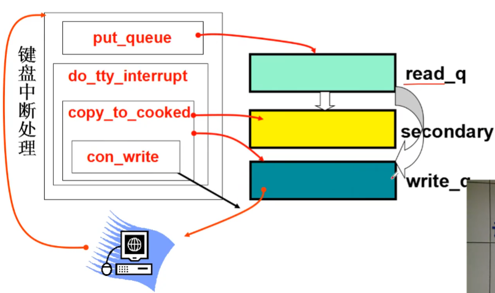
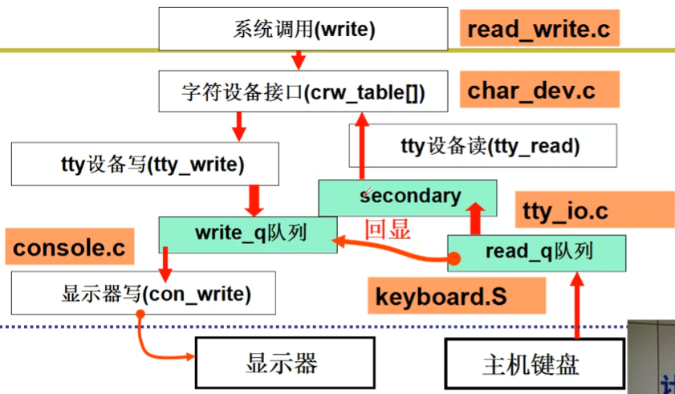

# 键盘
对于操作系统， 敲键盘就会导致键盘中断

## 开始
从一开始的时候配置 0x21 中断为键盘终端
``` C
void con_init(void)
{
    set_trap_gate(0x21, &keyboard_interrupt);
}
```
``` C
//在 kernel/chr_drv/keyboard.S 中
.global _keyborad_interrupt
_keyborad_interrupt:
    inb  $0x60, %al
    call key_table(, %eax, 4)   // key_table+eax*4
    ...
    push $0
    call _do_tty_interrupt
```
`inb  $0x60, %al` 从端口 0x60 中取扫描码数据到 %al, 根据取到的值调用对应的处理函数。

## key_table
key_table 是一个函数数组， 不同的按键扫描码对于着不同的函数处理, 显示字符通常使用 `do_self`
``` C
//在 kernel/chr_drv/keyboard.S
key_table:
    .long none, do_self, do_self, do_self
    .long do_self, ..., func, scroll, cursor 等等


mode: .byte 0
do_self:
    lea     alt_map, %ebx
    testb   $0x20, mode     //检测 alt 是否同时按下
    jne     1f
    lea     shift_map, %ebx //检测 shift 是否同时按下
    textb   $0x30, mode
    jne     1f
    lea     key_map, %ebx

#if defined(KBD_US)
key_map:    .byte 0,27  .ascii "1234567890-=" ...
shift_map   .byte 0,27  .ascii "!@#$%^&*()_+" ...
#elif defined(KBD_GR)
```
这里是找到映射表， 如 a 的 key_map 映射为 a， 而 shift_map 的映射为 A
``` C
1:  movb (%ebx,%eax), %al   //将找到的 ASCII 放到 al
    orb   %al, al
    je    none              //如果没有对应 ASCII 码
    testb $0x4c, mode       //看 caps 是否亮
    je    2f
    cmpb  $'a, %al
    jb    2f
    cmpb  $'}, %al
    ja    2f
    subb  $32, al           //变大写
2:  testb $??, mode         //处理其他模式， 如 ctrl 按下
3： andl  $0xff, %eax
    call  put_queue         //把 ASCII 放到缓冲队列
none: ret
```

## 放入缓冲队列
``` C
struct tty_queue *table_list[] = {
    &tty_table[0].read_q,
    &tty_table[0].write_q,
    ...
}

put_queue:
    movl  _table_list, %edx
    movl  head(%edx), %ecx
1:  movb  %al, buf(%edx, %ecx)
```
拿到 con.read_q 的缓冲头部， 把 ASCII 写入

## 回显 _do_tty_interrupt
``` C
void do_tty_interrupt(int tty)  //tty == 0
{
    copy_to_cooked(tty_table + tty);
}

void copy_to_cooked(struct tty_struct *tty)
{
    GETCH(tty->read_q, c);
    if(L_ECHO(tty)) {           //回显分支
        PUTCH(c, tty->write_q);
        tty->write(tty);        //字符重新打印在屏幕上
    }
    PUTCH(c, tty->secondary);   //完成 copy_to_cooked
    ...
    wake_up(&tty->secondary.proc_list);
}
```

## 总结

-

# 参考资料
> https://www.bilibili.com/video/BV1d4411v7u7?p=27