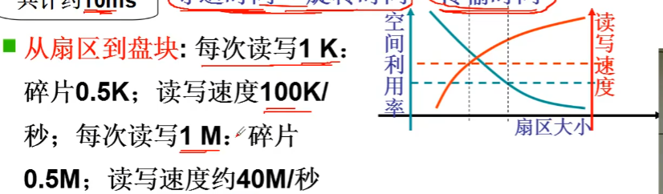
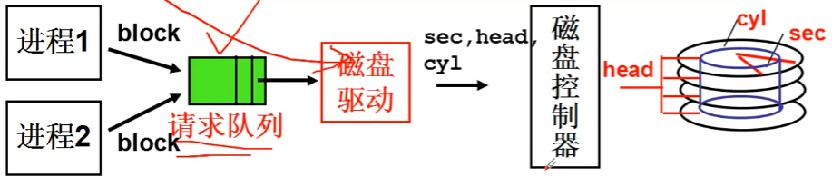

# 生磁盘的使用

## 开始

CPU 发出一个读命令， 磁盘收到命令后将数据送往内存， 读完之后向 CPU 发出中断


## 认识磁盘


磁盘的 IO 过程就是移动磁头， 旋转磁盘， 如果是读取数据就是通过磁生电， 从磁头上获得一个电流。 如果是写入一个数据就是通过电生磁， 磁头通电改变磁盘的磁性。


## 直接的使用磁盘

需要往控制器中写柱面(cyl)、 头(head)、 扇区(sec)、 缓存位置


``` C
void do_hd_request(void)
{
    ...
    hd_out(dev, nsect, sec, head, cyl, WIN_WRITE, ...);
    port_write(HD_DATA, CURRENT->buffer, 256);
}

void hd_out(drive, nsect, sec, head, cyl, cmd...)
{
    port = HD_DATA;     //数据寄存器端口(0x1f0)
    outb_p(nsect, ++port);
    outb_p(sect,  ++port);
    outb_p(cyl,   ++port);
    outb_p(cyl>>8,++port);
    outb_p(0xA0|(drive<<4)|head, ++port);
    outb_p(cmd,   ++port);
}
```

## 一层抽象
通过盘块号来读写磁盘

磁盘的驱动通过 block 号计算出 cyl, head, sec。
从三维编址转换为一维的编址， 要让相邻的 block 盘块对应的磁盘位置也是连续的， 这样可以读写更高效。

寻道时间（磁臂从开始移动到磁道所使用的的时间）占用的时间最长， 这样相邻盘块号尽量放在同一个磁道上。


C(cyl), H(head), S(sec), 得到的扇区号为 
$$
C \cdot (Header \cdot Sectors) + H \cdot Sectors + S
$$

磁盘的访问中， 绝大多数的时间用在寻道时间和旋转时间上， 如果一次读写的大小更大， 会有效提升读写的速度， 但是会降低空间利用率。


``` C
static void make_request()
{
    struct request *req;
    req = request + NR_REQUEST;
    req->sector = bh->b_blocknr << 1;      //一个盘块有两个扇区
    add_request(major + blk_dev, req);
}

void do_hd_request(void)
{
    unsigned int block = CURRENT->sector;
    __asm__("divl %4":"=a"(block), "=d"(sec):"0"(block),
            "1"(0), "r"(hd_info[dev].sect));
    __asm__("divl %4":"=a"(cyl), "=d"(head):"0"(block),
            "1"(0), "r"(hd_info[dev].head));
    hd_out(dev, nsect, sec, head, cyl, WIN_WRITE, ...);
    ...
}
```
上边的汇编完成了两次取余的操作:
DIVL 指令把 EDX:EAX 组成的扇区号除以每磁道扇区数（hd_info[dev].sect），所得商值在 EAX 中，余数在 EDX 中。其中 EAX 中是到指定位置的对应总磁道数（所有磁头面），EDX 中是当前磁道上的扇区号。
DIVL 指令把 EDX:EAX 的对应总磁道数除以硬盘总磁头数（hd_info[dev].head），在 EAX 中得到的整除值是柱面号（cyl），EDX 中得到的余数就是对应的当前磁头号（head）。

## 第二层抽象

多个进程通过请求队列使用磁盘， 多个磁盘访问的请求需要进行调度， 调度需要让寻道时间尽量的少。

### FCFS(First come First Serve)
最简单的算法，最先来的请求最先服务


### SSTF(Shortest Seek Time First)
最短寻道时间优先算法

这种算法的缺点， 磁头会频繁处理中间磁道的请求，造成边缘磁道的**饥饿**

### SCAN磁盘调度
SSTF + 中途不回折， 每个请求都有处理机会

这种算法有时中间的请求也会占到偏移

### C-SCAN 电梯算法
直接移动到一端， 两端的请求都能很好的处理


``` C
static void make_request()
{
    struct request *req;
    req = request + NR_REQUEST;
    req->sector = bh->b_blocknr << 1;       //一个盘块有两个扇区
    add_request(major + blk_dev, req);      //加入到请求队列中
}

#define IN_ORDER(s1,s2) \
((s1)->cmd<(s2)->cmd || ((s1)->cmd==(s2)->cmd && \
((s1)->dev < (s2)->dev || ((s1)->dev == (s2)->dev && \
(s1)->sector < (s2)->sector))))

static void add_request(struct blk_dev_struct *dev, struct request *req)
{
    struct request *tmp = dev->current_request;
    req->next = NULL;
    cli();  //关中断(互斥)//队列作为多进程共享资源，需要临界区保护
    /*
     * 这里的条件判断就是找到电梯算法的插入点
     */
    for(; tmp->next; tmp = tmp->next)
        if((IN_ORDER(tmp, req) || !IN_ORDER(tmp, tmp->next)) && IN_ORDER(req, tmp->next))
            break;
    req->next = tmp->next;
    tmp->next = req;
    sti();  //开中断
}
```
条件判断的通过有两种情况:
* `IN_ORDER(tmp, req)`&&`IN_ORDER(req, tmp->next)`, 就是三者的 sector扇区号按照 `tmp` < `req` < `tmp->next` 的顺序, 符合顺序， 请求插入到中间去。
* `!IN_ORDER(tmp, tmp->next)`&&`IN_ORDER(req, tmp->next)`，这是发生了 `tmp`>`tmp->next`, 说明电梯算法走到了头， 并且 `req` < `tmp->next` 新一轮扫描 req 的扇区是最小的，就将请求插入到最前面。


# 参考资料
> 视频课程：https://www.bilibili.com/video/BV1d4411v7u7?p=28