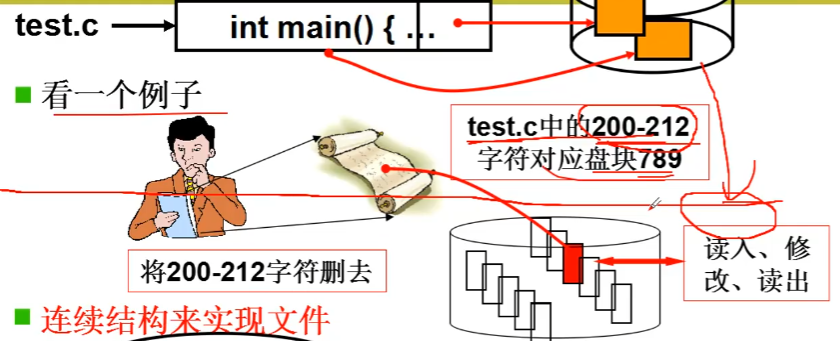
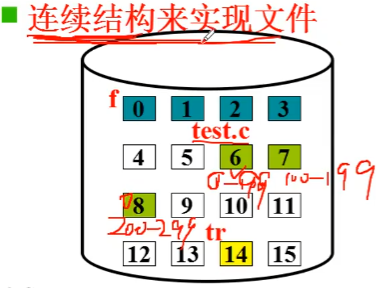
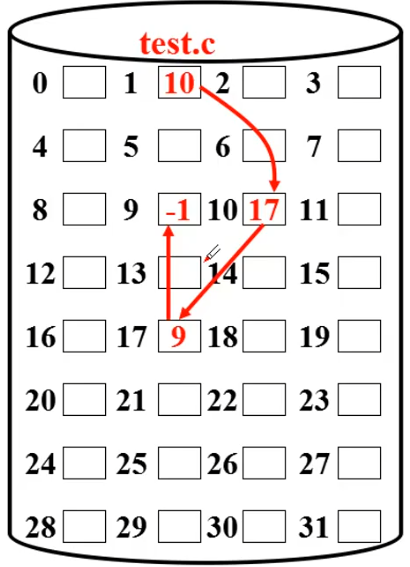
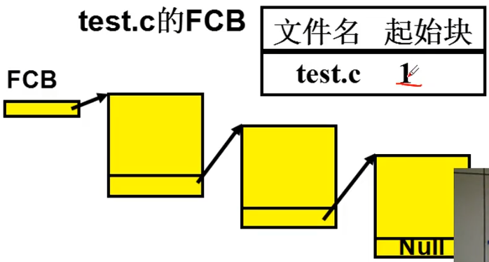
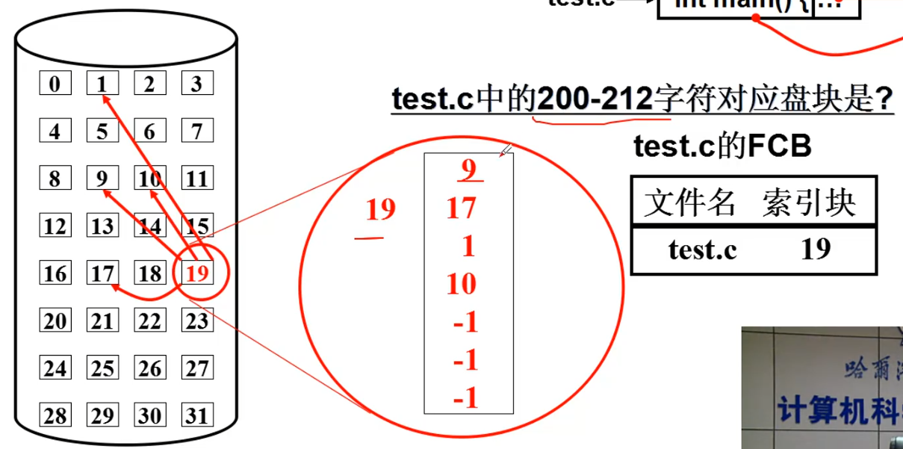
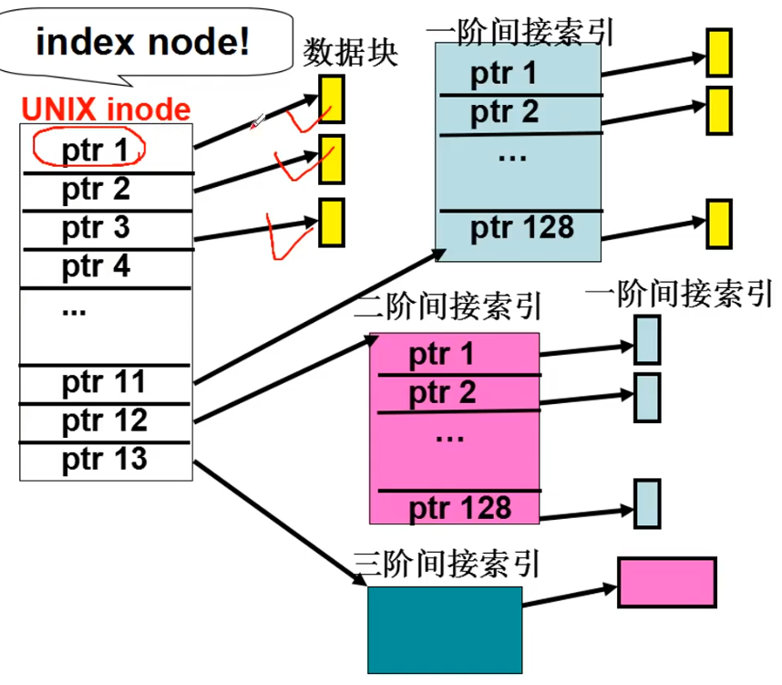

# 从生磁盘到文件

## 第三层抽象
引入文件， 在盘块号上引入更高一层的抽象概念， 核心在于建立字符流和盘块的映射关系。

用户操作文件将 200-212 字符删除， 操作系统会找到文件字符所在的盘块号 789， 将文件内容读出、修改、再写入磁盘， 这样就完成了一个文件的修改。

通过连续的结构才磁盘中存放文件， 那么想要找到文件中对应字符所在盘块号， 就可以通过文件的**第一个盘块号**推算出来。
文件通过 FCB 结构储存文件信息

链式结构实现文件

索引结构

通过一个索引块来储存文件所使用的盘块号有哪些， 通过索引块中的数据找到文件中字符所对应的盘块号。

多级索引

这种结构既可以表示很大的文件， 又可以对小的文件进行高速访问

# 参考资料
> https://www.bilibili.com/video/BV1d4411v7u7?p=29&spm_id_from=pageDriver