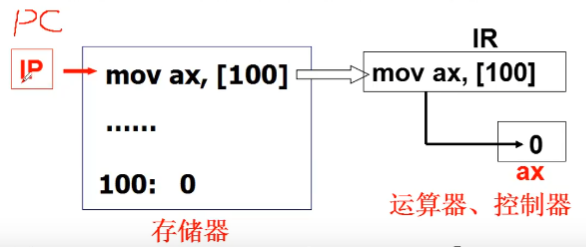

[TOC]
# 揭开钢琴的盖子
计算机的工作一直都是取址执行



## 可以打开电源了
x86 PC做了什么:
1. x86 PC刚开机CPU处于实模式,实模式的寻址CS:IP(CS左移四位+IP)
2. 开机时, CS=0xFFFF; IP=0x0000
3. 根据上面的CS:IP寻址==0xFFFF0==(BISO映射区)*BIOS(Basic Input/Output System)*
4. 检查RAM,键盘,显示器,软硬键盘
5. 将磁盘0磁道0扇区读入==0x7C00==处, 512Bytes
6. 设置CS=0x7C0, IP=0x0000
7. 操作系统从引导扇区开始

## 引导扇区代码:bootsect.S
``` x86asm
.global begtext,begdata,begbss,endtext,enddata,endbss
.text //文本段
begtext:
.data //数据段
begdata:
.bss  //未初始化数据段
begbss:
entry start //关键字entry告诉连接器"程序入口"
start:
    mov  ax, #BOOTSEG  //BOOTSEG = 0x07C0
    mov  ds, ax
    mov  ax, #INITSEG  //INITSEG = 0x9000
    mov  es, ax
    mov  cx, #256
    sub  si, si
    sub  di, di
    rep
    movw
    jmpi go, INITSEG
```
地址 **ds:si** = ==0x07C00==
地址 **es:di** = ==0x90000==
这里通过 `rep` 指令将 ==0x07C00== 处的256个字节移动到 ==0x90000==
`jmpi` 指令会将 `go` 赋值给 **IP**, `INITSEG` 赋值给**CS**

## jmpi go, INITSEG 段间跳转
``` x86asm
go: 
    mov ax, cs      //cs=0x9000
    mov ds, ax
    mov es, ax
    mov ss, ax          //为 call 做准备
    mov ap, #0xff00
load_setup:
    mov dx, #0x0000
    mov cx, #0x0002
    mov bs, #0x0200
    mov ax, #0x0200+SETUPLEN
    int 0x13            //BISO中断
    jnc ok_lead_setup
    mov dx, #0x0000
    mov ax, #0x0000     //复位
    int 0x13
    j   load_setup
```
0x13是BISO度磁盘扇区的中断, **al = ax_low**, **ah = ax_high**, ah=0x02读磁盘, al=扇区数量(SETUPLEN=4), ch=柱面号, cl=开始扇区, dh=磁头号, dl=驱动器号, es:bx=内存地址


## 读入 setup 模块后:ok_load_setup
``` x86asm
Ok_load_setup:  //载入setup模块
    mov dl, #0x00
    mov ax, #0x0800  //ah=0x08获得磁盘参数
    int 0x13
    mov ch, #0x00
    mov sectors, cx
    mov ah, #0x03
    xor bh, bh
    int 0x10 //读光标
    mov cx, #24
    mov bx, #0x0007  //显示属性
    mov bp, #msg1
    mov ax, #1301
    int 0x10 //显示字符, 操作系统的LOGO
    mov ax, #SYSSEG  //SYSSEG=0x1000
    mov es, ax
    call read_it //读入system模块
    jmpi 0,SETUPSEG
```
在bootsect.S中的文件末尾
``` x86asm
sectors:  
    .word 0  //磁道扇区数
msg1:      
    .byte 13, 10
    .ascii "Loading system..."
    .byte 13, 10, 13, 10
```

## read_it 读入system模块
``` x86asm
read_it:
    mov ax,es
    cmp ax,#ENDSEG
    jb  ok1_read
    ret
ok1_read:
    mov ax, sectors
    sub ax, sread  //sread是当前磁道以读取扇区数
    call read_reack //读磁道
```
在引导扇区的末尾,用来让BISO识别应道扇区
``` x86asm
.org 510
    .word 0xAA55  //扇区的最后两个字节
```

## 读取完成之后回到上面的`jmpi 0,SETUPSEG`程序运行到**setup**