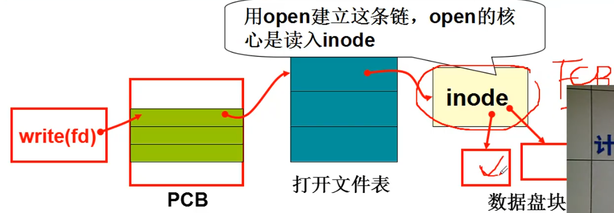
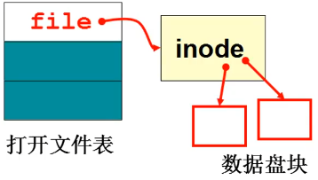
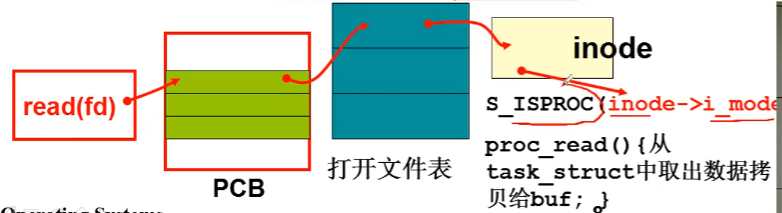

# 文件使用磁盘的实现

## 通过文件来使用磁盘
``` C
//在 fs/read_write.c 中
int sys_write(int fd, const char *buf, int count)
{
    struct file *file = current->filp[fd];
    struct m_inode *inode = file->inode;
    if (S_ISREG(inode->i_mdoe))
        return file_write(inode, file,  buf, count);
}
```



* 找到要读写的哪一段字符， file 中存在一个**读写指针**(通过 fseek 修改)， 就是开始的位置， 再加上 count。
* 接着就要找到对应盘块号， 通过**索引 inode** 找到这一段字符对应盘块号
* 把盘块号和缓冲放入电梯算法的**请求**中， 让磁盘去读写

``` C
int file_write(struct m_inode *indoe, struct file *file, char *buf, int count)
{
    off_t pos;
    if (filp->f_flags & O_APPEND)
        pos = inode->i_size;    //往末尾追加
    else
        pos = filp->f_pos;      //从读写指针开始

    while (i < count) {
        /*通过读写指针位置/块大小，再从索引中查找盘块号*/
        block = create_block(inode, pos/BLOCK_SIZE);
        /*放入电梯队列*/
        bh = bread(inode->i_dev, block);
        int c = pos % BLOCK_SIZE;
        /*指针p指向缓冲块中开始写入数据的位置*/
        char *p = c + bh->data;
        /*该缓冲已经修改*/
        bh->dirt = 1;
        /*从开始读写位置到块末共可写入c个字节*/
        c = BLOCK_SIZE - c;
        pos += c;
        ...
        /*从用户缓冲区buf中复制c个字节到告诉缓冲块中p指向的开始位置处*/
        while (c-- > 0)
            *(p++) = get_fs_byte(buf++);
        /*释放缓冲块*/
        brelse(bh);
    }
    /*修改到新的pos位置*/
    filp->f_pos = pos;
}

//// 取文件数据块block在设备上对应的逻辑块号。
// 如果对应的逻辑块不存在就创建一块。返回设备上对应的已存在或新建的逻辑块号。
// 参数：inode - 文件内存i节点指针；block - 文件中的数据块号。
int create_block(struct m_inode * inode, int block)
{
	return _bmap(inode,block,1);
}

//// 文件数据块映射到盘块的处理操作。（block位图处理函数，bmap - block map）
// 参数：inode - 文件的i节点指针；block - 文件中的数据块号；create - 创建块标志。
// 该函数把指定的文件数据块block对应到设备上逻辑块上，并返回逻辑块号。如果创建标志
// 置位，则在设备上对应逻辑块不存在时就申请新磁盘块，返回文件数据块block对应在设备
// 上的逻辑块号（盘块号）。
static int _bmap(struct m_inode * inode,int block,int create)
{
    // 然后根据文件块号的大小值和是否设置了创建标志分别进行处理。如果该块号小于7，
    // 则使用直接块表示。如果创建标志置位，并且i节点中对应块的逻辑块(区段)字段为0，
    // 则相应设备申请一磁盘块（逻辑块），并且将磁盘上逻辑块号（盘块号）填入逻辑块
    // 字段中。然后设置i节点改变时间，置i节点已修改标志。然后返回逻辑块号。
	if (block<7) {
		if (create && !inode->i_zone[block])
			if ((inode->i_zone[block]=new_block(inode->i_dev))) {
				inode->i_ctime=CURRENT_TIME;
				inode->i_dirt=1;
			}
		return inode->i_zone[block];
	}
        // 如果该块号>=7,且小于7+512，则说明使用的是一次间接块。下面对一次间接块进行处理。
    // 如果是创建，并且该i节点中对应间接块字段i_zone[7]是0，表明文件是首次使用间接块，
    // 则需申请一磁盘块用于存放间接块信息，并将此实际磁盘块号填入间接块字段中。然后
    // 设置i节点修改标志和修改时间。如果创建时申请磁盘块失败，则此时i节点间接块字段
    // i_zone[7] = 0,则返回0.或者不创建，但i_zone[7]原来就为0，表明i节点中没有间接块，
    // 于是映射磁盘是吧，则返回0退出。
	block -= 7;
	if (block<512) {
		if (create && !inode->i_zone[7])
			if ((inode->i_zone[7]=new_block(inode->i_dev))) {
				inode->i_dirt=1;
				inode->i_ctime=CURRENT_TIME;
			}
		if (!inode->i_zone[7])
			return 0;
        // 现在读取设备上该i节点的一次间接块。并取该间接块上第block项中的逻辑块号（盘块
        // 号）i。每一项占2个字节。如果是创建并且间接块的第block项中的逻辑块号为0的话，
        // 则申请一磁盘块，并让间接块中的第block项等于该新逻辑块块号。然后置位间接块的
        // 已修改标志。如果不是创建，则i就是需要映射（寻找）的逻辑块号。
		if (!(bh = bread(inode->i_dev,inode->i_zone[7])))
			return 0;
		i = ((unsigned short *) (bh->b_data))[block];
		if (create && !i)
			if ((i=new_block(inode->i_dev))) {
				((unsigned short *) (bh->b_data))[block]=i;
				bh->b_dirt=1;
			}
        // 最后释放该间接块占用的缓冲块，并返回磁盘上新申请或原有的对应block的逻辑块号。
		brelse(bh);
		return i;
	}
    ...
}
```
如果盘块号为 0~6 表示文件直接数据块， 如果 盘块号>=7 盘块号就通过一重间接映射盘块号。 i_zone[0~6]表示文件直接数据块， i_zone[7] 表示一重映射， i_zone[8] 表示二重映射。

## 设备文件 Inode
``` C
struct m_inode {
	unsigned short i_mode;  //文件的类型和属性
	unsigned short i_uid;
	unsigned long i_size;
	unsigned long i_mtime;
	unsigned char i_gid;
	unsigned char i_nlinks;
	unsigned short i_zone[9];   //指向文件内容的数据块
/* these are in memory also */
	struct task_struct * i_wait;
	unsigned long i_atime;
	unsigned long i_ctime;
	unsigned short i_dev;
	unsigned short i_num;
	unsigned short i_count;
	unsigned char i_lock;
	unsigned char i_dirt;
	unsigned char i_pipe;
	unsigned char i_mount;
	unsigned char i_seek;
	unsigned char i_update;
};

    // 根据已打开文件的i节点的属性字段，我们可以知道文件的具体类型。对于不同类
    // 型的文件，我们需要操作一些特别的处理。如果打开的是字符设备文件，那么对于
    // 主设备号是4的字符文件(例如/dev/tty0)，如果当前进程是组首领并且当前进程的
    // tty字段小于0(没有终端)，则设置当前进程的tty号为该i节点的子设备号，并设置
    // 当前进程tty对应的tty表项的父进程组号等于当前进程的进程组号。表示为该进程
    // 组（会话期）分配控制终端。对于主设备号是5的字符文件(/dev/tty)，若当前进
    // 程没有tty，则说明出错，于是放回i节点和申请到的文件结构，返回出错码(无许可)。
/* ttys are somewhat special (ttyxx major==4, tty major==5) */
	if (S_ISCHR(inode->i_mode)) {
		if (MAJOR(inode->i_zone[0])==4) {
			if (current->leader && current->tty<0) {
				current->tty = MINOR(inode->i_zone[0]);
				tty_table[current->tty].pgrp = current->pgrp;
			}
		} else if (MAJOR(inode->i_zone[0])==5)
			if (current->tty<0) {
				iput(inode);
				current->filp[fd]=NULL;
				f->f_count=0;
				return -EPERM;
			}
	}
```

## 实践项目-实现 proc 文件
``` shell
#cat/proc/psinfo 
pid     state       father      counter     start_time
0       1           -1          0           0
1       1           0           28          1
```
这些信息明显不存在磁盘上， 是特殊文件。 数据存放在 PCB 也就是 **task_struct** 结构内部。
``` C
main(char *argv[])
{
    fd = open([argv[1]);
    while (文件没有结束) {
        read(fd, buf, 100);
        printf(buf);
    }
}
```
cat 对应的程序就将文件内容读出， 并且打印

``` C
void init()
{
    ...
    setup((void)- *) & drive_info);
    mkdir("/proc", 0755);
    mknod("/proc/psinfo", S_IFPROC|0444);
}
int sys_read(unsigned int fd, char *buf, int count)
{
    if (S_ISCHR(inode->i_mode))...
    if (S_IFPROC(inode->i_mode))
        proc_read(file, buf, count);
}
int proc_read(file, char *buf, int count)
{
    task_struct *p;
    sprintf(krnbuf, %d, %d, p[0]->pid, ...);
    按照 file->f_pos 和 count 将 krnbuf 拷贝到 buf 中;
    修改 file->f_pos;
}
```

# 参考资料
> https://www.bilibili.com/video/BV1d4411v7u7?p=30&spm_id_from=pageDriver