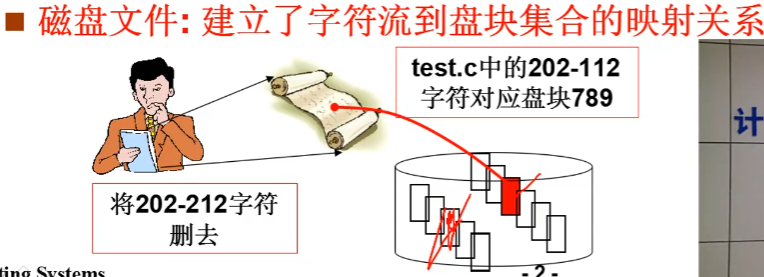
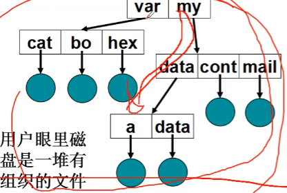
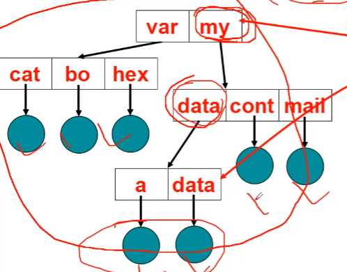
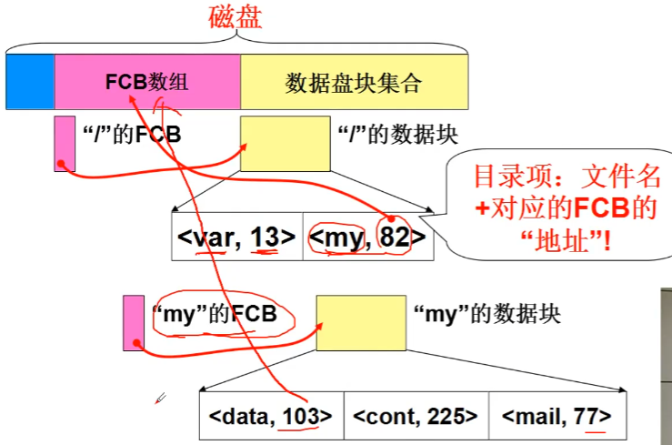
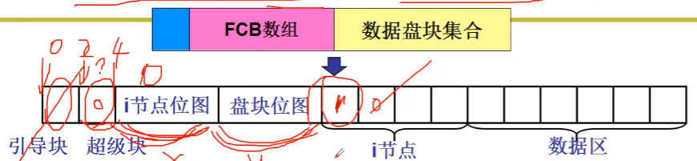
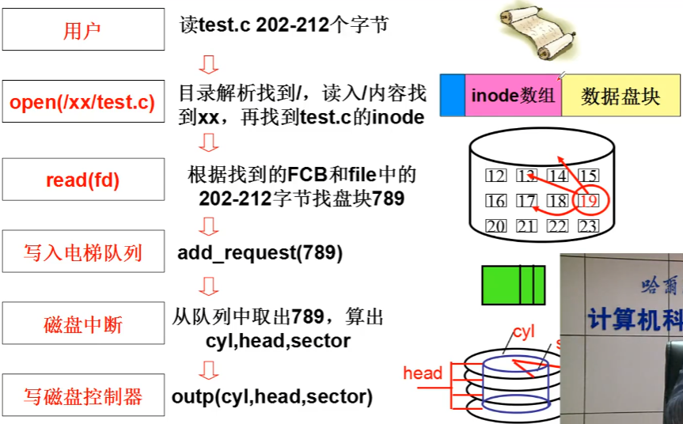

# 目录与文件系统

## 文件系统， 抽象整个磁盘

将盘块按照一定的结构进行组织， 在用户层面形成树状的文件组织结构

## 目录树
经过 k 次划分之后， 每个集合中的文件数为 $O(\log_kN)$

用 **"/my/data/a"** 定位文件 a, 得到文件的 FCB。

* 引导块表示磁盘开始
* 超级块记录 节点位图和盘块位图有多大的信息
* 节点位图表示有哪些 inode 是空闲， 哪些被占用
* 盘块位图表示哪些盘块是空闲

## 磁盘的使用

# 参考资料
> https://www.bilibili.com/video/BV1d4411v7u7?p=31&spm_id_from=pageDriver