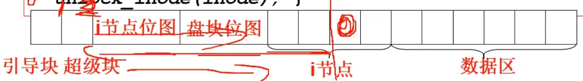

# 目录解析代码实现

## open


``` C
//在 linux/fs/open.c 中
int sys_open(const char *filename, int flag)
{
    i = open_namei(filename, flag, &inode);
    ...
}
int open_namei(...) 
{
    dir = dir_namei(pathname, &namelen, &basename);
}
static struct m_inode *dir_namei()
{
    dir = get_dir(pathname);
}
```

## get_dir() 目录解析
``` C
static struct m_inode *get_dir(const char *pathname)
{
    if ((c = get_fs_byte(pathname)) == '/') {
        inode = current->root;      //根目录开始
        pathname++;
    } else if(c)
        inode = current->pwd;       //目录解析从这里开始，当前目录开始
    while(1) {
        if (!c)
            return  inode;          //解析成功出口
            bh = find_entry(&inode, thisname, namelen, &de);
            int inr = de->node;
            int idev = inode->i_dev;
            inode = iget(idev, inr);        //根据目录项读取下一层 inode
    }
}
```
* root: 找到更目录
* find_entry: 从目录中读取目录项
* inr: 目录项中的索引节点
* iget: 读取下一层目录

## 根目录解析
在系统初始化的时候就读入的更目录的信息
``` C
void init(void)
{
    setup((void *) &drive_info);
    ...
}
sys_setup(void *BIOS)   //在 kernel/hd.c
{
    hd_info[drive].head = *(2 + BIOS);
    hd_info[drive].sect = *(14 + BIOS);
    mount_root();
    ...
}
void mount_root(void)   //在 fs/super.c
{
    mi = iget(ROOT_DEV, ROOT_INO);
    current->root = mi;
}
```

## 读取inode iget()
``` C
struct m_inode *iget(int dev, int nr)
{
    struct m_inode *inode = get_empty_inode();
    inode->i_dev = dev;
    inode->i_num = nr;
    read_inode(inode);
    return inode;
}
static void read_inode(struct m_inode *inode)
{
    struct super_block *sb = get_super(inode->dev);
    lock_inode(inode);
    block = 2 + sb->s_imap_blocks + sb->s_zmap_blocks + 
            (inode->i_num - 1) / INODES_PER_BLOCK;
    bh = bread(inode->i_dev, block);
    inode = bh->data[((inode->i_num - 1) % INODES_PER_BLOCK)];
    unlock_inode(inode);
}
```

读取一个 inode， 首先要找到 inode 所在的盘块好的位置， 需要先读取超级块知道 i 节点位图的长度和盘块位图的盘块长度， 最后找到 inode 所在的盘块好， 再从读取的盘块信息中找到对应的 inode。

## 目录解析 find_entry()
de: directory entry(目录项)
``` C
#define NAME_LEN	14
struct dir_entry {
    unsigned short inode;	//i节点号	
    char name[NAME_LEN];	//文件名
}

//在 fs/namei.c
static struct buffer_head *find_entry(struct m_inode **dir, char *name, ..., struct dir_entry **res_dir)
{
    int entries = (*dir)->i_zone[0];
    *bh = bread((*dir)->i_dev, block);
    struct dir_entry *de = bh->b_data;
    while (i < entries) {
        //如果当前目录的数据块已经检索完， 还没有找到， 就再读入下一个数据块， 直到所有的目录项 entries 全部找完
        if ((char *)de > BLOCK_SIZE + bh->b_data) {
            brelse(bh);
            block = bmap(*dir, i / DIR_ENTRIES_PER_BLCOK);
            bh = bread((*dir)->i_dev, block);
            de = (struct dir_entry *)bh->b_data;
        }
        if (match(namelen, name, de)) {
            *res_dir = de;	//j
            return bh;
        }
        de++;
        i++;
    }
}
```


# 参考资料

> https://www.bilibili.com/video/BV1d4411v7u7?p=32