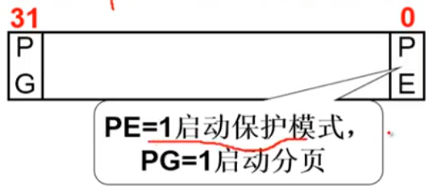
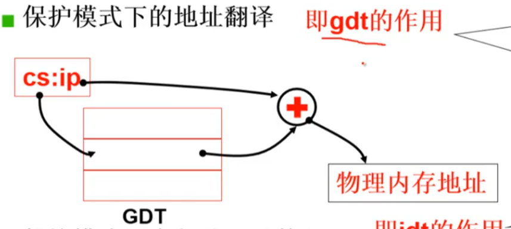
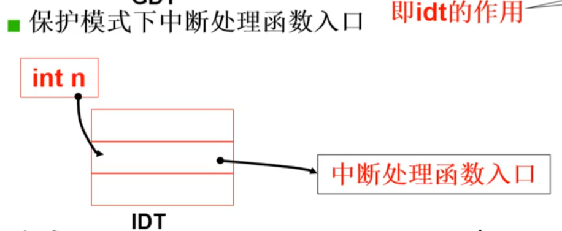
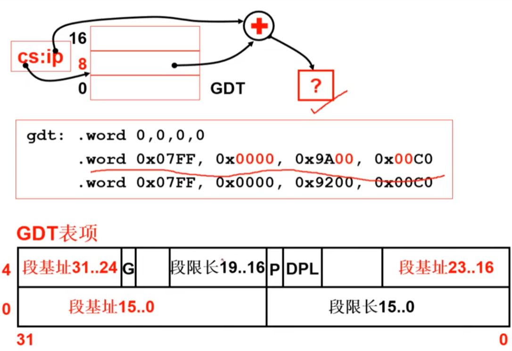
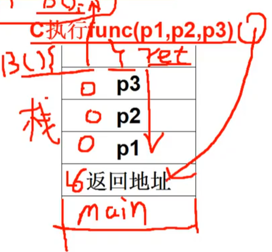
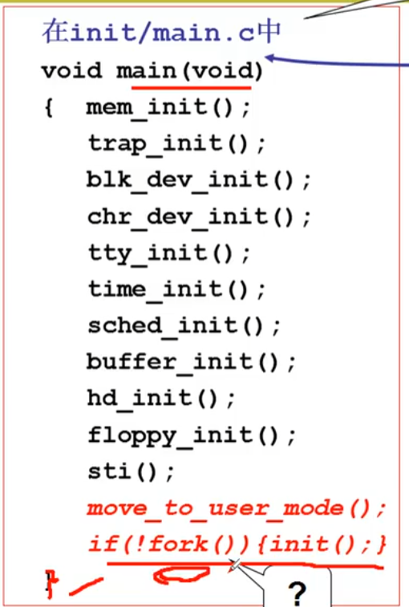
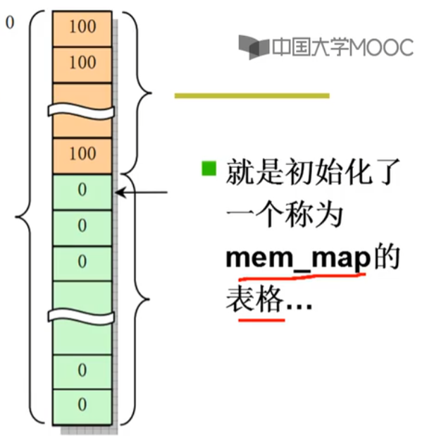

[TOC]

# 操作系统启动
## setup模块,即setup.S
**setup模块将完成OS启动前的设置**
``` x86asm
start:
    mov ax, #INITSEG
    mov ds, ax
    mov ah, #0x03
    xor bh, bh
    int 0x10  //取光标位置dx
    mov [0], dx //取出光标位置(包括其他硬件参数)到0x90000处
    mov ah, #0x88
    int 0x15
    mov [2], ax  //扩展内存大小 
    ...
    cli //不允许中断
    mov ax, #0x0000
    cld
do_move:
    mov es, ax
    add ax, #0x1000
    cmp ax, #0x9000
    jz  end_move
    mov ds, ax
    sub di,di
    sub si,si
    mov cx, #0x8000
    rep
    movsw
    jmp do_move
```
`rep`指令把 **ds:si** = ==0x90000== 的内容移到了 **es:di** = ==0x00000== 内存上去了
| 内存地址 | 长度 | 名称       |
| -------- | ---- | ---------- |
| 0x90000  | 2    | 光标位置   |
| 0x90002  | 2    | 扩展内存数 |
| 0x9000C  | 2    | 显卡参数   |
| 0x901FC  | 2    | 根设备号   |

## 进入保护模式
``` x86asm
call empty_8042
mov  al, #0xD1
out  #0x64, al  //8042是键盘控制器,其输出端口P2用来控制A20地址线
call empty_8042
mov  al, #0xDF
out  #0x60, al  //选通A20地址线
call empty_8042  //初始化8259(中断控制)一段非常机械化的程序
mov ax, #0x0001
mov cr0, ax
jmpi 0,8
```
这里的 `cr0` 寄存器

在启动了保护模式之后,原先的寻址方式转变为32位的寻址方式

### 保护模式下的地址翻译
通过GDT这个硬件来实现保护模式下的地址寻址

### 保护模式下的中断处理函数


## 将setup移到0地址处
``` x86asm
end_move:
    mov ax, #SETUPSEG
    mov ds, ax
    lidt idt_48
    lgdt gdt_48  //设置保护模式下的中断和寻址
    ...
idt_48:
    .word 0
    .word 0, 0
gdt_48:
    .word 0x800
    .word 512+gdt, 0x9
gdt:
    .word 0, 0, 0, 0
    .word 0x07FF, 0x0000, 0x9A00, 0x00C0
    .word 0x07FF, 0x0000, 0x9200, 0x00C0
```
上面代码中的 `jmpi 0,8` , ip = 0, cs = 8, 在开启了保护模式之后cs表示gdt表的偏移值,并且8的单位是字节数, cs=8 在gdt表中会查到第二行的表项

| 0x==00==00 | 0x97==00== |
| ---------- | ---------- |
| 0x==0000== | 0x07FF     |
可以获得段基址 ==0x00000000== (32位地址) 加上偏移ip=0之后地址仍然是 0x00000000,就可以跳转到 0 地址执行了

## 跳到system模块执行,第一部分就是 head.S
``` x86asm
startup_32:
    movl $0x_10, %eax
    mov  %ax, %ds
    mov  %ax, %es
    mov  %as, %fs
    mov  %as, %gs  //指向 gdt 的0x10项(数据段)
    lss  _stack_start, %esp  //设置栈
    call setup_idt
    call setup_gdt
    xorl %eax,%eax
```
三种汇编:
* as_86汇编:产生16位代码的Intel 8086汇编
* GNUas汇编:产生32位代码,使用AT&T系统
* 内嵌汇编:gcc 编译产生中间结果 as 汇编
  ``` C
  __asm__ ("汇编语句":"输入":"输出":"破坏部分描述")
  ```

## C 函数入口
```
after_page_table:
    pushl $0
    pushl $0
    pushl $0
    pushl $L6
    pushl $_main
    jmp set_paging
L6:
    jmp L6 //死循环
setup_paging
    设置页表
    ret  //从这里ret回去之后会到main
```

进入main之后会带三个参数0,0,0 ,函数返回之后会进入L6死循环

## main函数

main函数主要的工作就是对内存,中断,设备,时钟,CPU等内容初始化

## 看一看mem_init
看linux/mm/memory.c
``` C
void mem_init(long start_mem, long end_mem)
{
    int i;
    for (i = 0; i < PAGING_PAGES; i++)
        mem_map[i] = USED;
    i = MAP_NR(start_mem)
    end_mem -= start_mem;
    end_mem >>= 12;     //4K代码一个Page
    while(end_mem-- > 0)
        mem_map[i++] = 0;
}
```
