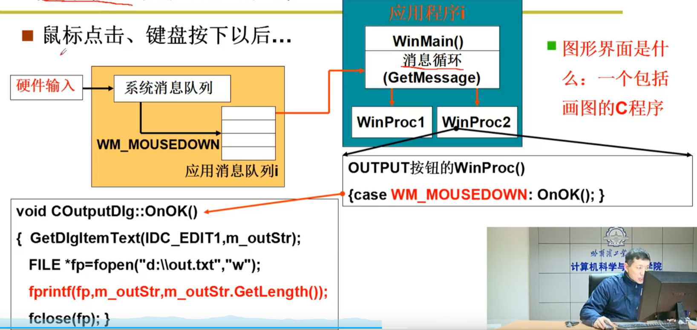
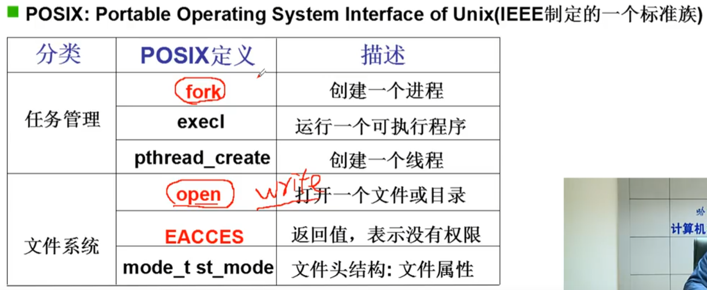

[TOC]
# 操作系统接口

## 命令行
首先编写一个程序
``` C
#include <stdio.h>
int main(int argc, char* argv[])
{
    printf("ECHO:%s\n",argv[1])
}
```
通过编译
``` bash
gcc -o output output.c
./output "hello"
```
`./output "hello"`会进入shell中运行,shell其实也是一段程序,shell会去执行对应的程序
``` C
int main(int argc, char* argv[])
{
    char cmd[20];
    while(1) {
        scanf("%s",cmd);
        if(!fork()) {
            exec(cmd);  //在这里执行命令输入的程序
        } else
        {wait();}
    }
}
```
运行最终的程序看到结果
>ECHO:hello

## 图形按钮


## 什么是操作系统接口
普通的C代码加上一些重要的函数
这一些重要的函数由操作系统来提供,这就是操作系统接口了:接口表现为函数调用,又由系统提供,所以称为系统调用system_call
