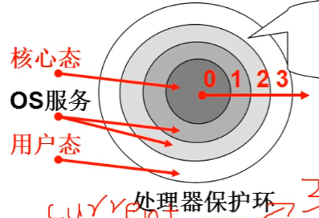
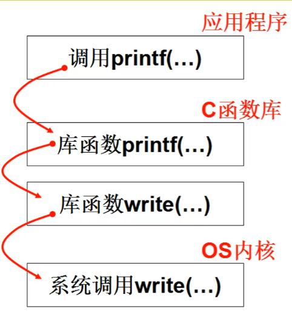
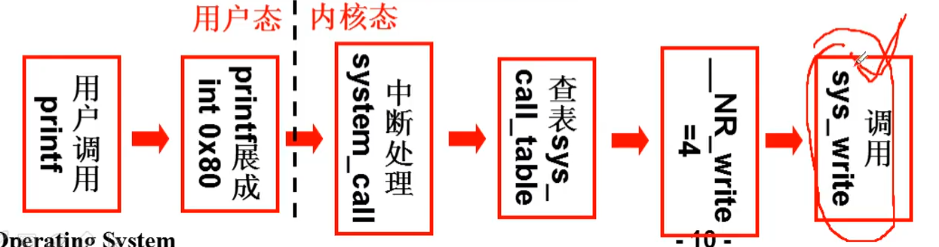
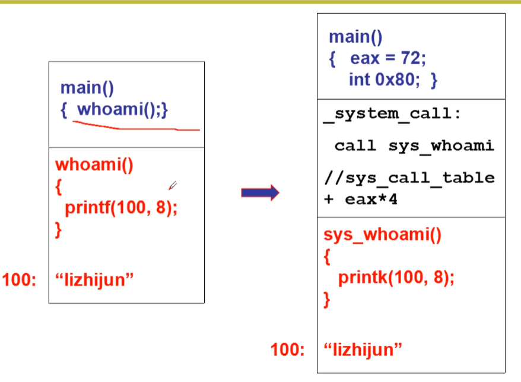

[TOC]
# 系统调用的实现


## 内核态,用户态
通过处理器硬件设计,内核态对应的内存就是内核段,用户态对饮的内存就是用户段.
* DPL(Description Privilege Level) 目标特权级别
* CPL(Current Privilege Level) 当前特权级别
* RPL(Request Privilege Level)
CS:IP 是当前指令,用 CS 最低两位: 0是内核态, 3是用户态

硬件提供了进入内核的方法, Intel x86 通过 int 指令可以将 CS 中的 CPL 改为0, 进入内核

系统调用的核心:
1. 用户程序包含一段 **int 指令**的代码
2. 操作系统写中断处理,获得想要调用的程序编号
3. 操作系统根据编号执行相应代码

## 系统调用的实现

应用程序的打印会调用到库函数中的打印,库函数会将内容变成write函数所需要的格式,通过系统终端 int 0x80 进入系统内核.
### 调用
``` C
//在 linux/lib/write.c 中
_syscall3(int, write, int ,fd, const char *buf, off_t, count)

//在 linux/include/unistd.h
#define __NR_write  4   //一堆连续正整数(数组下班,函数表索引)

#define __syscall3(type, name, atype, a, batype, b, ctype, c)   \
        type name(atype a, btype b, ctype, c) \
        {   long __res; \
            __asm__ volatile("int 0x80":"=a"(__res):""(__NR_##name), "b"((long)(a)), "c"((long)(b)), "d"((long)(c)));   \
            if(__res >= 0)  \
                return  (type)__res;    \
            errno =- __res; \
            return -1;  \
        }
```
产生终端之后,我们要设置int 0x80的中断处理,将对应的函数入口的地址配置到 IDT 表中去, 这样发送中断就会调用对应中断服务函数
### 初始化
``` C
//  在初始化的时候有这样一段
void sched_init(void)
{   set_system_gate(0x80, &system_gate);}

//  在 linux/include/asm/system.h
#define set_system_gate(n, addr)    \
        _set_gate(&idt[n], 15, 3, addr);
#define _set_gate(gate_addr, type, dpl, addr)   \
        __asm__("movw %%dx, %%ax\n\t" "movw %0, %%dx\n\t"   \
                "movw %%eax, %1\n\t" "movl %%edx, %2":: \
                "i"((short)(0x8000+(dpl<<13)+type<<8))),   \
                "o"(*((char*)(gate_addr))),
                "o"(*(4+(char*)(gate_addr))),
                "d"((char*)(addr), "a"(0x00080000))
```

在初始化的时候DPL会被设置成3, 当发送中断之后会配置CPL为0从而进入内核态
### 中断服务函数
进入中断服务函数,查表调用
``` as
//linux/kernel/system_call.s中
nr_system_calls=2
.global _system_call
_system_call:
        cmpl    $nr_system_calls-1, %eax
        ja      bad_sys_call
        push    %ds
        push    %es
        push    %fs
        pushl   %edx
        pushl   %ecs
        pushl   %ebx            //调用的参数
        movl    $0x10, %edx
        mov     %dx, %ds
        mov     %dx, %es        //内核数据
        mov     $0x17, %edx
        mov     %dx, %fs        //fs可以找到用户数据
        call    _sys_call_table(, %eax, 4)
        pushl   %eax            //返回值压栈
        ...
ret_from_system_call:
        popl    %eax
        ...
        iret
```
在调用表中找到写函数
``` C
//在 include/linux/sys.h
fn_ptr  sys_call_table[]=
{
    sys_setup, sys_exit, sys_fork, sys_read, sys_write, ...
};

//在include/linux/sched.h
typedef int (fn_ptr *)();
``` 



