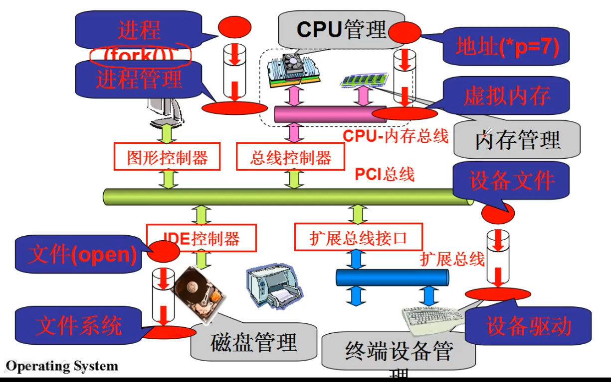

# 操作系统历史

* 批处理操作系统:典型代表 **IBSYS**
* 需要干多种事(多进程结构和进程管理萌芽):**IBM OS/360**
* 核心任然是任务切换, 但是需要多人同时作业, 资源复用:MIT **MULTICS**
* 简化版的 MULTICS : **UNIX**
* 1987 年 **MINIX**(类UNIX) 发布用于教学
* Linus 学习 MINIX 之后, 做出 **Linux** 发在互联网上
----
* PC操作系统: **QDOS**
* Bill Gates开发 BASIC解释器, FAT磁盘 并且和QDOS组合, 最后买下QDOS 改名为 **MS-DOS**
* 让用户使用更加方便,文件, 开发环境, 图形界面, 推出了 **Windows**

----
任务:
1. 掌握实现操作系统的多进程图谱
2. 掌握实现操作系统的文件操作视图

