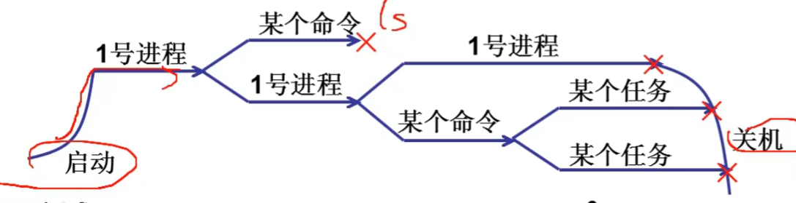
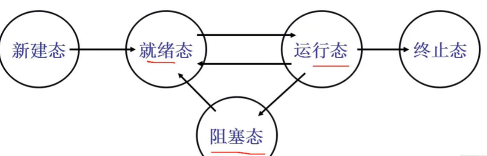
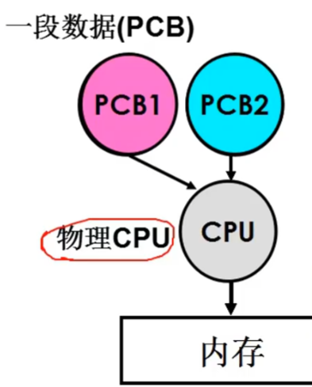
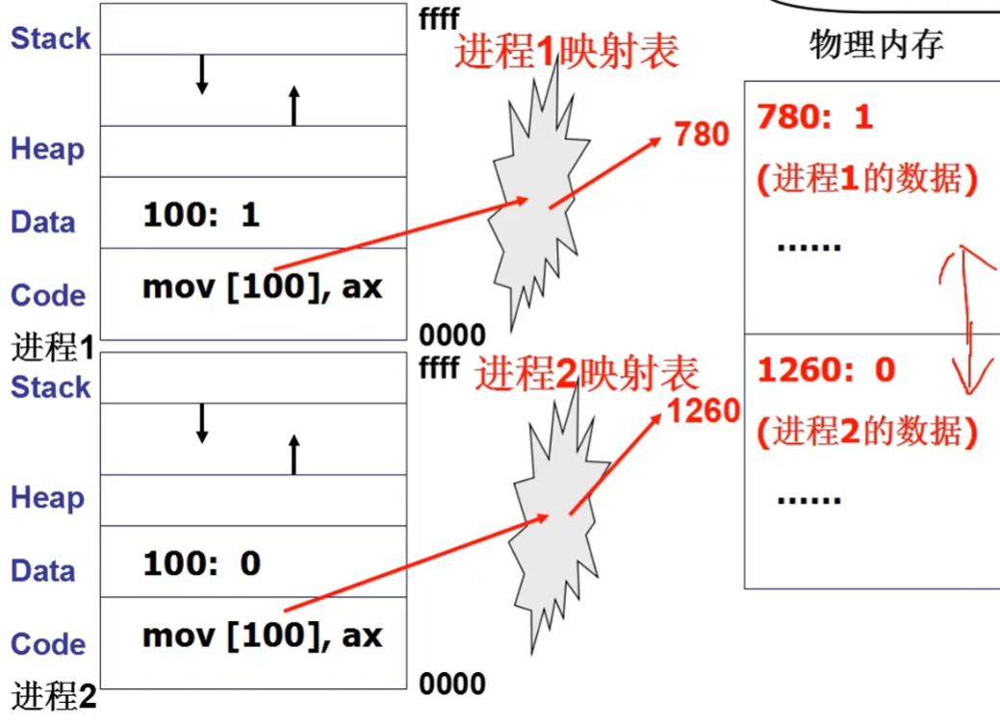

[TOC]
# 多进程图像

启动了的程序就是进程, 所以是多个进程推挤
* 操作系统需要把这些进程记录好, 按照合理的次序推进(分配资源, 进行调度)

多进程图像从**启动开始**到**关机结束**
* main 中的 fork() 创建了第一个进程
  * init执行了shell
* shell 再启动其他进程



进程的状态图


## 任务的切换
``` C
switch_to(pCur, pNew) {
    pCur.ax = CPU.ax;
    pCur.bx = CPU.bx;
    ...
    pCur.cs = CPU.cs;
    pCur.retpc = CPU.retpc;

    CPU.ax = pNew.ax;
    CPU.bx = pNew.bx;
    ...
    CPU.cs = pNew.cs;
    CPU.retpc = pNew.retpc;
}
```


## 多进程的影响
* **进程1** 可能会改写 **进程2** 的内存, 需要限制不同进程内存的读写, 做到内存管理

每一个进程拥有自己的内存映射表

* 多进程有时也需要合作
如果只是简单的交替执行, 例如在写入一个文件的时候, 两个进程都发现一个空位, 在交替执行下会把信息写在同一个地方, 导致错误出现.
**解决方法**: 多个进程访问同一个共享内存的时候, 一个进程在访问共享内存之前给变量上锁, 这样其他进程就不能影响共享内存, 在处理完毕之后, 变量开锁, 此时才可以给其他的进程去使用共享内存的变量.