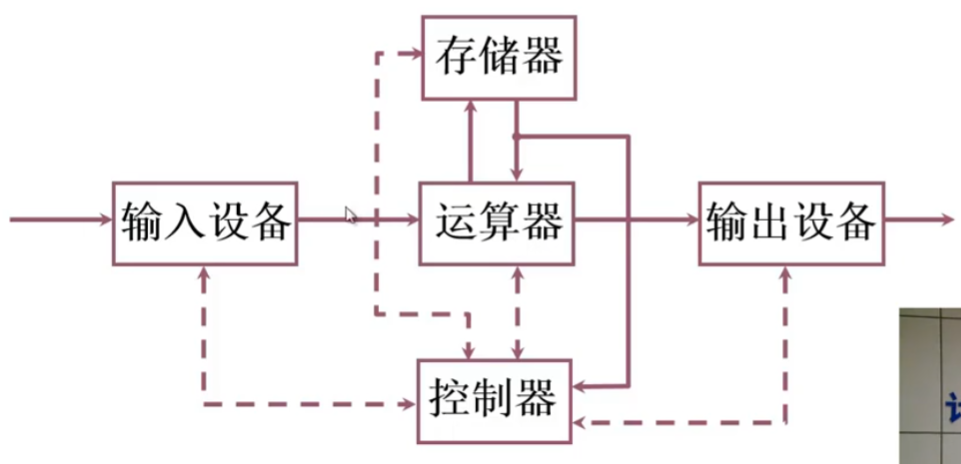
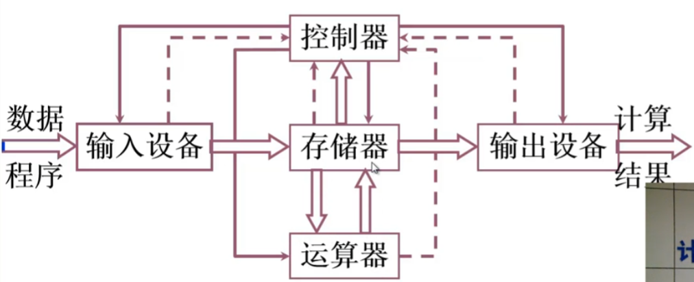
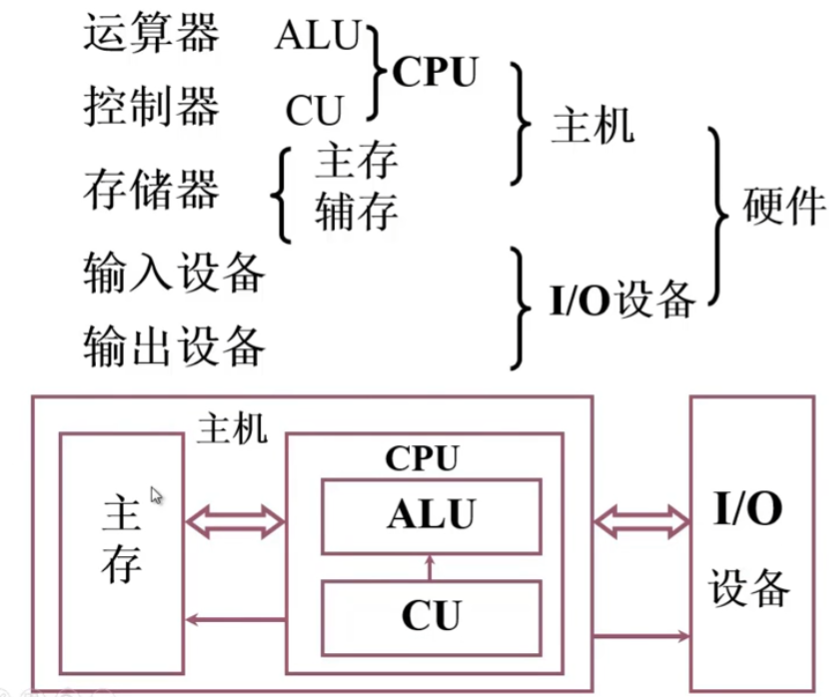
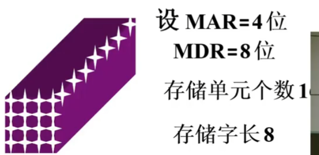
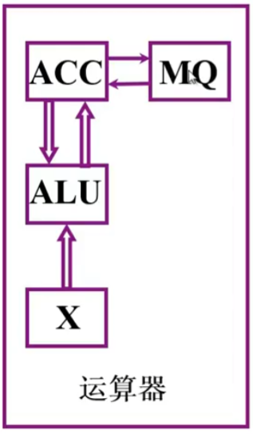
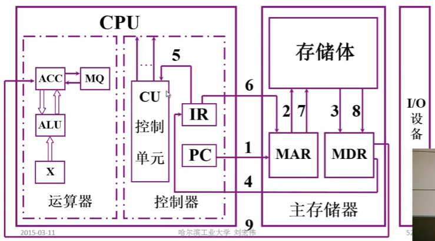

# 计算机系统简介

## 计算机系统

计算机系统分为：

1. 硬件：计算机的实体，主机，外设
2. 软件：由具有各类特殊功能的信息程序组成
    1. 系统软件：管理整个计算机系统：语言处理程序， **操作系统**， 服务型程序（例如数学库，MPI），数据库管理系统， 网络软件
    2. 应用软件：按任务需要编制成的各种程序

## 计算机系统层次结构

1. 高级语言：虚拟机器$M_4$，用编译程序翻译成汇编语言程序
2. 汇编语言：虚拟机器$M_3$， 用汇编语言翻译成机器语言程序
3. 操作系统：虚拟机器$M_2$， 用机器语言解释操作系统
4. 机器语言：实际机器$M_1$：用微指令解释机器指令
5. 微指令系统：微程序机器$M_0$：由硬件直接执行微指令

# 计算机体系结构和计算机组成

* 计算机体系结构：能够被程序员看到的计算机系统的属性，概念性的结构与功能特性。包括指令集， 数据类型， 存储西寻址技术，I/O机制都是抽象的属性。
* 计算机组成：如何实现计算机体系结构所体现的属性。指令如何实现， 如何取指令，分析指令，去操作，运算，送结果等都是计算机组成问题。

# 计算机的基本组成

## 冯·诺依曼计算机特点

* 计算机由运算器，存储器，控制器，输入设备，输出设备**五大部件**组成
* 指令和数据以同等地位**存放在存储器**内
* 指令和数据都采用二进制数标识
* 指令有操作码和地址码组成， 操作码用来标识操作的性质，地址码用来标识操作数在存储器的位置。
* 指令在存储器按顺序存放。通常，指令是按顺序执行的，在特定条件下，可以按照运算结果或根据设定的条件改变执行程序。
* 机器以运算器为中心，输入输出设备与村暑期间的数据传送通过运算器完成。

## 硬件框架图

### 以运算器为中心：

实线为数据线，虚线为控制线和反馈线

### 以存储器为中心：

### 现代计算机硬件框图

系统复杂性管理的方法

* 层次化(Hierarchy)：将被设计的系统划分为多个模块和子模块
* 模块化(Modularity)：有明确定义的功能和接口
* 规则性(regularity)：模块更容易被重用

# 计算机的解题过程

## 存储体

存储体-存储单元-存储元件（0/1）

存储单元：存放一串二进制码

存储字：存储单元中二进制代码的组合

存储字长：存储单元中二进制代码的位数

MAR(Memory Address Register):存储器地址寄存器，用来存放欲访问的存储单元的地址， 其位数对应存储单元的个数

MDR(Memory Data Register)：存储器数据寄存器，存放从存储体某个单元中取出的代码或者准备存往某存储体单元的代码，位数与存储字长相等

## 运算器

设 [M] 表示地址 M 单元中的内容；X表示X寄存器，[X]表示X寄存器中的内容；ACC表示累加器，[ACC]表示累加器中的内容；MQ表示乘商寄存器，[MQ]表示乘商寄存器中的内容

*   加法操作

$$
[M] \rightarrow X \\
[ACC] + [X] \rightarrow ACC \\
$$

*   减法操作

$$
[M] \rightarrow X \\
[ACC] - [X] \rightarrow ACC
$$

*   乘法操作

$$
[M] \rightarrow MQ \\
[ACC] \rightarrow X \\
0 \rightarrow ACC \\
[X] \times [MQ] \rightarrow ACC//MQ \\
$$

ACC 保存结果的高位， MQ 保存结果的低位

*   除法操作

$$
[M] \rightarrow X \\
[ACC] \div [X] \rightarrow MQ \\
$$

商保存在 MQ 中， 余数存在 ACC 寄存器中

## 控制器

控制器指挥各部件自动系统调工作：

*   取指：从存储器读出一条指令
*   分析指令：指出该指令需要完成什么操作 
*   执行指令：根据操作数所在的地址以及指令的操作码完成操作 

**程序计数器**（PC:Program Counter）：存放当前欲执行的指令地址，具有自动加一的功能

**指令寄存器** (IR:Instruction Register)：存放当前执行的指令，将操作码发送给 （CU）控制单元， 将操作的地址发送给 MAR。

**控制单元**（CU）：分析传入的指令， 发出各种未操作命令序列，控制被控对象

## 一条指令过程

*   取数过程

    **取指**过程：PC 存放下一条指令的地址， 将地址发送给 MAR，存储体通过 MAR 的地址将取出的指令放在 MDR 寄存器中， 最后将 MDR 寄存器中的指令送给 IR 寄存器。

    **分析指令**过程：IR 接收到的数据分为操作码以及操作数所在的地址， 将操作码送给 CU 控制单元。经过 CU 分析为取数指令，CU 将 IR 中存放的操作数所在地址放在 MAR 。存储体通过地址找到操作数放在 MDR 中，最后将操作数送给 ACC 寄存器。

*   存数过程

    **取指**过程：PC 存放下一条指令的地址， 将地址发送给 MAR，存储体通过 MAR 的地址将取出的指令放在 MDR 寄存器中， 最后将 MDR 寄存器中的指令送给 IR 寄存器。

    **分析指令**过程：IR 接收到的数据分为操作码以及操作数所在的地址， 将操作码送给 CU 控制单元。经过 CU 分析为存数指令，CU 将 IR 中存放的操作数所在地址放在 MAR 。CU 控制将 ACC 要存的数据放在 MDR 中去， 由储存提将数据放在对应的地址上。

# 计算机硬件技术指标

*   机器字长：机器 CPU 一次处理的数据的位数， 通常与 CPU 的寄存器位数有关。
*   运算速度
    *   早起采用一次运算的时间来衡量机器运算速度不合理
    *   后来采用吉普森（Gibson）法，考虑每条指令执行的时间以及他们在操作书中所占的百分比$T_M=\displaystyle\sum_{i=1}^nf_it_i$
    *   CPI: 执行一条指令所需要的时钟周期
    *   MIPS: 每秒执行的百万条指令
    *   FLOPS: 每秒浮点运算次数
*   存储容量
    *   主存容量： 存储单元个数 * 存储字长
    *   辅存容量： 字节数标识

# 参考资料

> 视频课程https://www.bilibili.com/video/BV1t4411e7LH?p=2

