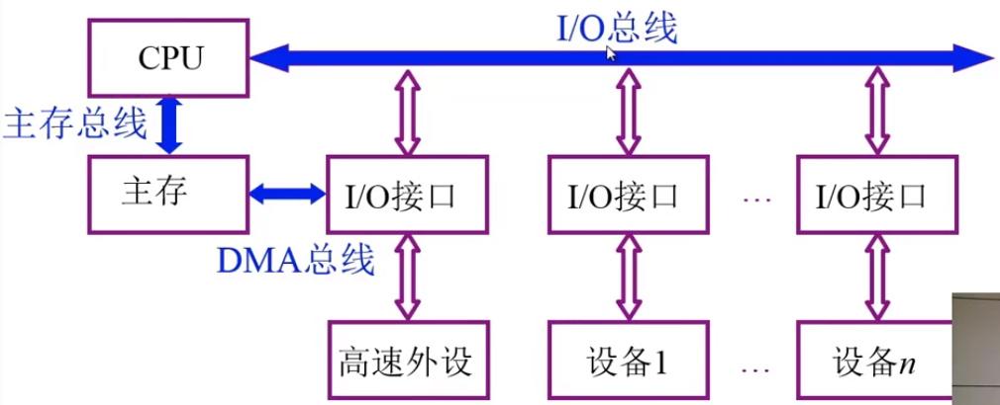
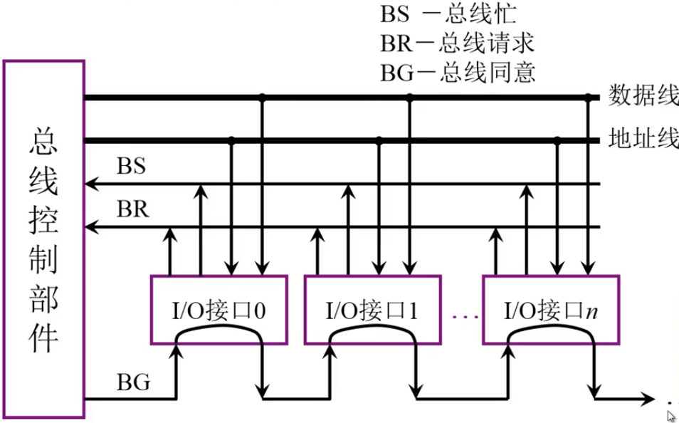
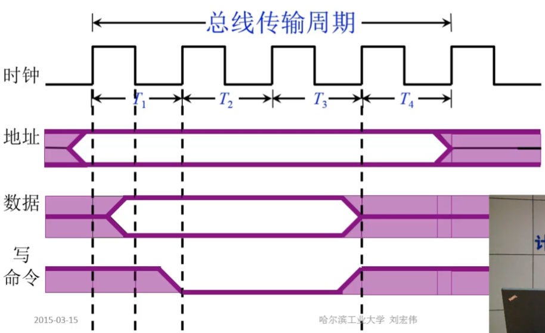

# 总线的基本概念

总线是各个部件的信息传输线，是各个部件共享的传输介质

总线信息的传输：串行和并行

## 总线结构的计算机举例

1.   单总线结构框图，在某一时刻只能有一个设备向总线发送信息，这种结构会导致CPU和主存的效率不足

     

2.   面向CPU的双总线结构框图，将CPU和主存中间通过M总线来传输数据，提高了主存和CPU运行效率，不过IO设备和主存直接的通信效率降低

     

3.   以存储器为中心的双总线结构框图

     

# 总线的分类

根据总线的位置进行划分：

1.   片内总线：芯片内部的总线
2.   系统总线（板级总线，板间总线）：计算机各部件之间的信息传输线
     1.   数据总线：双向，与机器字长，存储字长有关
     2.   地址总线：单向，与存储地址，IO地址有关，主要用来指出数据总线上的源数据或目的数据在主存单元的地址或者IO设备的地址
     3.   控制总线：有出有入。管理各部件能在不同的时刻下获得总线的使用权，靠控制总线来完成。
3.   通信总线：用于计算机系统之间或者计算机系统与其他系统之间的通信
     1.   串行通信
     2.   并行通信

# 总线特性及性能指标

## 总线的特性

1.   机械特性：尺寸、形状、管脚数、排列顺序
2.   电气特性：传输方向和有效的电平范围，输入输出，高有效还是低有效
3.   功能特性：每根传输线的功能，地址总线传输地址码，数据总线传输数据，控制总线发送控制信号。
4.   时间特性：总线上的各种信号之间相互存在一种有效的时序关系

## 总线的性能指标

1.   总线宽度：数据线的根数
2.   标准传输率：总线带宽，单位时间内总线上传输数据的位数，通常用每秒传输信息的字节数衡量单位（MBps）
3.   时钟同步/异步：数据与时钟同步工作为同步总线
4.   总线复用：一条信号线上分时传送两种信号。例如通常地址总线和数据总线是分开的两种总线，为了提高总线的利用率，可以将地址总线和数据总线共用同一组物理线路
5.   信号线数：地址总线，数据总线，控制总线的总和
6.   总线的控制方式：突发、自动、仲裁、逻辑、计数
7.   其他指标：负载能力，电源电压，是否扩展

## 总线标准

系统与各模块、模块和模块之间一个互联的标准界面

| 总线标准     | 数据线 | 总线时钟                                                     | 带宽                                         |
| ------------ | ------ | ------------------------------------------------------------ | -------------------------------------------- |
| ISA          | 16     | 8MHz                                                         | 16MBps                                       |
| EISA         | 32     | 8MHz                                                         | 33MBps                                       |
| VESA(VL-BUS) | 32     | 32MHz                                                        | 132MBps                                      |
| PCI          | 32/64  | 33/66MHz                                                     | 132/528MBps                                  |
| AGP          | 32     | 66.7/133MHz                                                  | 266/533MBps                                  |
| RS-232       | 串行   | 数据终端设备（计算机）和数据通信设备（调制解调器）之间的标准接口 |                                              |
| USB          | 串行   | 普通无屏蔽双绞线、带屏蔽双绞线                               | 1.5Mbps(USB1.0)12Mbps(USB1.0)480Mbps(USB2.0) |

## 总线结构

1.   单总线结构：所有的设备都挂载一组总线上

2.   多总线结构

     1.   双总线结构：将速度较低的IO设备从总线分离出来，通过**通道**对IO进行统一的管理

          

     2.   三总线结构：通过 DMA ，让高速的外设直接通过DMA总线访问主存

          

     3.   三总线结构：在CPU和主存中间加入了 Cache进行局部缓存，并且加入局部IO控制器

          

     4.   四总线结构：在三总线的结构上，加入了高速总线连接高速的外设

          

## 总线结构举例

1.   传统微型机总线结构

     

2.   VL-BUS 局部总线结构

     

3.   PCI总线结构

     

4.   多层PCI总线结构

     

## 总线控制

总线判优控制，主设备：对总线具有控制权；从设备：响应从住着呗发来的总线命令

总限额判优控制：

1.   集中式

     1.   链式查询：BG总线同意一个一个向下查询。设备要使用总线时，首先发出BR总线请求，总线控制器会通过BG总线同意串行的一个一个查找有总线请求的IO设备，找到之后建立BS总线忙标识这个设备已经占用了总线。这种查询方式中，离总线控制部件最近的设备具有更高的优先级。

          

     2.   计数器定时查询：多了一组地址线。总线控制器收到BR总线请求之后，总线空闲的情况下总线控制器中的定时器开始计数，并通过设备地址线发出地址信号。计数器从0开始，或者按照一定的优先序列，设备的优先级就按照有限的序列进行设备的查找。这种优先级顺序更加灵活。

          

     3.   独立请求方式：每一台设备有一套单独的总线请求线和总线同意线。总线控制器通过程序决定设备的优先级，这种优先级方式会更加灵活，响应速度更快。缺点是控制线的数量更多

          

2.   分布式

## 总线通信控制

总线周期：完成一次总线操作的时间：

1.   申请分配阶段：需要使用总线的主设备或从设备提出申请，经过总线仲裁决定哪一设备使用总线
2.   寻址阶段：获得了使用权的主设备通过总线发出本次访问的从设备的地址和有关的命令，启动传输
3.   传数阶段：主模块和从模块进行数据交换
4.   结束阶段：主模块有关信息从主线上撤出，让出总线使用权

### 同步通信

通信双方统一时标控制数据。

在$T_1$上升沿主设备发出地址信息，在$T_2$上升沿主设备发出读命令，在$T_3$上升沿从设备传输数据，在$T_4$上升沿主设备撤销读命令，让出总线。

在$T_1$上升沿主设备发出地址信息，在$T_1$下降沿主设备发出写入的数据，$T_2$上升沿主设备发出写命令，在$T_4$上升沿主设备撤销读命令，让出总线。

同步通信需要主从模块时间配合一致，有相同的公共时钟。

### 异步通信

异步通信允许模块的速度不一致，采用请求(Request)和应答(Acknowledge)的方式通信。

*   不互锁：主模块发出请求，不必等到从模块的应答信号，一段时间后，确认从模块已经收到请求之后，撤销其请求信号；从模块收到请求后，在条件允许时发出应答信号，并经过一定时间确认主模块收到应答之后，自动撤销应答信号。
*   半互锁：主模块发出请求信号之后，必须等到模块的回答信号之后才会撤销请求信号
*   全互锁：主模块发出请求信号，等待从模块应答之后再撤销请求信号；主模块请求撤销之后，从模块才会撤销应答信号

### 半同步通信

*   同步：**发送方**用系统时钟前沿发信号；**接收方**用系统时钟后沿判断、识别。
*   异步：允许不同速度的模块工作，增加一条“等待”响应信号$\overline{WAIT}$ 

如果从模块处理速度慢，在收到命令之后会发出等待响应，主模块等到等待响应信号消失之后才会进行后续的数据传输。

### 分离式通信

将一个传输周期分为两个子周期。在第一个子周期，主模块A获得从先的使用权将命令，地址，等有关信息传输到总线上，从模块B接收。第一个子周期结束之后放弃总线的使用权，让出给其他设备使用。模块B收到命令之后经过一段时间的处理，将数据准备好，由B模块作为主设备申请总线使用，将数据传回从设备A上接收。这种方式不存在空闲的等待时间，重复利用了总线的有效占用。

