# 概述

## 存储器分类

1.   按存储介质
     1.   半导体存储器：TTL、CMOS
     2.   磁表面存储器：磁盘，磁带，磁鼓
     3.   磁芯存储器
     4.   光盘存储器
2.   按照存取方式
     1.   随机存储器（Random Access Memory，RAM）
          1.   静态
          2.   动态
     2.   只读存储器（Read Only Memory，ROM）
          1.   MROM
          2.   PROM
          3.   EPROM
          4.   EEPROM
     3.   闪存Flash Memory
     4.   辅助存储器
          1.   磁盘
          2.   磁带
          3.   光盘
     5.   缓存 Cache

### 存储器的层次结构

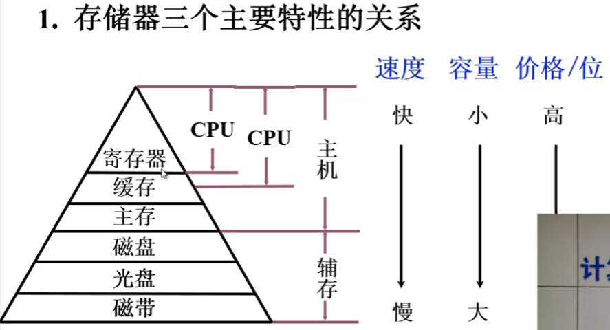

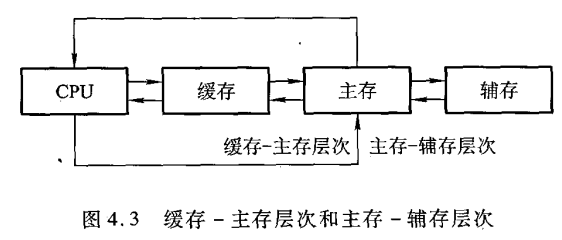

缓存-主存的结合主要是解决主存和CPU的速度不匹配的问题，主存-辅存的结合主要是解决主存容量不足的问题。

虚拟存储系统，程序员编程的地址范围与虚拟存储器的地址空间对应，虚拟存储器中，逻辑地址变换为物理地址的工作时计算机系统和操作系统自动完成。

# 主存储器

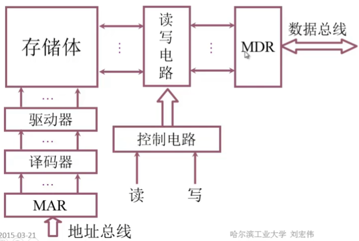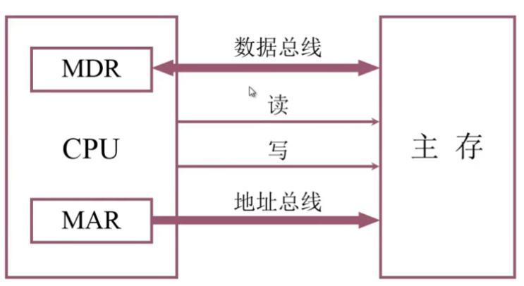

计算机用8位二进制数表示一个字节，计算机可以用字节寻址，也可以按照字寻址。32位机器可以按照字来寻址，每一个存储的字包含4个可独立寻址的字节。

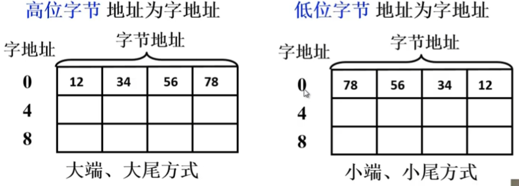

主存的技术指标

1.   存储速度：主存存放二进制代码总位数
2.   存储速度
     1.   读取时间：启动一次存储器操作（读或写）的全部时间。分为读出时间和写入时间
     2.   存取周期：连续两次独立的存储器操作（读或写）所需的最小**间隔时间**，一般；来说存取周期比存取时间要长
3.   存储器的带宽：位/秒

# 半导体存储芯片

## 存储芯片的基本结构

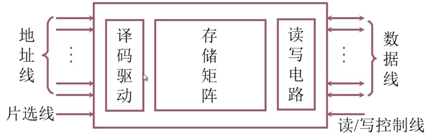

地址线是单向的，数据线是双向的。根据地址线数和数据线数可以推算出芯片容量。片选线选择哪一个存储芯片是这一次数据访问所使用的。读写控制线控制芯片使用读操作还是写操作。

## 译码驱动方式

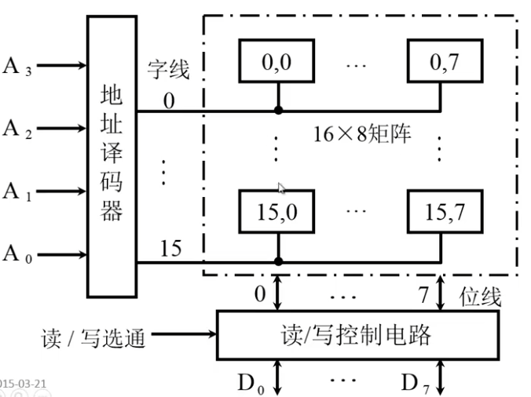

线选法。根据地址译码器输入的地址只会有一条译码器输出有效，从有效的这个输出中读取所需要的数值。根据读写选通，控制这位地址是读数据还是写数据。**缺陷**：对容量稍大一点的芯片，译码器的输出会达到非常大的一个数值。

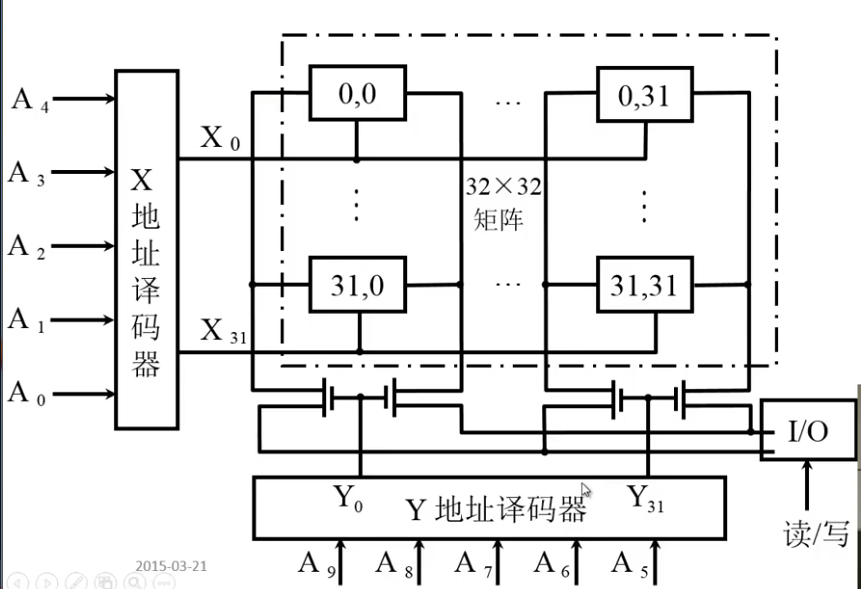

重合法。把地址分为行地址和列地址，当行地址和列地址重合时，对应地址位读写的开关才会打开。根据读写的操作选择数据通过哪一个开关写入或者读出数据。比线选法译码器输出的线数少很多。

例如有一个1M大小的芯片，总共有10根地址线。通过**线选法**的译码器，译码器输入为10根地址线，输出为1M跟选择线。通过**重合法**的译码器，译码器X和Y分别输入为5跟地址线，译码器X和Y分别输出1K根选择先，共2K根。比线选法节省非常多的空间。

## 随机存取存储器

### 静态RAM(SRAM)

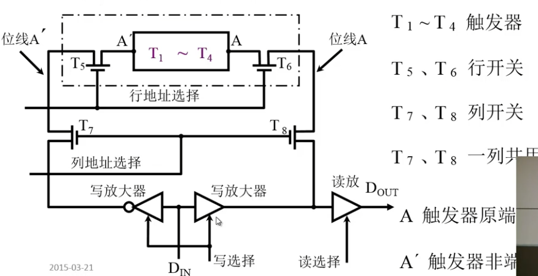

静态RAM的基本结构如图。由触发器，两个行开关，两个列开关，一对反逻辑的写放大器，一个读放大器组成。

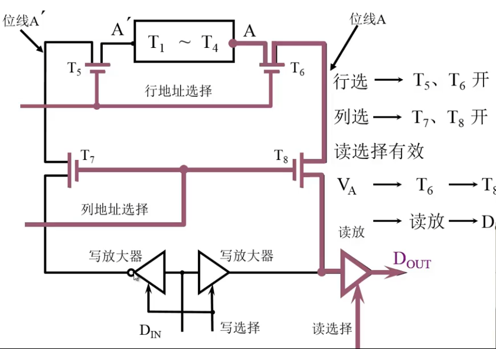

静态RAM的读操作。通过行列地址选择打开$T_6 T_8$晶体管，打开读选择，数据从A端通过$T_6 T_8$晶体管，再通过读放大器输出。

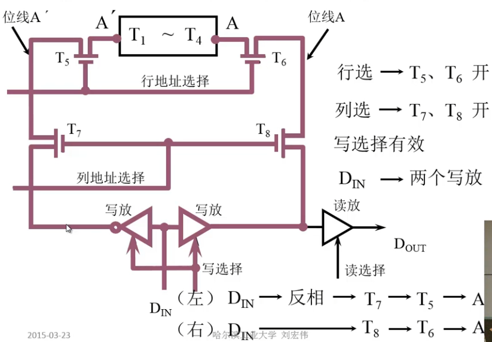

静态RAM的写操作。使能行列地址选择打开$T_5T_6T_7T_8$晶体管，打开写选择。数据通过正反一对写放大器分别输出到触发器的正负两端完成数据的写入。

#### 触发器基础知识

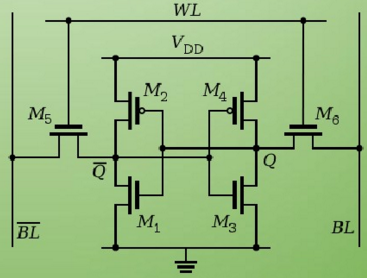

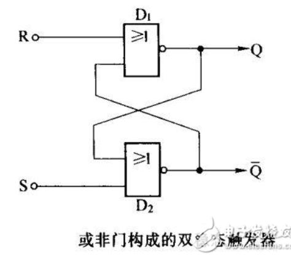

SRAM的每一个bit位存储在四个场效应管组成的交叉耦合的反相器中。

*   读状态
    *   读取数据位1，即Q的电平为高。在读取之前也就是$M_4M_6$导通之前首先对BL和BL#进行预充能为高，再去导通$M_4M_6$。导通之后，Q的电位和BL都为高电位不变，BL通过$M_4$保持拉高电位，$\overline{Q}$为低电平使得BL#通过$M_1$泄电变为低电位。
    *   读取数据位1时，情况刚好相反。
*   写状态
    *   写入数据1，首先在$M_4M_6$导通之前把要写入的数据加载到BL和BL#中，此时BL为高电平，BL#为低电平。再去导通$M_4M_6$。导通之后，触发器稳定到新的写入状态中。
    *   写入数据0的情况相反。

#### RAM芯片举例

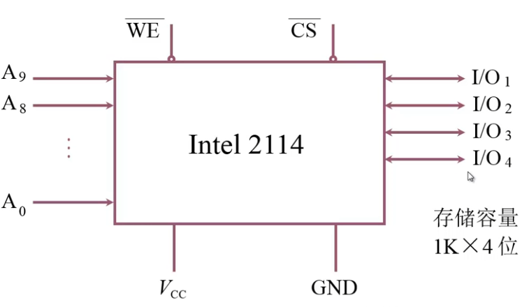

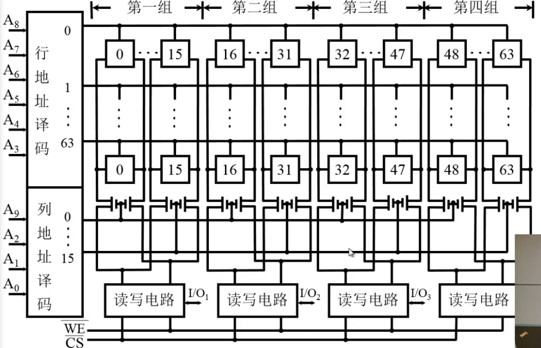

将10位地址分为6+4，由64行和16列组成。其中每16列为一组，数据总共是4位，总共有四组列。

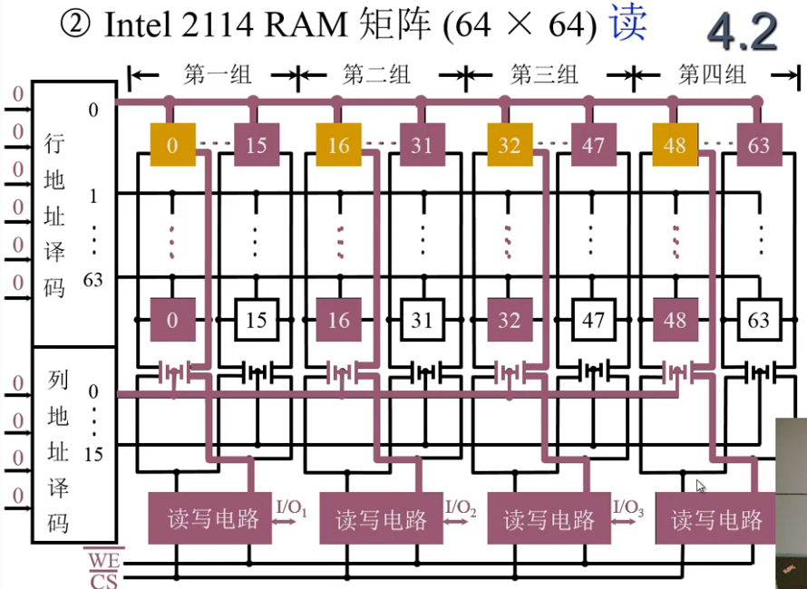

读取数据地址0，行地址译码为0，选中第0行。列地址译码为0列，选中第0列。总共4组列所以会有4个触发器可以读出数据到读写电路中，最终输出地址上的4位数据。

### 动态RAM（DRAM）

#### 三管动态RAM

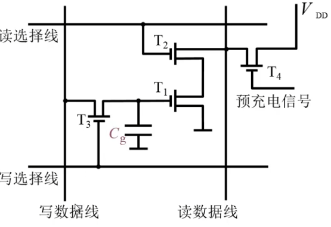

读数据过程，首先发出预充电信号，此时$T_4$导通，读数据线变为高电位。

*   当电容$C_g$中的电位为0时，$T_1$不会导通。读选择线使能后导通$T_2$，此时读数据线会维持在高电位，数据读出为1。
*   当电容$C_g$中的电位为1时，$T_1$导通。读选择线使能后导通$T_2$，读数据线通过$T_2T_1$接地电平变为0，数据读出为0。

说明读出信息与实际信息相反，实际的数据输出需要在读数据线上取反。

写数据过程，在写数据线上输出对应电平，再使能写选择线。

*   当写数据线为1，$T_3$导通之后，电容两端存在电压差，对电容进行充电，写入数据1。
*   当写入数据线为0，$T_3$导通之后，电容两端接地，电容放电，写入数据为0。

写数据的信息与实际信息相同。

#### 单管动态RAM

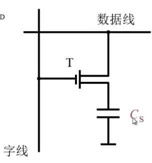

单管动态RAM的结构更加简单。当发送读写时都控制字线进行选择，数据线写入或者读取电容数据。

#### 动态RAM举例

##### 三管动态RAM

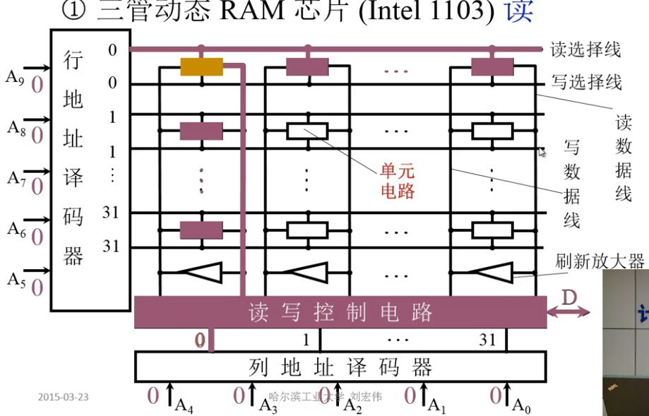

读取数据的地址位0，行地址译码后会选择读选择还是写选择，选择第0行的读选择线。在读选择线选择了之后读数据线就输出了反向的实际电平。根据列地址译码器的输出，选择了低0列的输出电平最终实际输出。

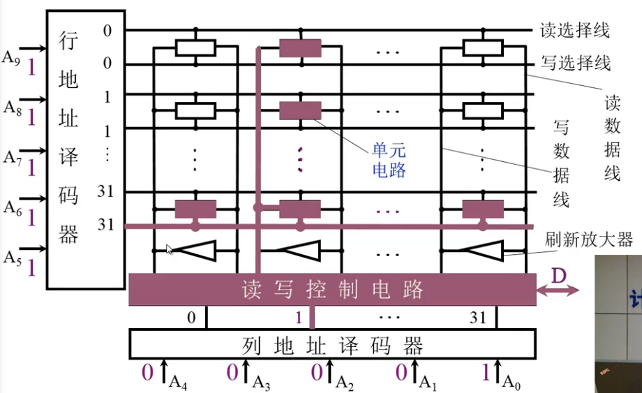

读取数据地址0x3E1，行地址译码器选择第31行的写选择线。列地址译码器选择对应的列地址，读写控制电路将要写入的bit位输出到写数据线上，再使能写选择线之后将数据写入对应的地址。

##### 单管动态RAM

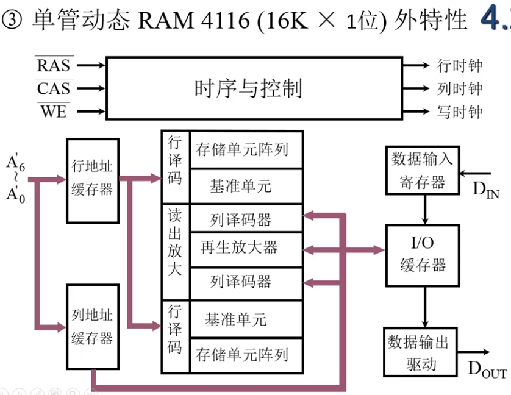

RAM4116芯片16K的地址通过14位地址来寻址，通过7根数据线分时写入行列缓存来选择14位的地址。

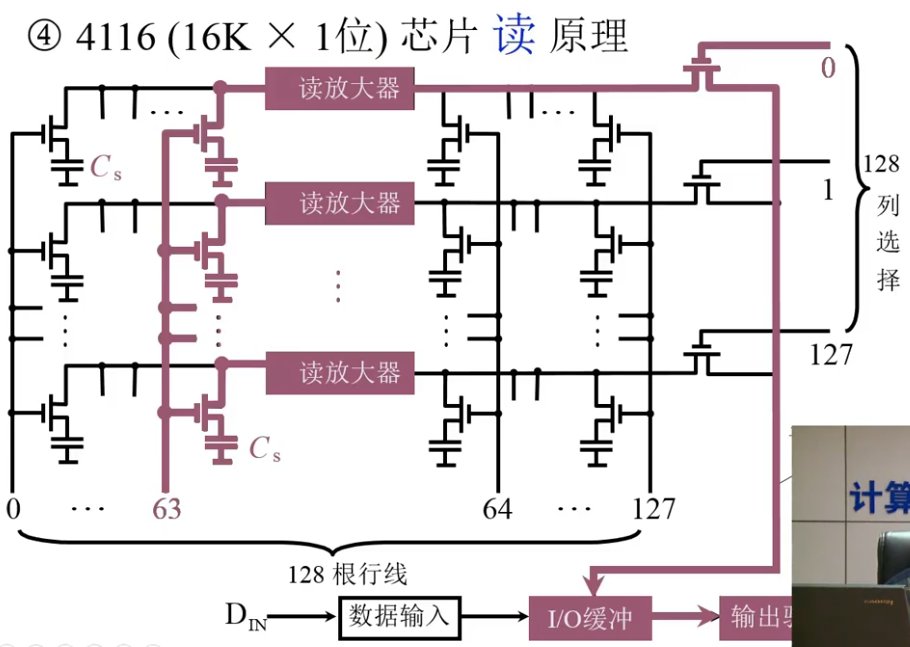

选择的行地址为读放大器左边的63行，列地址选择第0列使能数据的输出。

*   当电容中的数据存放为0，行地址使能之后，读放大器左边获得电平0，那么放大器另一端右边输出就是1，再通过列选择的使能输出，得到IO缓冲中为1。如果行地址在读放大器的右边，电容输出的电平和最终输出的电平一致。
*   当电容存放数据位1，通过读放大器右边输出为0，最终IO缓冲会获得0。

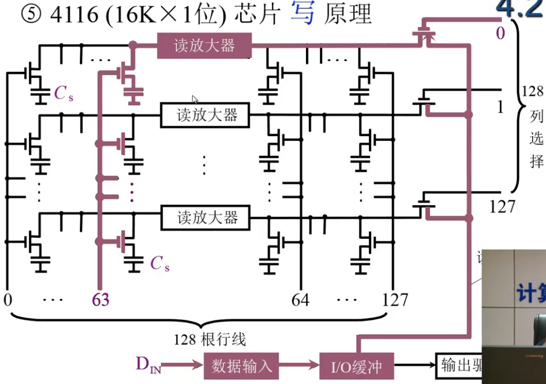

选择的行地址为读放大器左边的63行，列地址选择第0列使能数据的输入。

*   当写入的数据位1，在IO缓冲的数据也就为1，使能行和列选择的晶体管，数据通过读放大器反向为0写入到电容中。如果读取这一位的地址，数据还会再通过放大器，这样就是的数据的读写保持一致。
*   当写入数据位0，在IO缓冲的数据也就为0，使能行和列选择的晶体管，数据通过读放大器反向为1写入到电容中。

这种方式的读出和写入也能保持**读写一致**

##### 动态RAM刷新

*   集中刷新

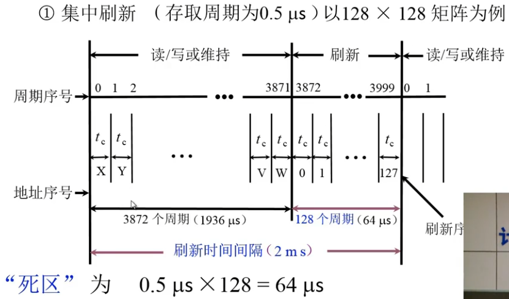

DRAM每2ms刷新一次，每次行选择列选择需要的时间为0.5us，一个刷新时间间隔中就会存在4000个周期。其中3872个周期DRAM可以正常使用和读写，最后的128个周期集中刷新所有的128行。其中**死区的时间**为64us，死区时间率为3.2%。

*   分散刷新

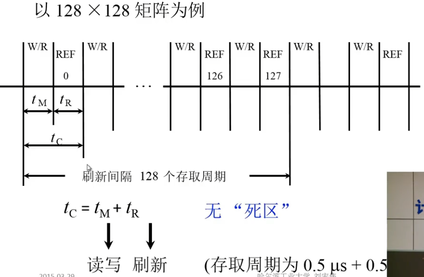

每次读写的周期(0.5us)之后，会按照顺序依次刷新(0.5us)每一行。这样真实的存取周期就变为1us，所有的行刷新使用128个存取周期。这样不用考虑死区问题，但是芯片**存取性能存在下降**。

*   分散刷新和集中刷新结合（异步刷新）

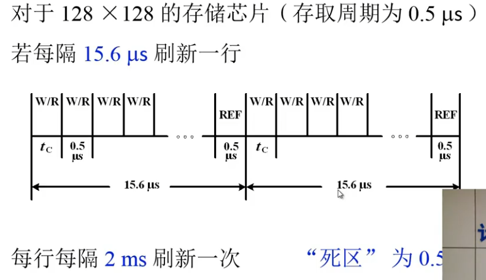

将2ms分割为128个周期，每个周期为15.6us。芯片每15.6us刷新一行。对于一个15.6us的周期内是集中刷新，对于2ms的周期内是分散刷新。如果将刷新安排在指令的译码阶段，将避免死区的产生，提升芯片利用率。

### 动态RAM静态RAM比较

|          | DRAM     | SRAM       |
| -------- | -------- | ---------- |
| 储存原理 | 电容     | 触发器     |
| 集成度   | 高       | 低         |
| 芯片引脚 | 少       | 多         |
| 功耗     | 低       | 高         |
| 价格     | 低       | 高         |
| 速度     | 慢       | 快         |
| 刷新     | 需要刷新 | 不需要刷新 |

综合上面的优缺点，DRAM经常用来做**主存**，价格低容量大。而SRAM用来做**缓存**，价格高性能高容量低。

## 只读存储器

最早的只读存储器在生产就写好了内容不能进行修改。后来第一次改进用户可以自己写，不过只能一次性的写。再次改进后可以进行多次擦写，但是擦写方式不方便。再次改进，芯片可以进行电擦写，不过需要特殊电擦写设备。最后改进为可以通过计算机直接进行电擦写。

### 掩膜ROM(MROM)

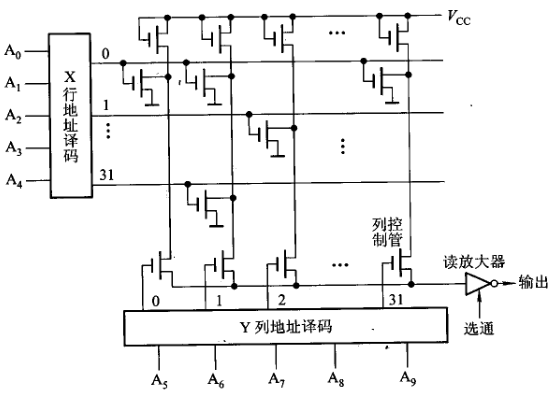

在地址译码选择之前，列通过Vcc进行充电为高电位。行选择线有效之后，行选择线和列选择先交叉处有MOS管的位导通变为0，没有MOS管的位依旧为1。最终有效列选择之后，输出电平通过读放大器输出。

# 参考资料

>   https://www.bilibili.com/video/BV1t4411e7LH?p=22